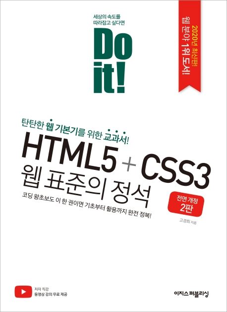

---  
title: "📖 Do it! HTML5+CSS3 웹 표준의 정석"  
date: '2020-12-30'
authors: teddygood
tags: ["Book Review"]
draft: false
slug: '/Do-it-html5-css3'
description: 데이터 생성, 검색, 조작까지 데이터 제대로 주무르기

keywords:
  - HTML
  - CSS
  - 웹
---

## ℹ️ Book Info

:::tip
책 이미지를 클릭하면 교보문고 사이트로 이동합니다!
:::

- 제목: Do it! HTML5+CSS3 웹 표준의 정석
- 저자: 고경희
- 출판사: 이지스퍼블리싱
- 출간: 2019-12-27

{/* truncate */}

## 🎬 Intro

나는 간단한 HTML, CSS는 생활코딩으로 공부했었다. C언어를 먼저 접했고, 웹 프로그래밍이 처음이었어서 속으로는 '이렇게 간단해도 되는건가?' 생각했었다. 결국 좀 더 자세하게 공부를 해보고자 이 책을 구입하게 됐다. 다른 책도 후보에 있었지만 책을 구매했을 당시 이 책이 가장 상위권에 있었다.

## 📖 Book Review

### 웹 프로그래밍 입문자에게 적절한가 

솔직히 프로그래밍을 처음 공부하시는 사람은 책이 꽤 두꺼워서 다 볼 수 있을지 모르겠다. 나도 보다가 너무 두꺼워 멈췄었다. 이 책을 두 번 정도 다시 읽으려고 도전했었을 정도이다. 엄청 친절하게 설명을 해주지만 '이걸 다 알아야 하나?'라는 생각이 들었었다.

엄청난 프론트엔드 개발자가 될 것이 아니라면 다 읽어보고 실습해볼 필요는 없다고 생각한다. 물론 시간이 많다면 천천히 꼼꼼하게 읽어보는 것도 좋겠지만, 인터넷에 다양한 강의가 존재하니 강의를 들으며 정리해보고 싶은 개념이 있다면 책을 보고 공부하는 것이 좋은 방법이다. 즉, reference로 사용하길 추천한다.

처음에는 이 책으로 HTML과 CSS를 완벽하게 공부하고 외운다는 생각으로 샀지만, 그건 적절하지 않은 공부 방법이라는 걸 알게 됐고 생활코딩 강의를 다시 보면서 이 책을 간단하게 읽었다. 

### 이 책 이외에 추천 문서

HTML과 CSS는 영어만 읽을 줄 알면 [MDN](https://developer.mozilla.org/ko/)과 [w3schools](https://www.w3schools.com/)를 추천한다. 이 밖에도 간단하게 공부하고 싶다면 [생활코딩](https://opentutorials.org/course/1), [유튜버 드림코딩](https://www.youtube.com/@dream-coding/featured) 등 다양한 강의들이 많으니 참고하면 된다. 또한, [부스트코스](https://www.boostcourse.org/web344)에도 강의가 있으니 도움이 될 것이다.

## 🔖 대상 독자

웹 퍼블리셔를 목표로 하는 사람들에게 추천한다. 또한, 프론트엔드 개발자를 목표로 하는 사람에게 추천한다.