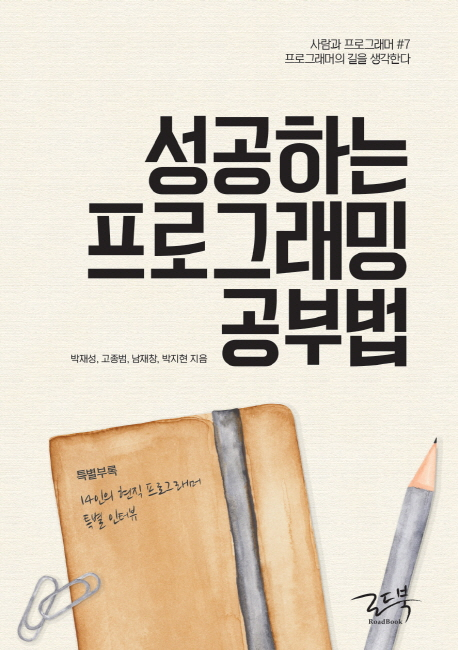

---  
title: "📖 성공하는 프로그래밍 공부법"  
date: 2021-01-07
authors: teddygood
tags: ["Book Review"]
draft: false
slug: '/successful-programming'
description: 사람과 프로그래머 \#7 프로그래머의 길을 생각한다

keywords:
  - 공부법
  - 프로그래밍
  - 성장
---  

## ℹ️ Book Info

:::tip
책 이미지를 클릭하면 교보문고 사이트로 이동합니다!
:::

- 제목: 성공하는 프로그래밍 공부법
- 저자: 박재성, 고종범, 남재창, 박지현
- 출판사: 로드북
- 출간: 2018-09-10

{/* truncate */}

## 🎬 Intro

우연히 도서관을 갔다가 이 책을 발견하게 되고 목차에서 너무 관심이 가서 읽게 됐다. 다시 보니 배달의 민족을 만든 우아한형제들의 교육 과정 중 하나인 우아한테크코스를 맡고 계신 박재성님이 저자로 참여한 책이라 읽어보고 싶었다. 

새로운 것을 만들어내고, 언어를 배우는 것이 재밌었지만 갑자기 너무 방대한 지식이 몰려와 프로그래밍에 흥미를 잃었던 시기가 있었다. 지금은 그런 시기가 지나고 재밌어서 꾸준히 공부하고 있지만 **'어떻게 프로그래밍을 공부해야 하는가'**, **'어떻게 컴퓨터 공학을 공부해야 하는가'** 등의 생각은 아직도 여전히 하고 있으며 길을 못 잡고 있었다. 이 책을 읽어보면 그래도 어떻게 공부해야 하는가에 대한 정답을 찾을 수 있지 않을까 싶어 읽게 됐다.

## 📖 Book Review

### 현직 프로그래머들의 경험

이 책에는 현직 프로그래머들의 다양한 경험이 담겨 있다. 프로그래밍을 어떻게 공부해야 하는지 고민하고 있는 분들이 읽으면 도움이 될 것이다. 그들의 경험을 간접적으로나마 이렇게 체험할 수 있어서 정말 좋았던 책이다. 

이 책의 저자는 4분으로 기록되어 있지만, 사실 11분의 인터뷰가 적혀 있으며, 각자 프로그래밍을 어떻게 공부했는지, 알고리즘과 수학의 중요성, 공부할 때의 동기, 공부하면서 혼란스러웠던 시기 등의 각자의 경험들을 알려준다. 나는 이 부분이 너무 도움이 됐다. 

### 생각을 많이 하게 되는 책

이 책은 프로그래밍 공부법에 대한 전반적인 내용을 다루고 있으며 "프로그래밍 공부는 왜 실패하는가"에 대해 다시 생각하도록 만들어준다. 좌절하는 시기가 없었으면 좋겠지만, 어떤 분야든지 공부를 하다 보면 언젠가는 그런 순간이 한 번쯤은 온다. 그럴 때 읽으면 좋은 책이다. 

## 다양한 Story

목차에는 **n장**이라고 표현되어 있지만, 책 후면에 **Story \#n**으로 표기되어 있다.

Story \#1은 우아한 형제들에서 진행하는 개발자 교육 프로그램인 우아한테크코스, 우아한테크캠프의 교육자로 유명하신 자바지기 박재성 님이 쓰신 부분이다. 이 파트에서는 앞으로 프로그래밍을 어떻게 공부할지에 대한 고민을 할 수 있었고, 어느정도 결론을 낼 수 있었던 부분이다. 도움이 많이 됐다.

Story \#2 부분에서는 애자일에 대해 설명한다. 난 애자일에 대해 들어보기만 했지 사실 잘 모른다. 그러나 예시를 통해 이야기를 잘 풀어주셔서 재밌게 읽은 부분이다. 애자일에 대해 더 알아보고 싶게 만들어준다.

Story \#3은 나처럼 글을 쓰시는 취미가 있거나 책을 읽는 것을 좋아하시는 사람이라면 재밌을 것이라 생각한다. 코딩을 소통으로 비유해서 설명하는 부분이다.

Story \#4는 비전공자들이 읽으면 재밌고 도움이 될 것이라 생각되는 부분이다. 대학에 입학하면 요즘은 1학년 때 대부분 필수 교양으로 프로그래밍을 접할 것이다. 주로 **컴퓨팅 사고**를 설명하고 파이썬으로 실습해보는 수업인 것으로 알고 있다. 이 파트는 그 과목의 심화 버전이라고 생각하면 될 것 같다. 대략 요약하자면 교양으로 배운 프로그래밍을 자신의 전공과 시너지를 높이는 방법에 관해 알려주기에 비전공자여도 이 책을 읽으면 꽤 도움이 될 것이라 생각한다.

## 🔖 대상 독자

"프로그래밍을 처음 공부하는 사람에게 적절한 책인가?"라는 질문에는 "아니요"라고 대답할 것이다. 물론 읽어보는 것도 도전이기에 좋다고 생각하지만 별로 추천하고 싶지는 않다. 어느정도 자신의 성장과 고민에 대해 고민을 해본 사람이 읽어봤으면 한다.

위에서도 언급했듯이 비전공자여도 전공자여도 개발자를 목표로 한다면 한번 읽어봐도 시간이 아깝지 않은 내용들이다. 학생들은 회사에 들어가지 않는 이상 선배 개발자들의 이야기를 접하기 어렵기에 더욱 추천한다.