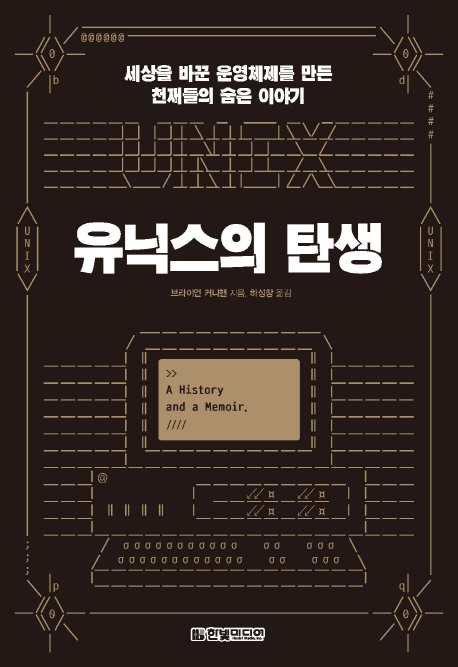

---  
title: "📖 유닉스의 탄생"  
date: '2021-01-28'
authors: teddygood
tags: ["Book Review"]
draft: false
slug: '/UNIX-history-memoir'
description: 세상을 바꾼 운영체제를 만든 천재들의 숨은 이야기

keywords:
  - UNIX
  - 브라이언 커니핸
  - 벨 연구소
---

## ℹ️ Book Info

:::tip
책 이미지를 클릭하면 교보문고 사이트로 이동합니다!
:::

- 제목: 유닉스의 탄생
- 저자: Brian W. Kernighan
- 역자: 하성창
- 출판사: 한빛미디어
- 출간: 2020-08-03

{/* truncate */}

## 🎬 Intro

이 책도 집 근처 도서관에서 빌려 읽은 책이다. 이 책을 처음 접한 곳은 한빛미디어 페이스북 페이지였다. 그때 마침 대학에서 운영체제 강의를 듣고 있었기 때문에 읽어보고 싶다는 생각을 했으나, 학기 중에는 너무 바빠 읽을 수가 없었다. 이 책에 대해 아무 생각 없이 지내다가 도서관에서 발견하게 됐고, "공공 도서관에 왜 있지?"라는 의문이 있었으나 어쨌든 빌려 읽게 됐다.

## 📖 Book Review

### 어떤 책인가?

저자인 브라이언 커니핸의 회고록 같은 책이다. 브라이언 커니핸은 C언어를 원서로 공부해본 사람이면 아는 [The C Programming Language](http://www.kyobobook.co.kr/product/detailViewEng.laf?mallGb=ENG&ejkGb=ENG&barcode=9780131103627)의 저자 중 한 명이다. 이 책은 C언어 창시자인 데니스 리치와 함께 썼다.

저자가 벨 연구소에서 경험했던 일들, 동료 개발자들과 관련된 여담 등 재밌는 일화들을 알려준다. C언어를 만든 데니스 리치, 데니스 리치와 함께 유닉스를 만들고 현재는 구글에서 Go언어를 공동 개발한 켄 톰프슨 등 엄청난 개발자들의 이름이 언급되며, 그 당시 벨 연구소가 얼마나 영리한 사람들이 많았으며 위대했는지 알려준다. 또한, 유닉스가 어떻게 만들어졌고 어떻게 발전했는지 등 유닉스의 역사를 보여준다.

정말 '경이롭다'라는 말이 어울리는 책이다. 중간중간 유닉스 개발 과정을 설명할 때 소설 같은 느낌도 준다. 또한, 함께 있던 동료들의 메일이라던가 그들이 직접 한 인터뷰가 나오는데 그런 부분을 읽는 것도 재밌는 구성이라고 생각했다. 이러한 역사를 어떻게 다 기억하는지 놀랐었다. 기록을 했었다고 해도 '이 많은 내용들을 어떻게 다 기록을 했었지?'라고 생각이 들 정도였다.

### 글쓰기에 진심

벨 연구소에 계셨던 개발자들은 글쓰기에 대한 진지한 태도를 가졌으며, 서로 비판해주고, 경영진의 지지까지 받았었다고 한다. 그렇기에 세상에 모든 개발자에게 영향을 끼치는 책들도 출간할 수 있었지 않았을까. 나도 이런 대단한 개발자들이 개발한 언어를 공부하고, 출간한 책들을 읽으며 공부한 학생이기에 이런 부분에서 매우 감명 깊었다.

난 개발자를 목표로 공부하는 대학생이지만 글쓰기를 좋아하니 이렇게 책을 리뷰하거나 공부한 내용들을 정리하는 블로그를 운영하고 있다. 누군가에게 도움이 됐으면 하는 마음으로 적고 있다. 앞으로도 나는 글쓰기를 계속 연습하고, 블로그를 통하여 세상에 지식을 남기는 개발자가 되고 싶다.

### 재밌는 일화

이 책에는 재밌는 일화들이 많이 나온다. 유닉스라는 이름도 사실 [멀틱스(Multics, Multiplexed Information and Computing Service)](https://ko.wikipedia.org/wiki/%EB%A9%80%ED%8B%B1%EC%8A%A4)에서 따온 말장난이었으며, 원래 이름은 UNICS였는데 AT&T 변호사들이 eunuchs(내시)와 발음이 유사하다고 하여 UNICS를 좋아하지 않았다고 한다.

C언어를 공부할 때 자주 쓰는 malloc 라이브러리를 만든 더글러스 매클로이에 대한 일화에 관한 이야기도 나온다. C언어를 공부해본 사람이라면 더욱 재밌게 읽을 수 있는 포인트다. 이밖에도 UNIX에서 파일을 만드는 system call 이름이 creat인 이유도 사실 켄 톰프슨의 오타였다는 재밌는 일화도 알 수 있다.

이밖에도 GitHub에서 MIT 라이선스와 같이 자주 쓰이는 BSD 라이선스도 사실 유닉스 때문에 나오게 된 라이선스라는 것도 알게 됐으며 꽤 유용한 정보들이 많았다. 지금 생각나는 것들은 이게 전부이다. 이 밖에도 유용하기도 하고, 재밌는 일화들이 많이 나온다. 개발자를 목표로 한다면 심심할 때 한 번 읽어봐도 재밌을 책이다.

## 🔖 대상 독자

개발을 이제 막 공부하는 사람들에게는 별로 추천하지 않는다. 적어도 운영체제, 시스템 프로그래밍을 공부했던 경험이 있으신 사람에게 추천하고 싶다. 난 운영체제 과목을 너무 대충 들었는지 이 책이 이 책은 꽤 어려웠다. 운영체제를 공부해보지 않은 분들이 보기에는 더 어려울 수도 있다.

우리 학교는 시스템 프로그래밍이라는 과목을 배워서 책을 읽을 때 중간중간에 나오는 코드들이라던가 용어들을 어느 정도는 쉽게 이해했는데 다른 독자들은 어떤지 잘 모르겠다. 모르는 코드는 구글링을 열심히 해보자. 이제 천천히 즐기면서 책을 읽어보자!
