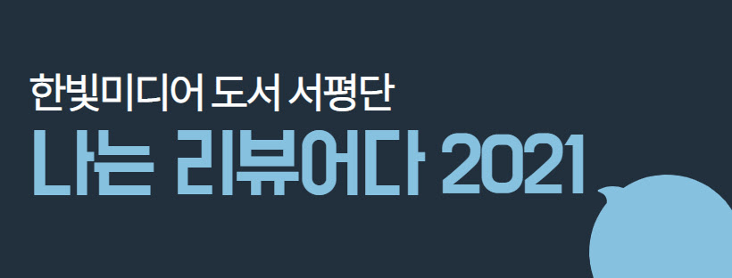

---  
title: "📖 맛있는 디자인 포토샵&일러스트레이터 CC 2021"  
date: '2021-02-18'
authors: teddygood
tags: ["Book Review"]
draft: false
slug: '/delicious-design-Ps-Ai'
description: 누구나 쉽게 배워 제대로 써먹는 그래픽 입문서

keywords:
  - 포토샵
  - 일러스트레이터
  - 디자이너
  - 맛있는 디자인
---

## Book Info

- 제목: 맛있는 디자인 포토샵&일러스트레이터 CC 2021
- 저자: 빨간고래, 윤이사라
- 출판사: 한빛미디어
- 출간: 2021-01-18

## 나는 리뷰어다 2021

이 책은 한빛미디어 도서 서평단 `<나는 리뷰어다 2021>`에 참가하게 되어 받게 된 책입니다. 한빛미디어에서 진행하는 `<나는 리뷰어다>`는 평소 IT 분야에 관심이 많은 분이라면 정말 도움이 되는 프로그램 중 하나인 것 같습니다. 저는 작년에 신청하고 싶었지만, 신청 시기를 놓쳐서 아쉬웠는데 이번에 이 활동에 참여할 수 있어서 정말 기쁩니다.

솔직하게 말하자면 `<나는 리뷰어다>`에 참여할 수 있을 줄은 생각도 못 했습니다. GitHub Jekyll 블로그 자체가 네이버 블로그, 티스토리, 브런치 같은 블로그처럼 유입이 잘 되는 블로그도 아닐뿐더러, 혼자 공부하거나 읽은 책들을 장점만 이야기하는 것이 아닌 사실적으로 리뷰하는 사람이기에 그렇게 생각했습니다.

대부분 이런 활동들은 어느 정도 영향력이 있는 사람 또는 유입이 많은 사이트에 기회를 주기에 저는 활동에 지원하더라도 도전해보자는 마음으로 지원했었습니다. 그러나 제가 뽑힘으로써 정말 `<나는 리뷰어다>` 활동은 꼭 영향력이 있는 인플루언서만 뽑는 활동이 아니라는 것을 알게 됐습니다. 저에게 자기계발의 기회를 준 `한빛미디어` 출판사에 감사드립니다.

이 활동은 주어진 리스트에서 희망 도서 3권을 선정하면 그중 1권을 랜덤으로 받을 수 있습니다. 저는 `처음 배우는 애저`, `진지한 파이썬`, `맛있는 디자인 포토샵&일러스트레이터`를 선택했었습니다.

## 왜 선택했나요?

저는 개발자를 목표로 하는 사람이지만 예전부터 유명한 컴퓨터 프로그램에 관심이 있었기에 다양한 프로그램들을 공부했었으며 포토샵 CS4를 공부했던 경험이 있습니다.

물론 개발자를 목표로 한다면 프로그래밍을 가장 잘해야 하는 것이 맞지만, 예전부터 개발만 하는 개발자가 되는 것이 아니라 다른 분야들의 지식도 어느 정도는 가진 개발자가 되고 싶었습니다. 이번 기회를 통해 포토샵을 다시 배울 수 있었으며, 일러스트레이터까지 공부할 수 있었습니다.

다른 2권을 선택한 이유는 지금 리뷰에서 불필요하니 굳이 설명하지는 않겠습니다.

## 무료 체험

저는 Adobe에서 제공하는 무료 체험을 이용하여 7일 동안 이 책을 끝내겠다는 생각으로 봤습니다. 학생 할인을 받으면 어느 정도 저렴한 가격으로 사용할 수도 있지만, 그러다가는 너무 여유롭게 책을 보고 다 안 읽은 상태로 리뷰를 적을 것 같아서 "차라리 빠르게 공부하고, 다 읽어보고 리뷰를 적자"라고 생각했습니다.

7일 동안 개발 공부, 책 읽기 등 모든 것을 내려놓고 이 책만 봐서 조금 지치고 어려움이 있었지만, 중간에 포기하고 싶지는 않았습니다. 한 번 보면 끝을 내고 싶다고 생각하기 때문이죠. 무료로 제공 받은 책이라고 대충 보지 않았습니다. 오히려 놓친 건 없는지 다시 실습하면서 책을 읽었습니다.

## 초보분들이 읽기 적절한가요?

저는 적절하다고 생각합니다. 예전에 제가 공부했을 때 600p가 기본으로 넘어가는 포토샵 책들보다 훨씬 읽기는 편했습니다. 이 책도 532p라서 초보자분들께 진입장벽이 있을 수 있겠지만 사실 사진 때문에 페이지가 많은 것뿐입니다.

또한, 설명하는 글들은 줄이고 사진 하나하나에 짤막하게 설명이 되어 있기 때문에 오히려 보기 편했습니다.

한빛미디어에서 `맛있는 디자인 스터디 그룹`을 운영하고 있어 혼자 학습하기 어려운 분은 공식 카페에서 진행하는 스터디에 참여할 수 있습니다. 막히는 부분이 있다면 카페의 Q&A 게시판에 질문할 수도 있다고 합니다.

## 좋았던 점

1. 업데이트된 기능들을 알려줍니다.

 Adobe는 CS6 버전 이후부터는 소프트웨어를 단품으로 판매하는 방법을 버리고 CC로 변경되면서 온라인 연결이 필수로 요구되는 버전으로 판매되고 있습니다. 일종의 구독료를 내고 사용하는 것과 같습니다.

 또한, 매년 업데이트되는 것으로 알고 있습니다. 이 책에서는 한 해가 지나고 Adobe CC 2020 버전에서 Adobe CC 2021로 변화하면서 어떤 신기능들이 생겼는지 알려줍니다.

 물론 업데이트가 되면 무엇이 업데이트됐는지 Adobe 공식 사이트 문서를 보면 더 빠르게 확인할 수 있습니다만, 그걸 확인하기 귀찮거나 어려운 분들은 간단하게 책을 보면 됩니다. 어떤 기능들이 업데이트됐는지 가장 빨리 확인하는 방법은 공식 문서를 보는 것이 가장 좋습니다.

2. 예제 파일들을 제공해줍니다.

 초보분들에게는 이미지 데이터가 없을 수 있기에 이 책은 예제 파일을 제공합니다. 또한, 실습 후 완성 파일도 제공하니 먼저 실습해 보고 비교할 수도 있습니다.

3. 포토샵과 일러스트레이터를 한 권에 공부할 수 있습니다.

 이 부분은 누구에게는 장점이 될 수도 있고 단점이 될 수도 있을 것 같습니다. 따로 출판되면 더 자세히 공부할 수 있다는 장점이 있겠지만, 저 같은 경우에는 간단하게 공부하고 싶다는 생각이 더 많았기에 이렇게 한 권으로 되어 있어서 좋았습니다.

 솔직히 이렇게 한 권으로 읽었어도 저는 이 책이 간단하다고는 생각이 들지 않았습니다. 오히려 다양한 기능들을 알려주기에 자세하다고 느꼈습니다.

 포토샵과 일러스트레이터를 책 한 권으로 만들어서 그런지 가볍게 입문용으로 공부하기에는 좋은 것 같습니다. 이전 맛있는 디자인 CC 2020은 포토샵, 일러스트레이터 따로 출판하기도 했고 같이 출판하기도 하셨는데 이번에는 어떻게 또 따로 출판하실지는 잘 모르겠습니다.

4. 기능들을 그저 사용하는 것이 아닌 활용하는 방법을 알려줍니다.

 포토샵에서는 개인적으로 인물 사진 보정법이 가장 유용했던 것 같습니다. SNS에 사진을 올릴 때 바로 활용할 수 있는 좋은 방법들인 거 같습니다.

 일러스트레이터에서는 글자 문구 또는 로고나 SNS에서 광고할 때 자주 사용되는 페이지 등을 디자인하는 실습을 해볼 수 있기 때문에 이 점에서 활용도가 높은 것 같습니다.

## 아쉬운 점

1. 책에서 프로그램을 한글 버전으로 사용하지 않고 영어 버전을 사용합니다.

 저 같은 경우에는 다양한 도구들을 영어로 써서 어느 정도 익숙하지만, 대부분의 사람은 한글을 쓸 것으로 예상되기에 조금 아쉬웠습니다.

 `기능 꼼꼼 익히기`가 있어서 다행히 대부분 설명을 자세하게 다 해주지만, 그냥 영어를 꺼리시는 분들이 있을 것 같습니다. 업무나 취미 등으로 활용하고자 하는 일반인에게는 영어에 대한 진입장벽이 있지 않을까 생각이 됩니다.

2. 강의가 없습니다.

 강의는 필수가 아니긴 합니다. 그렇지만 이렇게 실습이 요구되는 책들은 강의가 있었더라면 실습하기 더 편할 것이라고 생각합니다.

 책에서 설명하는 대로 실습을 진행했지만, 책에서 나온 결과 이미지와 제가 실습한 파일들을 비교했을 때 결과가 비슷하긴 하지만 조금 다르기도 했습니다.

 얼마나 조절하느냐, 어느 정도 드래그를 하느냐 등의 이유에 따라 달라지는 것이 디자인이기 때문에 책의 내용을 감으로 파악하고 사용해보는 것이 어려웠습니다.

 저는 어느 정도 자세한 설명을 좋아하기 때문에 강의가 있었으면 더 좋았겠다는 생각이 들었습니다.

## 개인적으로 공부하며 느낀 점

공부하면서 가장 놀랐던 점은 인공지능 기반의 Neural 필터였습니다. 이 필터를 활용하면 작업 과정을 거치지 않아도 몇 번의 클릭만으로 신기한 결과들을 만들어줍니다. 예를 들어 인물사진에서 사람의 나이와 표정, 시선 등을 변경하거나 흑백에서 컬러로 바꾸는 등의 기능들이 있습니다.

이런 기능들을 사용하면서 영상, 이미지 처리 과제들을 하며 필터들을 직접 구현하던 때가 자연스럽게 회상됐습니다. 또한, 제가 공부하는 것들보다 기술의 발전은 더 빠르다는 것을 몸소 느꼈었습니다. 얼른 다양한 기능들까지도 직접 구현할 수 있는 사람이 되고 싶다고 생각했습니다.

도구를 잘 사용하는 사람이 되는 것도 좋지만, 저는 직접 만드는 사람이 되고 싶습니다. 창조는 어쩌면 주어진 기능을 활용하는 것을 넘어서 생각하지 못한 것들을 만드는 것이니까 개발자라는 직업에, 프로그래밍에 더욱 매력을 느끼는 것 같습니다. 열심히 공부해야겠다고 다짐하는 계기가 됐습니다.

## 결론 평

`저처럼 포토샵을 한 번쯤 공부를 해봤지만, 기억이 잘 안 나서 다시 공부해보고 싶은 분 또는 포토샵, 일러스트레이터를 처음 공부해보시는 분들께 추천합니다.`

`이 책으로만 이 프로그램들을 마스터하겠다고 생각하시는 분들께는 추천하지 않습니다. 이 책은 입문용이며 결코 이 책을 봤다고 해서 전문가가 되지는 않습니다.`

어디까지나 제 생각일 뿐이니 참고만 해주시길 바랍니다.