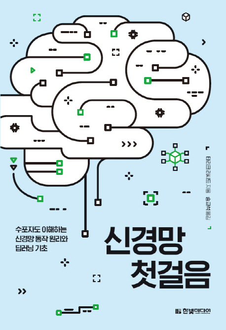

---  
title: "📖 신경망 첫걸음"  
date: '2021-03-10'
authors: teddygood
tags: ["Book Review"]
draft: false
slug: '/make-your-own-neural-network'
description: 수포자도 이해하는 신경망 동작 원리와 딥러닝 기초

keywords:
  - 신경망
  - 딥러닝
  - 뉴럴 네트워크
---

{/* truncate */}

## Book Info

:::tip
책 이미지를 클릭하면 교보문고 사이트로 이동합니다!
:::

- 제목: 신경망 첫걸음
- 저자: Tariq Rashid
- 역자: 송교석
- 출판사: 한빛미디어
- 출간: 2017-04-03

## 이 책을 읽게 된 이유

`나는 리뷰어다 2021` 활동을 하여 3월 리뷰에는 `GAN 첫걸음`이라는 책을 제공받게 됐습니다. 그 책을 먼저 읽다가 책 서론에서 저자의 전작인 `신경망 첫걸음`이라는 책을 먼저 읽고 GAN 첫걸음을 읽으면 더욱 도움이 될 거라고 적혀 있어서 궁금증이 생겼습니다. 처음에는 다른 지역 도서관을 가야하나 아니면 책을 구매를 할까 고민을 했었는데 우연히 대학 전자 도서관에 이 책이 있어서 빌려 읽게 됐습니다. 

## 책 소개

딥러닝에 대해 관심이 있는 사람들은 한 번쯤 들어봤을 신경망에 대해 친절하고 쉽게 알려주는 책입니다. 이 책의 부제는 `수포자도 이해하는 신경망 동작 원리와 딥러닝 기초`입니다. `딥러닝 공부를 하는데 어떻게 수포자도 이해를 할 수 있어?`라는 질문을 하실 수 있습니다만, 진짜 이 책을 직접 보면 어려운 수식들이 없습니다. 간단한 산수 정도로만 활용하여 해결을 합니다.

단점은 수학적인 개념들이 적다 보니 `왜 이게 쓰이지?`라는 질문이 생깁니다. 친절한 것은 좋았지만, 그만큼 수학적인 부분들에서 자세하지 않고 설명하는 과정 없이 넘어갔다는 점이 조금은 아쉬웠습니다. 그러나 이런 설명들은 검색하면서도 공부할 수 있었기에 딥러닝 입문서로는 엄청 괜찮다고 생각합니다. 

정말 빠르게 보면 하루 또는 이틀만에 볼 수 있을 정도로 쉽게 설명하며, 시각화 된 이미지들이 많아서 더 빨리 보는데 도움이 됐습니다. 

이 책을 처음 읽었을 때 2017년에 이렇게 친절한 책이 출간했다는 점이 놀랄 정도였습니다. 그 당시에 이런 책이 있다는 것을 알았더라면 좀 더 빠르고 쉽게 딥러닝에 입문 했을텐데 안타깝다는 생각이 들었습니다.

이 책의 처음에는 개념들이 나오며 점점 갈수록 `Jupyter Notebook`환경에서 예제를 공부할 수 있습니다. 책에서는 IPython을 사용하고 있으나 Jupyter Notebook을 사용해도 무방합니다. 이런 환경 구성에 대해서도 자세하게 알려주지는 않습니다만, 저흰 구글링을 할 수 있으니 이 정도는 봐주도록 합시다. [저자 Github 주소](https://github.com/makeyourownneuralnetwork)에 코드가 있으니 참고하면서 공부하면 됩니다.

## 대상 독자

전공자든 비전공자든 그냥 딥러닝 입문하는 사람이 읽으면 좋습니다. coursera에 Andrew Ng 교수님의 Machine Learning, 김성훈 교수님의 모두를 위한 딥러닝 같은 강의를 듣기 전에 입문용으로 읽어보면 도움이 될 것이라고 생각합니다.

## 요약

`전공자든 비전공자든 딥러닝에 입문하시는 분들은 읽어보면 많은 도움이될것이라고 생각합니다.`

어디까지나 제 생각일 뿐이니 참고만 해주시길 바랍니다.