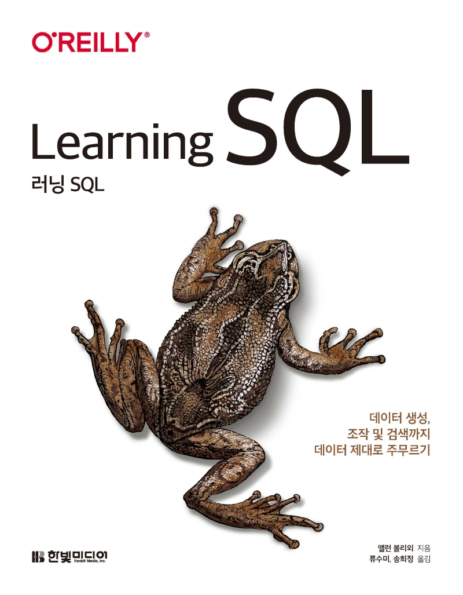
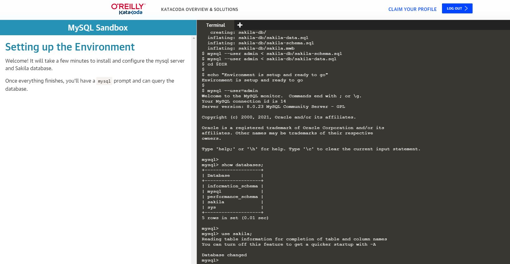
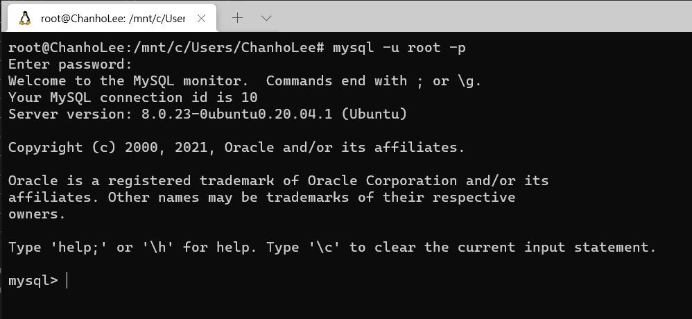

:::info
한빛미디어 <나는 리뷰어다> 활동을 위해서 책을 제공받아 작성된 서평입니다.
:::

## ℹ️ Book Info

:::tip
책 이미지를 클릭하면 교보문고 사이트로 이동합니다!
:::

- 제목: 러닝 SQL
- 저자: Alan Beaulieu
- 역자: 류수미, 송희정
- 출판사: 한빛미디어
- 출간: 2021-03-30

<!--truncate-->

## 🎬 Intro

나는 컴퓨터 공학 전공생이지만 아직까지 데이터베이스 공부를 제대로 해본 적이 없다. 우리 학과는 Computer Science보다 Computer Engineering에 더 가까운 학과이기에 4학년 2학기에 데이터베이스 과목이 배정되어 있다. 그러나 나는 웹 백엔드를 공부하다 보니 자연스럽게 SQL 공부의 필요성을 느끼게 됐고 "언젠가 공부를 해야겠다."라고 생각했다. 마침 한빛미디어 출판사의 `나는 리뷰어다`에 참여하게 되어 이 책을 읽을 수 있게 됐다.

## 📖 Book Review

### SQL

이 책은 제목에서도 알 수 있듯이 SQL을 공부하는 책이다. SQL은 MySQL, ORACLE DATABASE, IBM DB2, Microsoft SQL Server, PostgreSQL 둥과 같이 좋류가 다양하다. 그중 이 책은 가장 대중적이라고 할 수 있는 MySQL을 중점으로 설명한다. 가끔 MySQL 이외의 SQL 예제들이 나오기도 하지만 SQL 문법 자체가 거의 비슷하여 큰 어려움은 없다.

### 실습 환경

대부분의 SQL 책의 예제들은 테이블을 직접 생성하여 데이터를 추가해보기도 하며, 사전에 미리 만들어 둔 데이터베이스를 직접 다운 받아 실습할 수 있도록 되어 있다. 이 책에서는 Sakila라는 데이터베이스를 사용한다. Sakila 데이터베이스는 MySQL에서 개발된 데이터베이스로 책 또는 문서의 튜토리얼 등의 예제에 사용할 수 있는 데이터베이스이다.

이 책을 공부하기 위한 환경을 세팅하기 위해서는 MySQL을 설치하고 Sakila 데이터베이스까지 받아야 하지만 환경을 구성하는 것이 어려운 사람들을 위해 이 책의 원서 출판사인 O'REILLY에서 [Katacoda](https://www.katacoda.com/)라는 실습 환경을 제공한다. 이제 막 공부를 시작한 사람들 입장에서는 매우 편하게 공부할 수 있다. 이렇게 공부할 수 있는 환경을 제공하는 것이 쉬운 일은 아니기에 가장 인상적인 부분이었다. 

이외에도 환경을 구축할 수 있는 사람은 스스로 환경을 구축하여 책의 예제를 따라 하며 실습을 진행하면 된다. 나는 WSL2(Windows Subsystem for Linux 2)를 사용하여 MySQL 환경을 구축했다. 처음에는 Windows에서 MySQL을 사용하려 했으나 이 책은 터미널에서 쿼리를 작성하기에 나도 MySQL Workbench를 사용하지 않고 터미널에서 실습을 진행했다.

### 입문에 그치지 않는 책

단순 SQL 쿼리문만을 사용하는 것이 아니라 SQL의 배경부터 기초 문법을 설명하고 끝에는 분할, 군집화, 샤딩, 빅데이터 같이 SQL을 이용한 고급 기술을 간단하게 소개한다. 특히 2015년에 처음 등장한 오픈소스인 Apache Drill을 사용해본다. 

### 공부하기 편한 책

이 책은 455 페이지로 꽤 두꺼운 책이지만 Chapter가 18까지 있어 조금씩 보기 좋다. 하루에 한 Chapter씩 보면 18일이면 다 읽을 수 있다. 이렇게 짧게 Chapter가 구성되어 있어 책을 읽는데 부담을 덜했다.

또한, 한 Chapter가 끝날 때마다 `학습 점검 실습 문제`가 있어 Chapter의 내용들을 점검할 수 있었다. 꽤 마음에 들었던 부분이다. 보통 이런 책들은 실습 예제만 있고 복습할 수 있는 문제들이 없기 마련이다. 그러나 이 책은 문제를 제공하고 문제의 정답까지 부록에 기술되어 있다. 즉, 공부한 내용들을 점검하기에 좋은 책이었다.

마지막으로 실습할 수 있는 코드가 많으며, 종종 예제 코드마다 어떠한 상황에서 사용해야 하는지에 대한 설명이 적혀 있었다. SQL을 작성하면서 어려운 부분이 있을 때 레퍼런스로 참고하면서 읽기에도 좋은 책이라 생각한다.

## 🔖 대상 독자

가끔 한 Chapter에서 설명하고자 하는 주제가 있지만, 그 주제와 조금 벗어난 다른 Chapter의 코드를 미리 설명하는 경우가 있다. 그렇기에 SQL을 적어도 한 번 공부해본 사람이 읽으면 얻는 것이 더 많을 것이라 생각한다.

SQL을 완전히 처음 공부하시는 독자라면 다른 책도 같이 읽으면서 공부하는 걸 추천하고, SQL을 공부해본 독자라면 이 책의 코드들을 간단하게 실습해보면서 복습하는 방향으로 읽으시면 도움 될 것이라고 생각한다.
