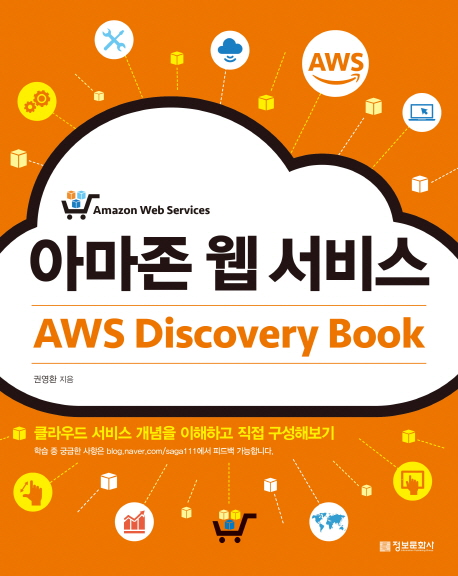

---  
title: "📖 아마존 웹 서비스 AWS Discovery Book"  
date: '2021-05-14'
authors: teddygood
tags: ["Book Review"]
draft: false
slug: '/AWS-Discovery-Book'
description: 클라우드 서비스 개념을 이해하고 직접 구성해보기

keywords:
  - AWS
  - 클라우드
  - Amazon Web Service
---

## ℹ️ Book Info

:::tip
책 이미지를 클릭하면 교보문고 사이트로 이동합니다!
:::

- 제목: 아마존 웹 서비스 AWS Discovery Book
- 저자: 권영환
- 출판사: 정보문화사
- 출간: 2019-02-10

{/* truncate */}

## 🎬 Intro

최근 백엔드 개발자 채용 공고를 읽어보면 클라우드 환경에서의 경험을 요구하는 기업들이 많아졌다. 특히 AWS는 대부분의 기업에서 쓰이고 있기에 AWS 사용 경험이 있는 사람을 더욱 선호한다. 나도 백엔드 개발자를 목표로 하고 있기에 AWS를 경험해봐야겠다는 생각에 이 책을 읽게 됐다.

**"AWS 공식 문서가 너무 잘 되어 있는데 굳이 책을 봐야 할까?"**라는 생각도 했지만 그 문서를 다 읽어볼 자신이 없었기에 핵심만 빠르게 실습할 수 있는 책을 원했다. [따라하며 배우는 AWS 네트워크 입문](https://product.kyobobook.co.kr/detail/S000060612654), [서비스 운영이 쉬워지는 AWS 인프라 구축 가이드](https://product.kyobobook.co.kr/detail/S000001766358) 등의 책들도 고려했었습니다만, 이 책이 전자도서관에 있길래 빌려 읽었다. [따라하며 배우는 AWS 네트워크 입문](https://product.kyobobook.co.kr/detail/S000060612654) 책은 2020년 후반에 나온 책이라 더 고민됐었다. 나머지 책들은 나중에 기회가 된다면 읽어볼 예정이다.

## 📖 Book Review

### 구성

한 장에 개념->개념에 맞는 AWS 서비스->실습->에필로그 순서로 구성되어 있다. 한 장이 끝날 때마다 에필로그에는 도움이 되는 내용 또는 역사 등이 나와서 저에게는 꽤 재밌는 부분이었다. 특히 8장에서 Auto Scaling을 공부할 때는 `auto scaling 기능이 실제로 사용할 수 있을까?, 과연 사용하는 사람이 있을까?`라는 의문이 있었는데 에필로그에 데브시스터즈에서 쿠키런 서비스를 운영할 때 사용했다는 사례가 있었다. 현업에서의 사례가 적혀 있어서 그런지 더욱 그 기술에 흥미가 갔었다. 

이 책은 AWS의 개념을 간단하게 익히기 좋은 입문 책이라고 생각한다. 매우 깊게 알려주지는 않지만 핵심이라고 생각이 드는 주요 서비스들은 다 알려준다. 또한, 실습이 엄청 많으며 모두 이미지로 자세하게 설명되어 있다. AWS를 처음 경험하는 초보자들도 AWS 회원가입부터 EC2, S3, VPC 등의 것들을 친절하게 가르쳐준다. 물론 2019년에 나온 책이라 메뉴 또는 명칭이 조금 다르다. 이런 부분은 구글링 하면서 공부하면 된다.

마지막 12장, 13장에는 AWS certification을 어떻게 준비하고 어떻게 공부해야 하는 지에 관해 설명한다. 시험 응시나 어떤 사이트에서 공부를 해야 하는지 등을 알려주는데 이미지로 잘 설명이 되어 있다. 2년이 지난 지금도 유효한 방법인지는 잘 모르겠으나 AWS 자격증에 관심이 있거나 필요한 사람은 참고하면 된다.

### 프리티어 활용

나는 예전에 AWS를 처음 공부할 때 "AWS는 유료 서비스인데 연습을 위해서 결제까지 해야 하는가?"라는 생각을 했었다. 알고보니 간단한 실습들은 결제가 필요 없었고, 이 책 또한 `AWS 프리 티어`를 활용하기에 그런 걱정은 할 필요가 없다. 책에서 나온대로 잘 따라한다면 결제가 될 일이 없다. 실습이 끝날 때마다 바로바로 사용한 서비스들을 종료하거나, 중지시킴으로써 과금이 될 일이 없는 것이다.

## 🧑‍🏫 대상 독자

AWS 경험을 해보고 싶은 입문자에게 이 책을 추천한다. 혼자 하면 어려울 수 있었던 실습들을 시행착오 없이 도와준다. 또한, 이미지로 설명이 잘 되어 있어서 전반적으로 친절하다 느꼈다. 그러나 이 책은 결국 클라우드를 공부하는 책이기에 기본적인 터미널 사용법, 네트워크 등의 기초적인 CS 지식은 필요하다. 간혹 그런 개념들을 설명해주기는 하지만 위에서도 언급했듯이 자세히 설명하지는 않고, 간단하게 설명한다. 모르는 부분이 나올 때마다 계속 구글링을 하면서 책을 읽는 것을 추천한다. 나도 그렇게 책을 읽었고, CS 지식을 더 열심히 공부 해야겠다는 생각이 들었다. 