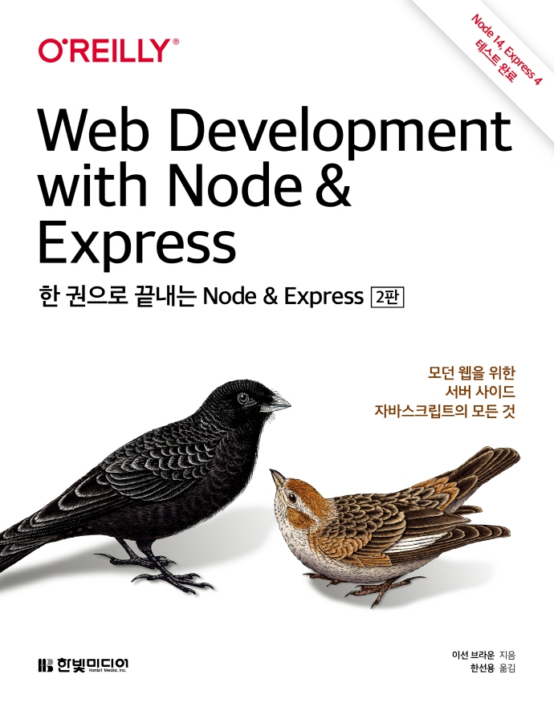

---  
title: "📖 한 권으로 끝내는 Node & Express"  
date: '2021-05-20'
authors: teddygood
tags: ["Book Review"]
draft: false
slug: '/web-development-with-node-and-express'
description: 모던 웹을 위한 서버 사이드 자바스크립트의 모든 것

keywords:
  - Node.js
  - Express
  - 백엔드
  - JavaScirpt
---

:::info
한빛미디어 \<나는 리뷰어다\> 활동을 위해서 책을 제공받아 작성된 서평입니다.
:::

## Book Info

:::tip
책 이미지를 클릭하면 교보문고 사이트로 이동합니다!
:::

- 제목: 한 권으로 끝내는 Node & Express
- 저자: Ethan Brown
- 역자: 한선용
- 출판사: 한빛미디어
- 출간: 2021-05-01

{/* truncate */}

## Intro

이 책은 한빛미디어에서 진행하는 `나는 리뷰어다 2021`에 참여하게 되어 읽게 됐습니다. 매 달마다 나는 리뷰어다 활동에 제공되는 책은 언제나 좋은 책들이었습니다. 근데 특히 이번 5월 달 리뷰 희망 도서들은 제가 개인적으로 공부하고 싶은 분야들이었기에 선택할 때 너무 고민됐습니다. 결국 `데이터 과학을 위한 통계(2판)`, `고성능 파이썬(2판)`, `한 권으로 끝내는 Node & Express(2판)`을 선택했지만 리스트에 있던 다른 책들도 기회가 된다면 읽고 이 블로그에 리뷰를 쓸 예정입니다.

## Book Review

처음 이 책을 받았을 때는 Node.js와 Express를 한 권에 끝내기에는 어렵지 않을까 생각했습니다. 그러나 읽어보니 선수 지식이 있으며, 구글링을 할 수 있다는 가정하에 공부하기에는 좋은 책이라고 느꼈습니다. 

단순히 웹 사이트를 만드는 것을 목적으로 하는 것이 아닌 배포 과정까지 공부할 수 있습니다. 또한, 실무 환경과 유사한 환경에서 테스트를 하며, DB 연결도 해보고 유지 보수 계획도 조금 다룹니다. 이밖에도 REST API, HTTP, QA, 쿠키 등을 간단하게 다뤄봅니다. 점점 끝으로 가면 데이터베이스도 다루고, React도 조금 사용해보는 책이니 이런 부분에서도 선수 지식이 있으면 좋을 것이라고 생각합니다.

충분한 핵심 내용만 전달하며, 방대한 내용들을 깊게까지 다루지 않습니다. 이런 부분은 node.js에 대해 숙련자이시면 좋아하실 수 있겠지만, 개인적으로 저 같은 초보자에게는 많이 어려웠습니다.

아무래도 책의 페이지 수를 줄이기 위해서 책에서는 예제의 꼭 필요한 부분만 소개되어 있습니다. 전체 구조를 확인하는 것은 저자의 [GitHub](https://github.com/EthanRBrown/web-development-with-node-and-express-2e)을 참고하시면 도움이 될 것입니다. 

## 대상 독자

저는 Node.js에 관한 지식이 없으며, 자바스크립트에 대해서는 아주 조금의 지식만 있었습니다. 저처럼 자바스크립트에 대한 깊은 이해가 없으신 분들은 읽기 힘드신 책이므로 이 책을 사기 전에 조금 고려하시길 바라겠습니다. 

이 책의 출판사 리뷰에도 사전 지식에 `자바스크립트 초중급`, `노드 & 익스프레스 초급`의 지식이 필요하다고 기술되어 있습니다.

물론 저처럼 사전 지식이 없으면 구글링 하면서 다른 강의, 책도 참고하면서 빡세게 공부하면 됩니다. 

node.js의 개념은 어느정도 갖고 있지만, 프로젝트 경험이 부족하신 분들께 추천드립니다. 특히 웹 사이트를 배포까지 하는 프로젝트를 해보고 싶은 분들께 도움이 될 것이라고 예상됩니다.