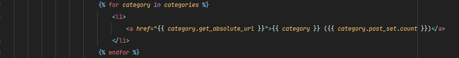
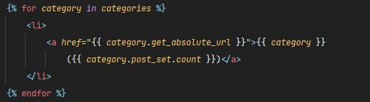
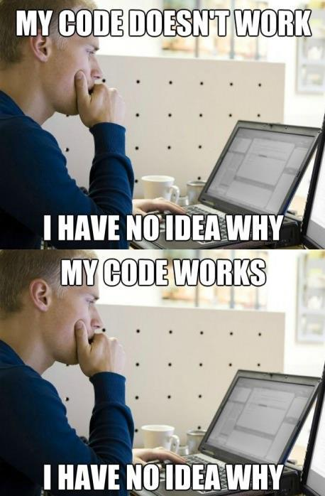
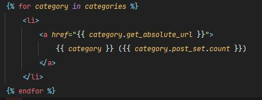

## 🤔문제

  

django 공부를 하던 도중 테스트 코드를 수정하게 되고 그에 맞춰 base.html 코드도 수정할 필요가 있었다. 위와 같이 코드를 적었고, 위의 코드는 현재 들여쓰기가 엄청 많이 사용된 상황. 작은 모니터를 쓰던 난 평소와 같이 당연히 Ctrl+Alt+l을 눌렀다. (Ctrl+Alt+l은 Pycharm의 Reformat and rearrange code이다.)

  

위와 같이 정렬된 것을 보고 "잘 됐네"라고 생각하면서 아무런 의심 없이 지나갔었다. 그 후 처음 테스트를 할 때는 무슨 문제가 있나 생각했지만, 점점 테스트를 할 때마다 FAIL이 뜨는 것을 보며 정신 나갈 거 같았다.

  

진짜 딱 저 유머였다. 자꾸 "아니, 이게 왜 안 돼?"라는 생각만 들면서 테스트 코드도 갈아엎고 html 코드도 읽어보면서 어디가 잘못 됐나 계속 찾아봤다.

<!--truncate-->

## 🚩해결

1시간이 지난 후에야 `<a>`태그가 중간에 나눠진 것을 확인하였고 '에이, 설마'라는 생각에 가장 처음의 코드로 고쳤는데 됐다.

괄호들을 너무 많이 써서 저렇게 정렬된 것을 못 찾고 있던 것이다. 처음 코드로 고치니 잘 돌아가더라...🤦‍♂️

  

위와 같이 코드를 써도 잘 돌아간다. `<a>`태그 안의 내용이 나눠진 채로 정렬되니 이런 문제가 생긴 것이다. 

IDLE가 긴 코드들을 알아서 잘 정리해줄 줄 알았는데 그게 아니었다. IDLE를 너무 믿었나. 예전에 Visual Studio에서도 이런 실수를 한 적이 있었는데, 조심할 필요가 있는 것 같다. 교수님들도 항상 IDLE를 너무 믿지 말라고 하셨는데 그 말이 갑자기 생각난다.