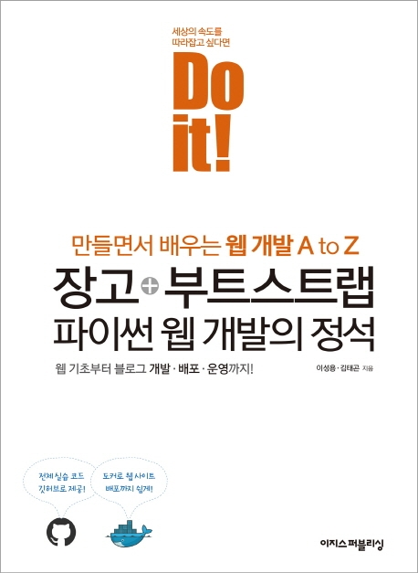

---  
title: "📖 Do it! 장고+부트스트랩 파이썬 웹 개발의 정석"  
date: '2021-06-09'
authors: teddygood
tags: ["Book Review"]
draft: false
slug: '/Do-it-django-bootstrap'
description: 모던 웹을 위한 서버 사이드 자바스크립트의 모든 것

keywords:
  - Django
  - Python
  - Bootstrap
  - Docker
---

## Book Info

:::tip
책 이미지를 클릭하면 교보문고 사이트로 이동합니다!
:::

- 제목: Do it! 장고+부트스트랩 파이썬 웹 개발의 정석
- 저자: 이성용, 김태곤
- 출판사: 이지스퍼블리싱
- 출간: 2021-01-18

{/* truncate */}

## Intro

예전에 멋쟁이사자처럼에 참여하는 분들이 Django를 사용하는 모습을 보고 웹에 대한 초보자도 공부하기 쉬운 스택이구나 싶어서 공부를 시도했던 적이 있었습니다. 그 당시에는 혼자 개발 공부하는 방법을 몰라 Django를 공부하는데 실패했었습니다. 뭐랄까 누군가 가르쳐주는 사람이 있으면 좋겠다는 생각 같이 그저 떠먹여 주길 바랬던 거 같아요. 뭐 어쨌든 그 이후로 Django는 포기했고 다른 스택들을 막 공부했었습니다.

최근에 다시 Django를 공부하기 위해서 '뭘 보고 공부를 해볼까' 고민하던 중 이번 년에 Django 책이 2권 출시가 됐는 걸 알게 됐습니다. 그게 이제 `Do it! 점프 투 장고`와 `Do it! 장고+부트스트랩 파이썬 웹 개발의 정석`이었습니다.

장고 공식 문서, Two Scoops of Django 등 위의 책들 이외에도 선택지는 있었습니다. Two Scoops of Django는 영어라 읽는데 오래 걸릴 거 같아서 읽지 않았습니다. 번역서도 있지만 2016년에 출간된 책이라 예전 버전을 사용할 거 같아서 선택하지 않았습니다. 

결국 위의 Do it! 책들 중 한 권을 읽고자 결심했고 도커를 사용하는 `Do it! 장고+부트스트랩 파이썬 웹 개발의 정석`을 선택했습니다. [점프 투 장고](https://wikidocs.net/book/4223)는 위키북스에도 있어서 참고하면서 읽었습니다.

## Book Review

### 웹 개발, 배포, 운영

이 책은 640 페이지의 은근 두꺼운 책입니다. 'Django 책이 뭐 이렇게 두껍나?'라고 생각하실 수도 있겠지만, 코드도 전부 표기되어 있으면서, 장고도 다루고, 부트스트랩, 배포 부분까지 다 다루는 걸 생각하면 640 페이지가 부족할 정도입니다. 근데 그 모든 걸 책 한 권에 정리해놨다는 것은 정말 대단한 일이라고 생각합니다. 그리고 저는 이 부분이 이 책의 가장 큰 장점이라고 생각합니다.

### 기술 사용

책에서는 블로그를 만든다고 되어 있지만 사실상 커뮤니티를 만듭니다. 로그인 하여서 글을 쓸 수 있으며 댓글 기능도 구현할 수 있습니다. Django를 사용하여 흔히 알려져 있는 CRUD(입력/조회/수정/삭제) 기능을 구현합니다.

#### 프론트

프론트 부분은 HTML, CSS, JavaScript를 필요한 부분들만 알려주고, Bootstrap을 활용하여 간단하게 꾸미는 방법을 알려줍니다. 개인적으로는 Bootstrap보다 최근 프론트 기술인 React를 다뤘으면 더 좋았을 거라 생각하지만 그렇게 되면 책 쪽수가 1000 페이지가 넘어갔을 거 같으니 저자분이 선택을 잘 하신 것 같습니다. 또한, React 같은 경우에는 초보자가 HTML, CSS, JavaScript를 자세히 배우지도 않고 간단하게 공부하기에는 어려우니 필요한 부분만 바로바로 사용할 수 있는 Bootstrap을 선택한 거라 생각됩니다.  

부트스트랩이 현재 버전과 다르므로 최신 버전을 사용하다가는 공식 문서를 보며 공부를 해야할 수 있으니 주의하시길 바랍니다.

#### Git

매 코드에서 무언가 진행 했을 때 GitHub에 commit하고 push합니다. 개인적으로 프로젝트를 하면서 언제 언제 올려야 하는지 알 수 있었기에 꽤 도움이 됐다고 생각합니다.

#### Docker, AWS

저는 이번에 도커를 처음 써보는 것이라 조금 어려운 감이 있었습니다. 이 책에서 Docker를 사용한 배포를 맛보기로 즐기기 좋습니다. 또한, AWS 같은 경우에도 사용하기 편한 Lightsail을 사용합니다. Lightsail은 처음 사용해봤는데 AWS 무경험자도 편하게 사용할 수 있을 거라고 생각합니다. 그리고 한 달은 무료니 걱정할 필요가 없다고 합니다.(저번 AWS 책도 이러다가 결제 됐는데 어떻게 될 지는 저도 모르겠습니다만 뭐 얼마 안 나올테니까 해보시면 재밌을 겁니다.)

#### TDD

테스트 주도 개발이라고 불리는 TDD입니다. 매번 Java하시는 분들이 하시는 얘기만 들었지 실제로 경험은 처음이었습니다. Django에도 TDD가 있다는 사실을 알게 해줬으며 이 책에서 많은 부분을 차지합니다. 매번 기능을 만들기 전에 테스트 코드를 짜서 미리 경험해볼 수 있습니다. 저는 개인적으로 이 부분이 가장 재밌었습니다.

#### Django

가장 중요한 부분이죠. 프로젝트를 만들고 MTV 패턴, FBV, CBV, 다대일 관계, 다대다 관계 등을 구현하고 사용해봅니다. 정말 꼼꼼하게 코드들이 기술되어 있고 코드 하나하나 설명이 잘 되어 있는 모습이 인상 깊었습니다. 또한, Django 개발을 하며 유용하게 쓰이는 다른 패키지들을 알려줍니다. 아쉬웠던 점은 Django REST framework에 대한 내용이 없다는 것입니다. 

### 개념

세부적이지는 않지만 Django에 대해 기본 이상은 알려주는 책이라고 보시면 될 것 같습니다. "만들면서 배우는 웹 개발"이라고 부제에서도 나와있듯이 만들면서 개념들 하나하나를 간단하게 설명합니다. 그렇기에 세부적인 개념 설명에 대해서는 조금 부족하다고 느낄 수도 있습니다. 

위에서도 말했듯이 프로젝트를 진행하는 느낌에서 설명하는 것이기 때문에 가끔 저자분들이 일부러 실수하는 부분이 들어가있기도 합니다. 이런 삽질을 할 수도 있다는 내용을 알려주시고 싶었던 것 같습니다. 근데 이런 부분 이외에도 삽질할 부분이 엄청 많습니다.

가끔 "알아두면 좋아요"라는 부분으로 중요 부분 이외의 개념들도 설명해줍니다. 이런 부분도 읽어보면 재밌었습니다. 

### 삽질

이 책을 읽으면서 했던 걱정 중 가장 큰 것은 `버전이 달라서 삽질하지 않을까?`였습니다. 제가 Django를 처음 공부할 때도 이 생각을 엄청 했었거든요. 어쨌든 결론은 저는 이 책을 읽으면서 배포 부분에서 삽질을 꽤 했습니다. 패키지의 버전도 더 업데이트 됐기도 하고, 도커를 처음 사용해보는 입장이었기 때문이죠. [Do It Django](https://doitdjango.com/) 저자분의 블로그(?)에서 다행히 Q&A를 잘 받아주셔서 잘 해결할 수 있었습니다. 

이번이 책 읽으면서 다른 문서들을 가장 많이 봤던 때였던 거 같습니다. 정말 그 패키지 Repository 들어가서 issue도 읽어보고, 패키지 공식 문서, stackoverflow 등등 가리지 않았던 거 같습니다. 그래서 그런지 이번 책은 읽는데 더 오래 걸렸습니다.

부트스트랩도 이 책은 버전을 4.5인가를 사용하는데 `난 최신 기술을 사용해보고 싶어!`라는 생각에 5.0.1 버전을 사용해봤다가 부트스트랩 공식 문서를 많이 참고하게 됐습니다.

가장 걱정했던 Django는 버전이 달라졌다고 해도 사용하는 부분에서 크게 달라진 것은 없었던 것 같습니다. 

제가 구매한 책은 초판 발행이라 그런지 들여쓰기, 오타가 꽤 있어서 이런 부분에서도 삽질한 것들도 있었습니다. 책을 자세히 보는 입장에서 이런 부분은 조금 아쉬웠습니다. 

## 대상 독자

저 같이 최신 버전을 사용해보시고 싶은 분들이 있으실 수도 있을테니 생활코딩 HTML, CSS, JavaScript를 다 보고 오셨으면 좋겠습니다. 장고를 공부하기 위한 파이썬은 웹 크롤링까지 알고 오시면 더욱 좋겠지만, 필수는 아닙니다. 필수는 함수, 클래스, 상속 등의 파이썬의 기본 개념들은 무조건 알고 있으셔야 합니다. 

파이썬으로 웹 개발을 경험해보고 싶은 분은 이 책을 처음 공부하는 책으로 추천합니다. 빠르게 웹 프로젝트를 개발, 배포, 운영해볼 수 있습니다. 