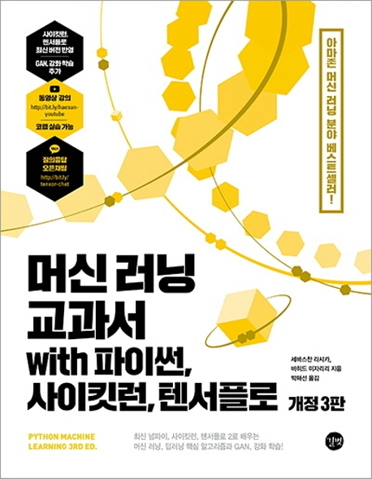

---  
title: "📖 머신 러닝 교과서 with 파이썬, 사이킷런, 텐서플로"  
date: '2021-06-10'
authors: teddygood
tags: ["Book Review"]
draft: false
slug: '/python-machine-learning'
description: 머신 러닝, 딥러닝 핵심 알고리즘부터 GAN, 강화 학습까지!

keywords:
  - Machine Learning
  - TensorFlow
  - Scikit-learn
  - Jupyter Notebook
---

:::info
길벗 ‘15차 개발자 리뷰어’ 활동을 위해서 책을 제공받아 작성된 서평입니다.
:::

## Book Info

:::tip
책 이미지를 클릭하면 교보문고 사이트로 이동합니다!
:::

- 제목: 머신 러닝 교과서 with 파이썬, 사이킷런, 텐서플로
- 저자: Sebastian Raschka, Vahid Mirjalili
- 역자: 박해선
- 출판사: 길벗
- 출간: 2021-03-31

{/* truncate */}

## Intro

이 책은 길벗에서 진행하는 `15차 개발자 리뷰어` 활동에 참여하게 되어 읽게 됐습니다. [페이스북 페이지](https://www.facebook.com/gbitbook/)를 팔로우 하고 있다보니 이런 활동을 알 수 있었습니다. 저는 곧 4학년이 되는 대학생으로써 졸업 작품으로 머신러닝 프로젝트를 해야할 지도 모르는 압박감에 조금이라도 미리 머신러닝에 대해 더 자세히 공부하고 싶었습니다.

이전에 선형대수학, 수치해석, 확률 및 통계 등의 과목에서 저도 모르는 사이에 교수님이 머신러닝 과제를 내주셔서 한참을 헤맸었습니다. 하고 있는 과제가 머신러닝과 관련되었다는 것도 모른채로 억지로 과제를 했던 기억이 나네요. 그 때는 그저 과제하는 것에만 급해서 제대로 공부를 하지 못 했었는데 이 책을 읽으면서 공부를 해보고 싶었기에 이 활동에 신청하게 됐습니다.

다른 책들도 솔직히 다 읽어보고 리뷰도 해보고 싶었습니다. 너무 탐나는 책들이 많았지만 현재 가장 공부해보고 싶었던 건 머신러닝이었기 때문에 이 책을 선택하게 됐습니다. 다른 책들은 언젠가 기회가 되면 리뷰를 하겠죠? 그리고 솔직히 선정될 지는 몰랐는데 막상 되니까 기쁘네요.

## Book Review

### 번역

이 책은 [Python Machine Learning 3rd Edition](https://www.amazon.com/Python-Machine-Learning-scikit-learn-TensorFlow/dp/1789955750)를 번역한 책입니다. 역자는 유명한 머신러닝 관련 책들을 번역하시고 쓰시는 `박해선`님입니다. 박해선님 번역서들을 보면 깔끔한 번역도 장점이 되겠지만, `역주`라는 부분이 도움이 꽤 많이 됩니다. 이 분이 얼마나 세부적으로 번역을 하시는 지 알 수 있는 부분입니다. 이런 각주에 관련된 부분은 사람마다 다르겠지만, 저는 이렇게 세부적으로 알려주는 것이 너무 좋았습니다.

번역된 책이라 머신러닝과 관련된 용어들이 혹시 전부 한국어로 번역되어 있지는 않을까 살짝 걱정은 했지만, 그런 걱정은 전혀 필요없었습니다. 전문 용어 부분에는 전부 굵게 표시되어 있으며 괄호를 이용해서 영어로 다 적혀 있습니다. 이런 세세한 부분도 너무 좋았습니다. 아무래도 머신러닝과 관련된 책들은 영문 문서들을 볼 일이 많을텐데 번역된 용어로 적혀 있었더라면 그 용어가 뭔 지 잘 몰랐을 것입니다. 

요즘 트렌드는 Jupyter Notebook 또는 Colab에서 설명과 함께 실습할 수 있는 코드가 제공된다는 것인데 그런 실습 코드도 한글화된 코드가 제공됩니다. 이런 부분도 번역을 하신 것이 정말 대단하다고 느껴집니다. 

### 개념과 실습

개념과 실습 두 마리 토끼를 다 잡는 책이라고 생각합니다. 868 페이지의 두꺼운 책에서 개념을 설명하며 코드까지 자세하게 나와있기에 책 제목처럼 `교과서`라는 이름이 어울리는 책입니다. NumPy만을 이용하여 바닥부터 알고리즘을 작성해보는 것이 매우 인상 깊었습니다. 

이 책은 각 장이 시작될 때마다 앞으로 무엇을 할 것이라는 것을 설명해 주는 부분들이 있는데 그런 부분에서 저자가 신경을 쓰면서 책을 썼다는 것이 느껴졌습니다. 또한, 알고리즘이 생긴 배경, 알고리즘이 어디에 쓰이는 지 등에 대한 내용도 같이 알려주는 것이 책을 수월하게 읽는 데 도움이 됐습니다. 마냥 어려운 개념들만 설명하는 책이 아니라는 것이죠.

더 세부적인 개념을 원하면 논문 제목을 알려주거나 참고 자료의 링크 또는 제목을 알려주는 부분에서도 저자의 세세함이 느껴졌습니다. 또한, 최근 이슈가 되는 기술들인 GAN, transformer를 다루는 것도 인상 깊었습니다. 

이 책으로도 부족하거나 좀 더 보충하고 싶은 내용이 있으면 역자이신 `박해선`님이 [유튜브에 올리시는 강좌](https://www.youtube.com/playlist?list=PLJN246lAkhQiEc-QvvGzUneCWuRnCNKgU)를 들어보시기 바랍니다. 현재 5장을 올리시고 있으시며 큰 도움이 될 것이라고 생각합니다. 

## 대상 독자

솔직히 말하면 이 분야를 처음 시작하는 분에게는 읽기 어려울 수도 있겠다는 생각이 듭니다. 처음부터 어려운 개념을 흡수하는 것을 좋아하시는 분이면 추천드립니다. 개념들이 어렵지만 자세하지 않은 책은 아닙니다. 좀 더 시간이 걸릴 뿐이죠. 

머신러닝에 대해 잘 모르셔도 괜찮습니다만, 파이썬 라이브러리에 대한 이해도는 어느정도 필요하다고 생각합니다. NumPy, matplotlib, pandas, TensorFlow, Scikit-learn, Scipy 등의 라이브러리가 있습니다. 근데 사실 저도 pandas, Numpy, matplotlib만 조금 쓸 줄 알지 나머지 라이브러리들은 처음입니다. 그렇지만 저처럼 직접 reference를 찾아가면서 공부할 수 있는 정도라면 모르셔도 무난할 거 같습니다.  

또한, 선형대수학, 확률 및 통계, 수치해석 등의 과목을 들어보시거나 머신러닝 알고리즘에 관심이 있으신 분들이라면 재밌게 공부하실 수 있을 것입니다. 이 책의 앞부분인 `실습 후기`를 보면 알 수 있듯이 잘 작동하기 때문에 [머신러닝 교과서 3판 깃허브](https://github.com/rickiepark/python-machine-learning-book-3rd-edition)를 참고하셔서 실습해보시면 많은 도움이 될 것입니다. 이 실습 코드를 사용해보려면 Colab 또는 Jupyter Notebook의 간단한 사용법 정도는 알고 있어야 하겠죠.