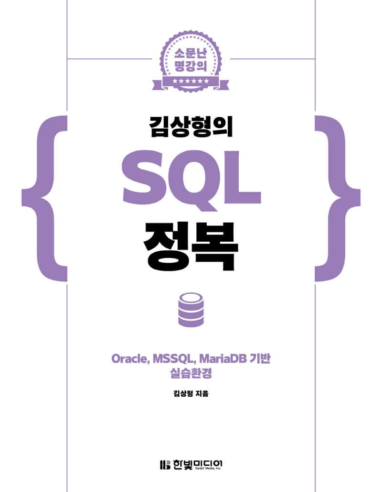

---  
title: "📖 소문난 명강의 김상형의 SQL 정복"  
date: '2021-06-20'
authors: teddygood
tags: ["Book Review"]
draft: false
slug: '/conquest-sql'
description: 머신 러닝, 딥러닝 핵심 알고리즘부터 GAN, 강화 학습까지!

keywords:
  - SQL
  - Oracle
  - MSSQL
  - MariaDB
  - 소문난 명강의
---

## Book Info

    "책을 누르면 교보문고 사이트로 연결됩니다!"

- 제목: 소문난 명강의 김상형의 SQL 정복
- 저자: 김상형
- 출판사: 한빛미디어
- 출간: 2021-05-01

## 이 책을 읽게 된 이유

    "한빛미디어 <나는 리뷰어다> 활동을 위해서 책을 제공받아 작성된 서평입니다."

이번 책은 4월 달과 마찬가지로 SQL을 공부하기 위해서 선택한 책입니다. 저번 `Learning SQL` 책은 MySQL을 기준으로 쓰여진 책이었다면 이번 책은 Oracle 기준으로 작성된 책입니다. Oracle DB는 특히 대기업에서 자주 사용되는 SQL이죠. 그래서 더 궁금했습니다. 매번 MySQL, PostgreSQL만 다뤄보던 저에게는 생소한 SQL이었거든요. 또한, MSSQL, MariaDB와의 차이점도 같이 설명해주니 다른 SQL도 입문하기에 좋다고 생각했습니다. 

## 책 리뷰 

### 저자

이 책의 저자는 [SoEn](http://www.soen.kr/)이라는 사이트를 운영하시는 분입니다.(사이트가 연결이 안 되네요. `soen.kr`입니다.) C/C++ 또는 Windows API를 공부해보신 적이 있으시다면 아실 거라고 생각합니다. 예전에 [Windows API 정복](http://www.kyobobook.co.kr/product/detailViewKor.laf?ejkGb=KOR&mallGb=KOR&barcode=9788979144215&orderClick=LAG&Kc=)이라는 책도 쓰셨던 분이죠. 그렇기에 이번 책을 읽으면서 설명들이 친근하다고 느껴졌습니다. 

### 다양한 종류의 SQL

Oracle DB는 대부분 대기업에서 사용하는 데이터베이스입니다. 그래서 그런지는 잘 모르겠지만, 이 책은 쿼리만을 설명하는 것이 아니라 UI가 이루어진 실습환경을 사용하여 SQL을 실습할 수 있습니다. 또한, Oracle, MSSQL, MariaDB의 3가지 실습환경을 구축해보면서 다양한 종류의 SQL을 경험해볼 수 있었습니다. 원래라면 각각의 SQL마다 책 한 권씩 보면서 공부를 해야하는데 이렇게 차이점만 알려주니 공부하는 입장에서는 너무 편리했었습니다. 

### 개인적으로 아쉬운 점

조금 아쉬웠던 점은 PostgreSQL에 대해서는 거의 언급 수준으로만 나왔다는 것입니다. 최근 스타트업에서는 PostgreSQL의 사용이 점차 늘어나고 있다고 생각합니다. 그렇기에 `MariaDB 대신 PostgreSQL이 설명되었다면 더 좋지 않았을까?`라는 아쉬움을 남습니다.

## 대상 독자

SQL을 정석으로 공부해보시고 싶은 분 또는 다양한 종류의 SQL을 경험해보시고 싶으신 분께 추천드립니다. 또한, 대기업에서만 주로 사용되는 Oracle DB에 대해 궁금하셨던 분 그리고 사용해보시고 싶은 분들께 추천드립니다. 