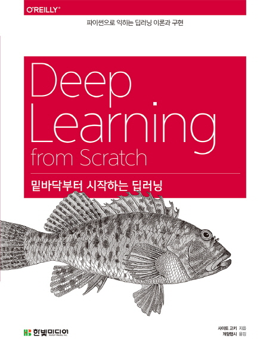

## Book Info

:::tip
책 이미지를 클릭하면 교보문고 사이트로 이동합니다!
:::

- 제목: 밑바닥붙터 시작하는 딥러닝
- 저자: Koki Saitoh(사이토 고키)
- 역자: 개앞맵시
- 출판사: 한빛미디어
- 출간: 2017-01-03

<!--truncate-->

## Intro

벌써 이 책이 출간한 지 4년이 됐다. 대학에 입학하고 파이썬을 처음 공부해보기 시작할 때 이 책을 알게 됐었다. 한창 딥러닝이 뜨고 있었고, 내가 알파고 같은 인공지능을 만들 수도 있다는 사실에 인공지능을 공부해보고 싶었다. 그러나 학교 수업을 따라가면서 과 생활을 하기에 바빴고, 선형대수학도 공부해본 적이 없었기에 읽는 것을 포기했었다. 시간이 지나고 3학년(사망년)이 끝난 이후 드디어 여유가 생겨 읽게 됐다.

## Book Review

### 딥러닝 입문하기 좋은 책

책을 판매하는 각종 온라인 서점 사이트를 들어가서 컴퓨터 서적 베스트셀러 랭킹을 보면 이 책은 꼭 한 자리를 차지하고 있다. 4년이나 된 책이 아직도 있다는 것은 그만큼 설명이 잘 되어 있고, 좋은 책이라고 인정받은 것이 아닐까. 딥러닝이 뜨기 시작하고 꽤 시간이 지난 지금, 딥러닝을 주제로 하는 책은 매우 많이 출간됐다. 그러나 나는 아직도 그 많은 책 중 이 책만큼 딥러닝 입문에 좋은 책은 없다고 느낀다.

또한, 다른 평범한 딥러닝 책과 다르게 돋보이는 점도 있다. TensorFlow, PyTorch 같은 라이브러리를 사용하지 않고 NumPy를 사용하여 밑바닥부터 파이썬과 넘파이로 구현을 한다는 것. 제목 그대로다. 텐서플로나 파이토치 같은 라이브러리를 사용하며 딥러닝 공부를 하는 것이 아닌, 밑바닥부터 구현하여 기억에 더 오래 남게 한다. 

또 다른 책들과 대비되는 점은 주피터 노트북을 사용하는 것이 아닌 파이썬 파일을 만든다는 점이다. 물론 주피터 노트북을 써도 코드는 돌아간다. 그러나 파이썬 파일 안에서 객체 지향적으로 구현해볼 수 있는 경험을 할 수 있었다. 나는 이런 부분이 너무 마음에 들었다.

### 참고 문헌

논문 같이 참고 문헌이 깔끔하게 다 정리되어 있다. 난 이게 엄청난 장점이라 생각했지만 편한 것만 바라는 독자에게는 불편할 수도 있겠다는 생각이 들었다. 보통 책에서 하나하나 꼼꼼히 설명해주는 것을 원하는 독자들이 많다. 그러나 이 책은 그들에게는 불편한 책일 것이다. 자세히 설명해주긴 하나, 좀 더 심화적인 부분은 직접 참고문헌을 보고 추가로 더 공부해야 한다. 즉, 논문에 익숙하지 않은 사람은 조금 읽는 데 오래 걸릴 수도 있다. 그러나 나에게는 이 책을 읽은 후에 더 공부할 것을 알려주는 느낌이라 좋았다.

### 앞으로의 공부

CHAPTER 8에서는 구현과 관련된 내용은 없으며 딥러닝에 대한 전반적인 설명이 기술되어 있다. 이 부분에는 다음 공부를 위한 키워드를 제시하고 있다. 이런 파트가 없었더라면 앞으로 딥러닝을 어떻게 활용할지, 어떤 분야를 더 자세히 공부할지 고민인 독자들이 많을 것이라 생각된다. 너무 도움이 되는 부분이다. 딥러닝에서 한 번쯤 볼 듯한 키워드는 대부분 있으니 꼭 구글링을 해보는 것을 추천한다.

## 대상 독자

딥러닝에 관심이 있다면 꼭 읽어보길 추천한다. 밑바닥부터 구현도 경험할 수 있고, 전반적인 컴퓨터비전의 기초 공부가 될 수 있을 것이다. 입문용으로도 꽤 추천한다. 언제까지나 쉬운 책만을 볼 수 없으니 꼭 도전해보길 바란다. 보통 오래 된 책은 읽지 않는 것을 추천하나 이 책은 출간된 지 꽤 됐어도 너무 좋은 책이었다.