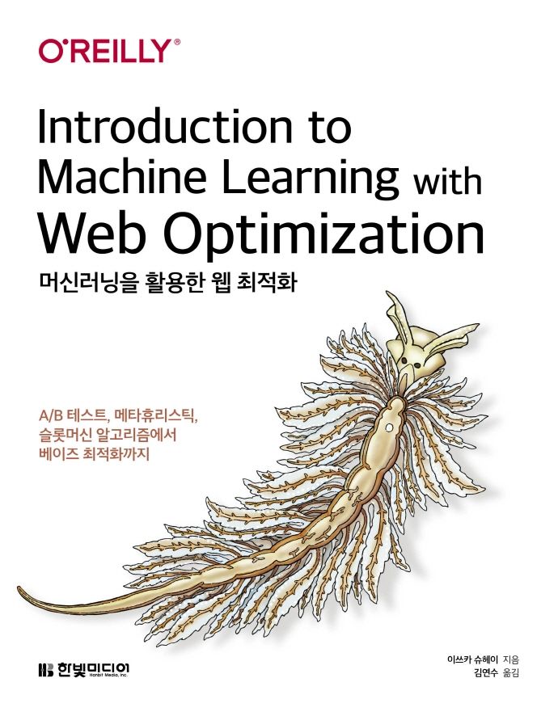

---  
title: "📖 머신러닝을 활용한 웹 최적화"  
date: '2021-07-22'
authors: teddygood
tags: ["Book Review"]
draft: false
slug: '/ml-with-web-optimization'
description: A/B 테스트, 메타휴리스틱, 슬롯머신 알고리즘에서 베이즈 최적화까지

keywords:
  - 확률
  - 통계
  - A/B 테스트
---

:::info
한빛미디어 \<나는 리뷰어다\> 활동을 위해서 책을 제공받아 작성된 서평입니다.
:::

## Book Info

:::tip
책 이미지를 클릭하면 교보문고 사이트로 이동합니다!
:::

- 제목: 머신러닝을 활용한 웹 최적화
- 저자: Shuhei Iitsuka(이쓰카 슈헤이)
- 역자: 김연수
- 출판사: 한빛미디어
- 출간: 2021-06-07

{/* truncate */}

## Intro

머신러닝에 `확률과 통계`는 꼭 필요한 수학 중 하나라고 생각합니다. 그렇기에 머신러닝 분야를 좀 더 자세하게 공부하기 위해서 대학에서도 `확률과 통계` 수업을 듣기도 했고 개인적으로 책을 보며 따로 공부하기도 했었습니다. 그렇기에 이 책을 읽기에는 충분히 읽을 수 있다고 생각했습니다.

또한 이 책의 부제에는 `A/B 테스트`라는 키워드가 있습니다. 최근에 저는 웹 백엔드와 데이터 분석 쪽을 공부하고 있기에 A/B 테스트에 대해 더 세부적으로 공부해보고 싶었습니다. 또한, 이 책은 제가 머신러닝을 배우면서 공부했던 내용들을 웹 최적화에 도입해볼 수 있다는 점이 저에게 너무 매력적으로 다가왔기에 꼭 읽어보고 싶었습니다.

## Book Review

### 웹 최적화

저는 머신러닝을 공부하면서 다양한 기초 지식들을 공부했었습니다. 이 책은 기초적인 확률과 통계 지식, 최적화 이론 등의 내용들을 어디에 사용할 수 있는지 알려줍니다. 지금까지 온갖 책, 강의 등에서 공부했던 내용들을 응용하는 책입니다. 이론적인 내용보다는 `웹 최적화라는 것을 어떻게 머신러닝으로 적용했을까`에 더 가깝습니다. A/B 테스트를 예시로 들어가면서 베이즈 정리를 활용해 A안과 B안 중 어느 것이 더 좋은가를 알려주는 등의 웹 최적화에 관한 예시들을 제시합니다. 응용에만 너무 가깝다고 해서 이론적인 내용들이 없는 것은 전혀 아닙니다. 필수적인 알고리즘, 확률과 통계 지식들은 적절하게 잘 설명되어 있습니다. 개인적으로 Chapter 7 베이즈 최적화가 가장 어려우면서 흥미 있게 봤던 부분이었습니다. 

### 부록

이 책의 끝을 보면 부록이 있습니다. 부록에서는 책에서 설명했던 계산들을 이해하기 위해 꼭 필요한 연산들이 설명되어 있습니다. 혹시나 책을 읽으시면서 어려운 점이 있으시다면 부록을 참고하시면 될 것 같습니다. 책을 읽기 위해 최소한의 정보가 있기 때문에 만약 서점에서 이 책을 사시는 분들이 있으시다면 부록을 먼저 보시고 이 정도는 이해하실 수 있다고 판단이 된다면 구매하시는 걸 추천드립니다.

### 코드

코드는 주피터 노트북으로 주어집니다. 이 책에서는 모든 샘플 코드는 구글 콜랩 상에서 실행하는 것을 가정하고 있다고 되어 있습니다. 이런 부분은 공부하는 입장에서 너무 편하고 좋았지만 가장 아쉬웠던 점은 예제 코드가 딱 한 파일으로 되어 있기 때문에 보기 어려웠습니다. 각 Chapter 별로 나뉘어져 있었으면 좀 더 실행하기 편리했을 것 같았는데 하나하나 다 실습해보는 독자로써 너무 아쉬웠습니다.

### 대상 독자

- 통계학 또는 머신러닝에 입문하고자 하는 웹 엔지니어
- 웹 마케팅 관련 담당자, 웹 마케터
- 머신러닝 응용, 특히 사람과의 상호 작용에 대한 응용에 흥미가 있는 분

제가 추천하지 않아도 이 책에 대상 독자가 위처럼 기술되어 있습니다. 근데 솔직히 이 책이 쉬운 책이 아니라 최소 통계적인 지식이 어느정도 있으신 분이 읽으셨으면 좋겠습니다. 슬롯머신 알고리즘, 베이즈 정리, 회귀 등 꽤 어려운 내용들이 많기에 머신러닝도 먼저 공부해본 분들에게 추천드립니다. 책 제목부터 머신러닝을 `활용한` 웹 최적화입니다. 꼭 사전 지식이 있으신 분들이 읽으시길 바라겠습니다.
