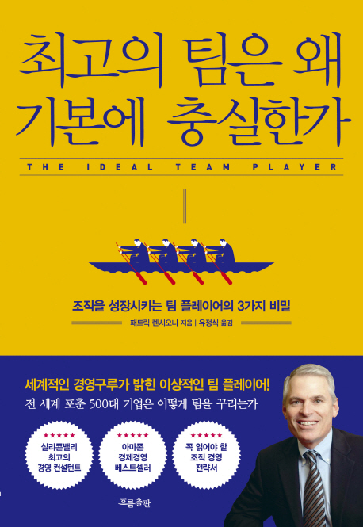

---  
title: "📖 최고의 팀은 왜 기본에 충실한가"  
date: '2021-08-20'
authors: teddygood
tags: ["Book Review"]
draft: false
slug: '/the-ideal-team-player'
description: 조직을 성장시키는 팀 플레이어의 3가지 비밀

keywords:
  - 기업 문화
  - 조직 문화
  - 성장
---

<!-- truncate -->

## Book Info

:::tip
책 이미지를 클릭하면 교보문고 사이트로 이동합니다!
:::

- 제목: 최고의 팀은 왜 기본에 충실한가
- 저자: Patrick M. Lencioni(패트릭 렌시오니)
- 역자: 유정식
- 출판사: 흐름출판
- 출간: 2018-08-24

## 이 책을 읽게 된 이유

최근 한 기업의 채용공고를 보면서 그 기업의 노션 페이지를 볼 수 있었습니다. 그 페이지에는 그 기업의 필독 도서 페이지가 따로 있더라고요. 마침 최근 개발 관련 독서만 해서 다른 주제의 책들도 읽어보고 싶다는 생각을 했었습니다. 그 페이지에는 스타트업, 인간 관계 등 스타트업에 다니고 있는 사람이면 도움이 많이 될 것 같은 책들을 소개해줬습니다. 10권의 책들 중 뭘 읽을까 고민이 되더라고요.

첫 번째로 고려한 점은 일단 **도서관에 책이 있는가**였습니다. 사려면 배송되는 시간도 꽤 걸리고 돈이 지출되니까요. 두 번째로 고려한 점은 **지금 이 책이 나에게 도움이 되는가**였습니다. 다양한 스타트업의 채용 공고를 읽으면서 제가 느낀 점은 **다양한 기업들의 문화들에 대해 좀 더 알아봐야 할 필요가 있다는 것**이었습니다. 분명히 스타트업들은 물론 개발을 잘하는 사람을 원하기도 하지만, 문화를 중요시하는 기업들도 있을 테니까요. 이 밖에도 한 권, 한 권 고르는 것에 대해 다양한 이유가 있었지만 글이 길어지므로 적지 않겠습니다.

## 책 리뷰

### 모델

이 책에서는 제시하는 모델이 있습니다. **겸손, 갈망, 영리함** 이 세 가지 자질을 벤 다이어그램으로 되어 있는 형태입니다. 저 단어들을 하나하나 단순하게 해석하면 안 된다고 생각합니다. 세부적인 개념들이 숨겨져 있으므로 이 책의 뒷부분인 2부에 이론을 읽어보시고 자신과 빗대어 성찰해보시면 도움이 될 것 같습니다. 이 자질들은 팀원, 리더 모두에게 도움이 될 거라고 생각됩니다.

**이 세 가지의 자질이 반드시 핵심가치여야 하는가?**라는 질문을 한다면 핵심가치일 필요는 없다고 말해주고 싶습니다. 각 기업마다 생각이 다를 것이고 팀마다 생각이 다를 것이니까요. 그렇지만 팀워크가 필요하고, 팀으로써 조직으로써 성장을 원한다면 아니, 좀 더 바라봐서 성공까지 바란다면 이런 덕목이 필요하지 않을까 싶습니다. 

2부 이론 부분에서는 덕목을 가진 사람들에 대해 설명도 해줍니다. 덕목을 가진 모든 경우의 수에 대해 설명하니 도움이 많이 될 것이라고 생각됩니다. 응용도 있습니다. 신규 직원을 채용할 때의 질문, 기존 직원 평가할 때의 질문, 하나 이상의 덕목이 부족한 직원이 있을 때는 어떻게 생각하고 개발해야되는가 등을 자세히 설명해줍니다. 이 모델을 도입하고 싶은 분이라면 상당히 도움이 될 것입니다.

### 스토리텔링

이 책의 특징 중 하나라고 말할 수 있습니다. 비문학으로 쓰인 책이 아니라 스토리가 있는 책이며 스토리를 통해 이 책에서 제시하는 모델을 설명하고 있습니다. 단순히 비문학이 아니기에 읽으면서 상당히 재밌다고 느꼈습니다. 스토리와 책에서 나오는 주인공들이 있기에 그들의 관계를 보면서 모델을 좀 더 쉽게 이해할 수 있었습니다.

간단하게 설명해보면 '제프'라는 주인공이 삼촌인 '밥'의 건설업계를 어쩔 수 없이 경영하게 되는 스토리입니다. 기업에 현재 상황, 문제를 파악하고 필요한 인재를 채용하게 되죠. 이 과정 속에서 어떻게 위의 모델로 평가하고 모델이 어떤 개념인지 알 수 있습니다. 더 자세한 내용이 궁금하시면 책을 읽어보시기 바랍니다. 

## 대상독자

위에서 대략적으로는 다 설명한 거 같은데 마지막으로 정리해보겠습니다. 개인적인 생각으로 이 책을 읽으면서 '아 나는 이걸 핵심가치로 삼고 조직에 꼭 도입해야겠다!' 이런 생각은 안 하셨으면 합니다. 좋은 가치들이긴 하지만 억지로 도입할 필요는 없을 거라고 생각합니다. 팀원들과 많이 상의하고 토론해본 후에 모두가 동의한다면 그 때 도입하는 것은 괜찮겠죠. 당연히 이렇게 생각하시길 바라겠습니다.

어쨌든 이게 중요한 게 아니고 전 이 책을 **조직 문화들을 간접적으로 경험해보고 싶은 사람, 그리고 이들은 어떤 사람을 채용하길 원하는가에 대해 궁금한 사람**이 읽어보셨으면 합니다. 기업들의 인재상은 모두 다릅니다. 어떤 기업은 인재상을 사이트에 올려놓기도 합니다만, 자신이 직접 추리를 해야하는 곳들이 대부분일 것이라고 예상됩니다. 전 추리를 해보기 위해서는 데이터가 많이 필요하다고 생각하며, 이 책은 그런 데이터를 쌓기 위해서 읽어보면 재밌을 책이라고 생각합니다. 

또한, 기업 문화, 조직 문화에 관심이 많으신 분들께도 추천드립니다. 읽어서 시간 낭비하고 후회되는 책은 절대 아니라고 생각합니다. 

