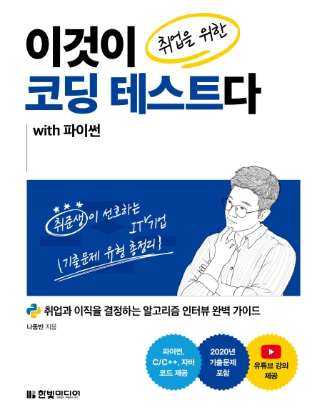

---  
title: "📖 이것이 취업을 위한 코딩 테스트다 with 파이썬"  
date: '2021-08-21'
authors: teddygood
tags: ["Book Review"]
draft: false
slug: '/coding-test-with-python'
description: 취업과 이직을 결정하는 알고리즘 인터뷰 완벽 가이드

keywords:
  - 코딩 테스트
  - 알고리즘 인터뷰
  - 취업
---

# Book Info

`책을 누르면 교보문고 사이트로 연결됩니다!`

- 제목: 이것이 취업을 위한 코딩 테스트다 with 파이썬
- 저자: 나동빈
- 출판사: 한빛미디어
- 출간: 2020-08-05

## 서론

    "한빛미디어 <나는 리뷰어다> 활동을 위해서 책을 제공받아 작성된 서평입니다."

요즘 취업 준비생들에게는 기업에 들어가기 위해서는 코딩 테스트가 필수가 되어 버렸습니다. 코딩 테스트를 안 보는 기업들도 존재하지만 대부분의 기업들이 코딩 테스트를 쳐서 면접 전에 채용 과정에서 사람들을 거르는 시험이 되어 버렸습니다. 예전이었다면 종만북을 사서 혼자 열심히 끙끙 되면서 공부했을텐데 요즘에는 취업을 위한 코딩 테스트를 준비하는 책이 나와 공부할 수 있는 리소스가 많아 다행이라 생각합니다.

특히 코딩을 공부하시는 분이라면 한 번쯤은 유튜브에서 봤을 분인 나동빈님이 이 책의 저자셔서 반가웠습니다. 저는 코딩 테스트 준비를 C++로 해서 '이 책을 읽을 기회는 없겠구나' 싶었는데 이렇게 좋은 프로그램에 참여하고 있어서 읽을 수 있는 기회가 생겼습니다. 예전부터 [유튜브 강의 영상](https://www.youtube.com/c/dongbinna/videos)도 보고 [안경잡이개발자 블로그](https://ndb796.tistory.com/)도 많이 보면서 참고했었습니다. 이 분을 모르신다면 들어가서 구경해보세요. 코딩을 공부하시거나 입문하시고 싶은 분들에게 추천드립니다.

또한, 이 책은 한빛미디어의 <이것이> 시리즈입니다. 예전에 이것이 우분투 리눅스다를 보고 우분투를 공부했던 기억이 있는데 이렇게 표지도 바뀌고 멋있게 재탄생한 시리즈 같아서 매우 반가웠습니다.

## 책 리뷰

### 최신 코딩 테스트 분석

일반적인 알고리즘 문제 풀이를 위한 책이 아니라 이 책은 취업을 위한 코딩 테스트를 준비할 수 있는 책입니다. 취업 준비를 위해서는 고등학생 때 기출을 풀고, 어떤 문제가 나올지 분석했듯이 코딩 테스트에서도 어떤 문제 유형이 나올지 생각해볼 필요가 있습니다.

이 책에서는 그간 16~20년 동안의 다양한 기업들의 코딩 테스트 기출문제 유형들을 분석하여 코딩 테스트를 어떻게 준비할 지 방향을 잡아주며 최신 경향을 알려주기도 합니다. 부록에는 카카오, 삼성전자 기출문제가 주어지기도 하죠. 특정 기업을 목표로 하는 분들에게는 상당히 도움이 될 것이라고 생각합니다.

### 채용 가이드

이 책은 일반적인 알고리즘 코딩 테스트를 준비하는 책이지만, 전반적인 취업에 대한 가이드도 해주는 책입니다. 비록 특정 개발 직군에 대해 세부적으로 면접 준비를 할 수 있도록 도와주는 것은 아니지만, 코딩 테스트를 준비하고 혹시 모를 그 다음의 면접까지 대비하기 위한 내용들을 설명해줍니다. 예를 들어 대부분의 기업들의 일반적인 채용 프로세스, 기술 면접의 대표적인 유형, 기술 면접 준비하는 방법 등 기술 면접을 준비하기 위해 어떤 부분들을 공부하고 대비해야 할 지 알려줍니다. 

### 매우 친절한 책

제목을 보면 알 수 있듯이 이 책은 Python으로 설명되어진 책입니다. 그러나 이 책은 C++, Java로 작성된 소스코드도 [깃허브](https://github.com/ndb796/python-for-coding-test)에 제공이 됩니다. 언어 자체는 아무래도 코딩 테스트에서 수단에 불과하므로 혹시 다른 언어로 공부해보고 싶은 분들을 저자분께서 배려해주신 것 같습니다. 꽤 많은 코드들이었는데 다양한 언어로 소스코드를 제공해주신 것 정말 대단하다고 생각됩니다.

이 책이 친절한 이유는 이것뿐만이 아닙니다. 유튜브에서 강의도 제공됩니다. 강의에서는 Python 코드만 설명하는 것이 아니라 C++, Java 코드에 대해서도 간단하게 설명하므로 들어보시면 도움이 많이 될 것이라 생각합니다. 특히 전 코딩테스트 바로 전 날에 벼락치기로 동빈님의 이코테 영상 몰아서 봤었습니다. 

## 부록과 좋은 내용들

학습 순서, 이 책으로 학습 하는 방법 등 저자가 취업 준비생분들에게 도움이 될 만한 것들은 모두 넣으셨습니다. 그렇기에 책의 구성이 매우 좋다고 말할 수 있습니다. 파이썬에 익숙하지 않은 분들을 위한 간단한 파이썬 문법도 부록으로 주어져 쉽고 빠르게 파이썬을 공부할 수 있습니다. 

요즘 코딩 테스트들은 일반적인 알고리즘 문제만 풀 줄 알아서는 안 됩니다. 물론 기업마다 다를 수는 있습니다만 대부분의 유명한 기업들은 개발형 코딩 테스트 문제도 있습니다. 또는, 화상 면접에서 이런 부분들을 갑작스럽게 해보라고 제시할 수도 있죠. 이 부분에 대해서도 자신이 지원하는 직군마다 어떤 문제가 나올지 모르지만, 이 책의 부록에서는 개발형 코딩 테스트도 간단하게 다룹니다. 카카오 코딩 테스트에 나왔던 REST API 호출, JSON format 데이터 파싱을 알려줍니다. 개념부터 직접 파이썬으로 코딩하는 부분이 나오니 참고하시면 좋을 것 같습니다. 

## 대상 독자 

'이 책 한 권으로 코딩 테스트를 만점 받고 면접으로 넘어갈 수 있다' 이건 장담 못 하겠습니다.  코딩 테스트에는 어떤 문제가 나올지 모르고 자신의 컨디션에 따라 점수는 언제든지 달라질 수 있기 때문이죠. 그러나 이 책을 보면 코딩 테스트 준비를 대략 절반 이상은 할 수 있다고 생각합니다.

개발 직군으로 이제 막 취업을 준비하시는 취업 준비생들이 읽으셨으면 좋겠습니다. 이 책에는 취업 준비를 위해 많은 것들이 담겨 있습니다. `이런 걸 예전에 미리 알았으면 좋았을텐데`라고 생각이 드는 정보들이 매우 많습니다. 사람이 책을 읽는 이유 중 하나는 다른 사람들의 경험, 자신에게 도움이 되는 정보들을 더 빠르게 습득하기 위해서라고 생각합니다. `정말 예전에 이런 정보들을 알았더라면 좀 더 빠르게 취업 준비를 해볼 수 있었지 않았을까?`라는 생각이 들 정도이니 취준생이 아니더라도 컴공 학부생이라면 미리 읽어보시는 것을 추천드립니다.