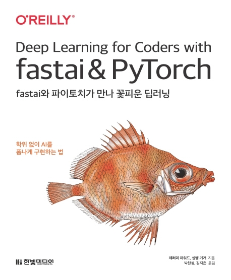

---  
title: "📖 fastai와 파이토치가 만나 꽃피운 딥러닝"  
date: '2021-09-19'
authors: teddygood
tags: ["Book Review"]
draft: false
slug: '/fastai-and-pytorch'
description: 박사 학위 없이 AI를 폼나게 구현하는 법

keywords:
  - PyTorch
  - fastai
  - 딥러닝
---

:::info
한빛미디어 \<나는 리뷰어다\> 활동을 위해서 책을 제공받아 작성된 서평입니다.
:::

## Book Info

:::tip
책 이미지를 클릭하면 교보문고 사이트로 이동합니다!
:::

- 제목: fastai와 파이토치가 만나 꽃피운 딥러닝
- 저자: Jeremy Howard, Sylvain Gugger
- 역자: 박찬성, 김지은
- 출판사: 한빛미디어
- 출간: 2021-08-10

{/* truncate */}

## Book Review

### 풀컬러

다른 분들의 리뷰들을 보시면 아시듯이 이 책은 풀컬러입니다. 정말 별 거 아니지만 이런 번역서들을 풀컬러로 만나면 기분이 그렇게 좋더라고요. 또한, 720p라는 두꺼운 책인데도 불구하고 풀컬러로 인쇄한 출판사가 정말 대단하다고 느껴집니다. 덕분에 시각적으로도 편하게 볼 수 있었습니다.

### TIP

이 책의 저자 2명과 함께 Alexis Gallagher라는 사람이 수학과 공학적 배경지식이 적거나 실제로 코딩 경험이 없는 사람들을 위한 TIP을 알려줍니다. 각 분야에 대한 멘토가 나와서 한 번씩 조언해주고 알려주는 느낌입니다. 매우 도움이 됐습니다.

### 하향식

일반적인 머신러닝, 딥러닝 책이었다면 밑바닥부터 무언가를 구현하여 하나하나 단계를 올라가는 느낌인데 이 책은 다릅니다. 이 책은 top-down(하향식)으로 쓰여진 책입니다. 일반적인 강의 또는 책과는 정반대의 방식이기 때문에 딥러닝에 대한 사전 지식이 있으면 좀 더 읽기 쉬울 것 같습니다.

처음부터 모델을 만들어보고 사용해보는데 이런 과정 속에서 모든 개념들을 이해하기는 어렵습니다. 이러한 초반부에서는 그저 딥러닝에 대한 흥미를 느끼는데 목표를 갖기를 바랍니다. 후에 내부적으로 어떻게 작동되는지 설명합니다. 

### 개발 환경

이 책은 Jupyter Notebook을 사용합니다. 그러나 이런 환경을 구성하는 방법까지 자세히 알려주지는 않습니다. 그렇기에 자신이 환경을 구성할 줄 알아야 합니다. 전 GPU가 매우 좋지 않기 때문에 구글에서 제공하는 [Colab](https://colab.research.google.com/)을 사용했습니다. 근데 전 Colab Pro를 사용했는데 왜 저자의 환경에서 코드를 실행시키는 것보다 더 오래 걸리는지 아직도 잘 모르겠습니다.

저처럼 GPU가 좋지 않다면 Colab 사용 방법도 알아야겠죠. 책에서는 자세히 설명되어 있지 않지만 [fast.ai course](https://course.fast.ai/start_colab)에서 Colab을 사용하여 코드를 사용하는 방법을 알려줍니다. 

### 질문지(Questionnaire)

각 장이 끝날 때마다 질문지가 주어집니다. 개인적으로 전 이 질문지가 독특하다고 느꼈고 정말 도움이 많이 됐습니다. 이 질문지는 각 장을 공부하기 전에 먼저 읽어도 좋고 한 장을 다 읽고 후에 복습용으로 읽어봐도 좋습니다. 사전에 읽으면 어떤 부분에 집중할 지 미리 알 수 있고 공부한 후에 읽으면 자신이 제대로 공부했었는지 지식을 점검할 수 있겠죠. 책을 잘 읽었다면 대부분의 질문들은 대답할 수 있을 것입니다. 그래도 질문지의 정답을 모르면 [Fastbook questionnaire solutions - fast.ai forum](https://forums.fast.ai/t/fastbook-questionnaire-solutions-megathread/76955)에서 solution이 주어지니 참고하시면 좋을 것 같습니다. 나중에 기회가 된다면 블로그에 질문지에 대한 솔루션을 올려볼 예정입니다.

## 대상독자

책에서는 1년 정도의 코딩 경험, 고등학교 이상의 수학 과정을 마친 사람을 대상으로 합니다. 그러나 전 이 책을 읽기 전에 추가적으로 파이썬, PyTorch, 조금의 딥러닝 지식이 있으면 책을 읽는 데 더 편할 것이라고 예상됩니다. 

전 딥러닝이 공부하기 어려운 이유가 '다양한 개념들과 기초 지식들'이라고 생각합니다. 개념을 세부적으로 다 설명해줘도 갑자기 무수히 많은 개념들이 등장하면 머리가 혼란스러워집니다. 또한, 딥러닝을 공부하기 위해서 기초 지식이 충분하지 않다면 이해하기 어려울 수도 있다고 생각합니다. 그렇기에 이 책을 읽을 때 빠르게 읽기 보다는 천천히 시간적 여유를 두고 이해하면서 읽으시는 걸 추천드립니다.
