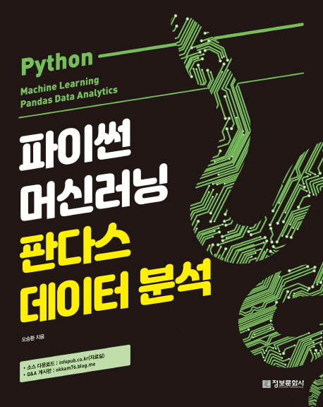

---  
title: "📖 파이썬 머신러닝 판다스 데이터 분석"  
date: '2021-09-27'
authors: teddygood
tags: ["Book Review"]
draft: false
slug: '/pandas-data-analysis'
description: .

keywords:
  - pandas
  - Machine Learning
  - Data Analysis
---

<!-- truncate -->

## Book Info

:::tip
책 이미지를 클릭하면 교보문고 사이트로 이동합니다!
:::

- 제목: 파이썬 머신러닝 판다스 데이터 분석
- 저자: 오승환
- 출판사: 정보문화사
- 출간: 2019-06-15

## 책 리뷰

### 왜 판매량이 많은가?

전 주로 어떤 책을 읽거나 살 때 그 책의 판매량을 참고합니다. 교보문고에서의 판매량은 다른 책이 더 많은 거로 정렬됐지만, yes24에서는 판매지수가 10,524로 판다스라고 검색했을 때 가장 높았습니다. 정보문화사라는 출판사는 제가 이 책을 포함하여 두 번째로 읽어봅니다. 자주 보지 못한 출판사지만 판매량이 많다는 점에서 이 책이 너무 궁금했습니다. 

전 pandas를 필요할 때마다 공식문서를 보거나 유튜브에서 강의를 찾아보면서 공부한 케이스입니다. 막 띄엄띄엄 공부하다 보니까 pandas를 책으로 한 번 제대로 공부해보고 싶었습니다. 마침 이 책이 pandas, matplotlib, seaborn 등 다양한 라이브러리를 알려주는 것 같아서 선택했습니다. 이 책 말고도 `데이터 사이언스 스쿨`, `파이썬 라이브러리를 활용한 데이터 분석` 등의 좋은 책들도 있습니다. 다른 책들도 나중에 읽어볼 예정입니다.

### 예제가 많은 책

예제가 꽤 많다고 느꼈으며 그렇기에 초보자들이 공부하는데 크게 어려움이 없을 것이라고 생각합니다. 예제에서 좀 아쉬웠던 점은 Jupyter Notebook으로 실습하는 환경으로 작성된 것이 아니고 일반적인 Python 파일이었다는 점입니다. 물론 Python으로도 돌아가겠지만 'Jupyter Notebook 형식으로 하나하나 보여줬다면 어땠을까'라는 아쉬움이 남습니다. 

### 시각화 라이브러리

matplotlib, seaborn을 오랜만에 다시 복습할 수 있다는 점이 좋았습니다. 또한, Folium 라이브러리를 사용하여 지도를 시각화한다는 것도 재밌었습니다. 데이터를 분석하는 과정이나 머신러닝 모델을 만들 때 어떻게 활용할지 알려줍니다. 

### 머신러닝 맛보기

머신러닝 모델을 만들어보는 과정을 보여줍니다. 모델을 직접 만드는 과정에서 pandas가 어떻게 쓰이고 다른 시각화 라이브러리들이 어떻게 쓰이는 지 보여주는 것은 매우 좋았으나, 아쉬웠던 점은 머신러닝 부분으로 들어가고 심화적인 부분으로 들어가서 그런지 세부적인 설명은 생략되어 있습니다. 차라리 KNN, SVM 같은 어려운 알고리즘은 제외하고 쉬운 알고리즘으로 만들어진 ML 모델을 만들어보는 과정을 소개했다면 처음 공부하시는 분들에게 읽는데 더 편했을 것이라 생각합니다. 

## 대상독자

파이썬을 공부한 후 데이터 분석을 해보고 싶은데 뭘 공부해야 할 지 감이 안 잡히는 사람에게 추천드립니다. 이 책은 392 페이지로 다른 데이터 분석 책들과 비교하면 부담이 덜 한 책입니다. pandas만 공부하는 책은 아니므로 전반적인 데이터 분석을 해보고 싶은 분들께 추천드립니다. pandas만 공부하시고 싶으시다면 [pandas 10분 완성](https://dataitgirls2.github.io/10minutes2pandas/) 문서를 읽으시는 걸 추천드립니다.