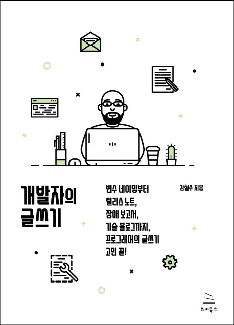

<!-- truncate -->

## Book Info

:::tip
책 이미지를 클릭하면 교보문고 사이트로 이동합니다!
:::

- 제목: 개발자의 글쓰기
- 저자: 김철수
- 출판사: 위키북스
- 출간: 2019-10-04

## Book Review

자세한 코드들을 보여주면서 다양한 경우에 대해 이해가 잘 되도록 설명해줍니다. 또한, 대부분의 내용들에 예시 또는 사례가 있기에 독자 입장에서 책 읽기 매우 수월했습니다.

제목이 *개발자의 글쓰기*라 이 책에서 말하는 *글쓰기*가 뭔지 궁금했었는데 읽고 나서 알게 됐습니다. 이 책에서 *글쓰기*란 일반적인 비즈니스 글쓰기가 아닌 정말 *개발자를 위한 글쓰기*를 말합니다. 개발하면서 필요한 글, 문장 등을 어떻게 쓸 지에 대해 설명합니다. 평소 개발하면서 어렵게 생각하는 변수 네이밍, 주석, 에러 메시지 등 생각하기 힘든 것들 좀 더 편하게 고려해볼 수 있도록 도와주는 책입니다. 

### 사용자(독자) 입장에서 글쓰기

이 책에서 개발자의 관점과 독자의 관점은 다르다는 것을 강조합니다. 그렇기에 독자를 누구로 선정하는 가에 따라 글쓰기 방식은 달라지며, 글을 보는 사람이 무엇에 관심이 있는 가에 대해 생각하고 글을 작성해야 한다고 말합니다. 사실 어떻게 생각하면 당연한 이야기지만, 평소 제가 글을 작성하면서 *독자를 고려하며 글을 썼는가* 의문이 생겼으며, 다시 생각해보게 됐습니다.

## 도움이 된 내용

### 한국어 문법

최근 SNS 또는 블로그를 보면 대부분의 사람들이 맞춤법을 신경쓰지 않고 쓰는 경우가 많습니다. 공식적인 상황이 아니라면 크게 중요하지는 않고, 비공식적인 상황에서 완벽히 지키면 또 딱딱해보이기 때문에 꼭 지켜서 사용하지는 않죠. 저도 블로그에 쓸 때 말고는 완벽하게 지키지는 않습니다. 그러다보니 가끔 맞춤법이 헷갈리는 경우들도 있습니다. 이 책에서는 글을 쓰면서 큰따옴표와 작은따옴표 사용법, 외래어 표기법 등 같이 헷갈릴만한 맞춤법들을 알려줍니다.

"큰따옴표는 글에서 직접 대화를 표시하거나 말이나 글을 인용할 때 사용한다. 작은따옴표는 인용한 말 안에 있는 인용한 말, 또는 마음속으로 한 말을 쓸 때 사용한다."

### 다양한 뜻을 가진 영어 단어

전 커밋 메시지를 작성할 때 주로 change와 modify를 자주 사용하는 편입니다. 가끔 *revise*라는 단어는 어떻게 써야할 지 고민이었는데 이 책에서는 그런 고민도 해결해줍니다. 

"change는 내용을 단순히 바꾸는 것, modify는 잘못된 것을 바로잡을 때 사용, revise는 기존에 없던 새로운 정보나 아이디어를 덧붙여 기존 내용과 달라졌음을 분명히 할 때 사용한다."

### 코드 네이밍 컨벤션

"코드 네이밍 컨벤션이 존재하는 이유는 코드를 읽기 쉽게 만들고 다른 개발자와 소통하기 위해서이다. 약어를 만드는 좋은 방법은 보편성을 기준으로 정하는 것이다. 중요한 단어를 앞에 쓴다."

### 기술 블로그 

"무턱대고 글부터 쓰면 안 되고, 충분히 생각해서 주제를 정하고 주제 의식을 확립한 후 글을 쓸 때 필요한 자료나 아이디어를 구해야 한다."

### 기타

이밖에도 도움이 되는 내용들은 많았으나, 현재 저에게는 필요하지 않은 내용이라 생략합니다. 

## 대상독자

전 개발 블로그를 운영하고 있기에 개발자의 입장에서 어떻게 글을 작성하면 좋을 지에 대해 궁금증이 생겨 이 책을 읽었습니다. 도움이 되는 내용들이 많지만, 그렇지 않은 부분들도 있습니다. 기술 블로그에 관한 글쓰기가 중점은 아니라는 것입니다. 그렇기에 저처럼 기술 블로그 작성에 관심이 있으신 분이라면, 필요한 부분만 읽어보시기 바랍니다. 아무래도 업무와 관련된 내용들도 꽤 있어서 현업에 있으신 분이 아닌 학생분들이시라면, 대상으로 적절하지 않을 수 있습니다.

당장 업무에서 개발과 관련된 글쓰기가 필요하신 분이라면 추천드리고 싶습니다. 장애 보고서, 릴리스 문서, 제안서 등을 작성하는데 도움이 될 것이라 생각합니다.

저는 아직 현업을 경험하지 못해 개발자가 문서를 얼마나 많이 작성하는 지는 잘 모릅니다. 그렇지만 몇몇 신입 개발자분들의 회고를 읽어보면 개발하는 것보다 개발 문서를 작성하는 일이 더 많다고 합니다. 만약 자신이 입사한 회사가 문서화에 관한 문화가 잘 이루어져 있다고 생각된다면, 어떻게 문서를 작성해야 하는 지도 대략적으로는 문서화가 이루어졌을테니 그 때는 이 책이 꼭 필요하지는 않겠죠. 그러나 만약 그렇지 않다면 이 책을 참고하시는 것도 나쁘지 않으리라 생각합니다.