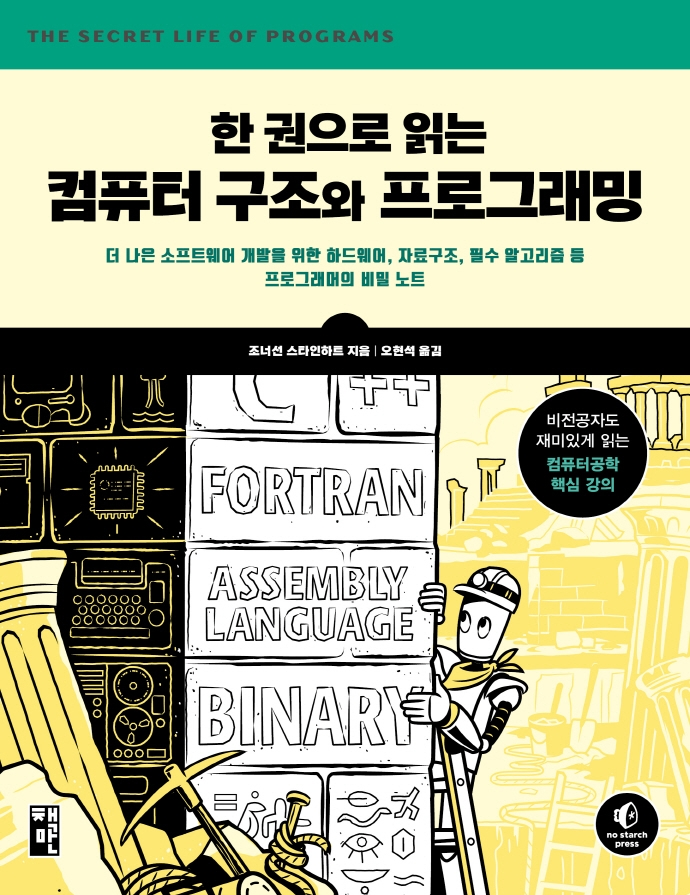

## Book Info

:::tip
책 이미지를 클릭하면 교보문고 사이트로 이동합니다!
:::

- 제목: 한 권으로 읽는 컴퓨터 구조와 프로그래밍
- 저자: Jonathan E. Steinhart
- 역자: 오현석
- 출판사: 책만
- 출간: 2021-04-08

## Book Review

제목이 *한 권으로 읽는 컴퓨터 구조와 프로그래밍*이듯이 저자가 이 책 한 권에 지식을 최대한 많이 넣으려고 한 노력이 보입니다. 어떻게 보면 장점이고 어떻게 보면 단점이라고 생각합니다

먼저 장점은 방대한 지식들을 알 수 있다는 점입니다. 이 책은 총 636 페이지로 이루어져 있으며, 컴퓨터공학(CE) 뿐만 아니라 전자공학(EE)까지 다룬다고 생각이 드는 책입니다. 현재 컴퓨터공학을 전공하고 있는 저도 이 책을 읽으면서 몰랐던 지식들이 많다고 느꼈으니까요. 즉, 요즘 컴퓨터공학에서 잘 가르치지 않는 내용들을 포함합니다. 또한, 컴퓨터공학을 전공하며 교수님들의 강의를 듣다 보면 예전의 유래라든지, 신기한 지식들을 가끔 말씀해 주시는데 그런 내용들이 이 책에 포함되어 있습니다.

단점은 책이 두꺼워서 어디에도 들고 다니기는 어렵습니다. 진짜 무겁습니다. 전 이 책을 다시 읽는다면 꼭 분철해서 읽고 싶습니다. 또한, 책을 읽는데 꽤 지루하다는 점입니다. 저자께서 내용을 최대한 쉽게 설명해 주지만, 매일 한, 두 장씩 읽어도 진도가 잘 안 나갔습니다. 평소 책을 빨리 읽는다고 생각이 되는 제가 책을 읽는데 예상외로 오래 걸렸습니다.

이 책을 읽기 전 웹에 대해서도 간단하게 알고 있으시면 읽기 수월할 것 같습니다. 9장에서 갑자기 웹에 대한 이야기를 하면서 저에게 익숙하지 않은 자바스크립트 코드가 나와서 조금 놀랬습니다. 

## 대상 독자

컴퓨터공학을 이제 막 전공하는 신입생, 비전공자에게는 추천하지 않습니다. 이 책은 다양한 서점에서 베스트셀러로 올라와 있지만 그렇다고 해서 입문자들이 쉽게 읽을 수 있는 책이 전혀 아니라고 생각합니다.

개인적으로 이 책은 공학도들이 읽어보면 좋은 복습용 책이라고 느껴집니다. 컴퓨터공학(CE)를 전공하는 학생뿐만 아니라, 컴퓨터과학(CS), 전자공학(EE) 등 기초 CS 과목에 대한 공부를 했던 경험이 있으시다면 읽어보면 매우 도움이 될 것이라 생각합니다. 소위 요즘 가르치지 않는 재밌는 지식들도 가르쳐줍니다. 예를들어 몇몇 학부는 수치해석을 안 가르치던데 CORDIC 알고리즘처럼 수치해석을 살짝 맛보는 내용이 있습니다. 전 이런 내용들을 오랜만에 다시 공부할 수 있어 많은 도움이 됐다고 생각합니다. 