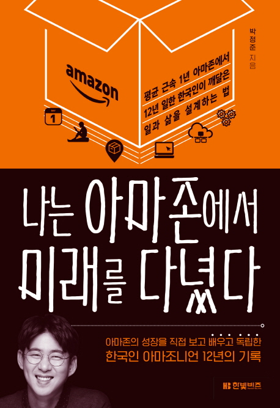

## Book Info

:::tip
책 이미지를 클릭하면 교보문고 사이트로 이동합니다!
:::

- 제목: 나는 아마존에서 미래를 다녔다
- 저자: 박정준
- 출판사: 한빛비즈
- 출간: 2019-03-07

## Book Review

이직률이 매우 높다는 Amazon에서 12년간 일을 한 경험은 흔치 않다고 생각되기에 출간되었을 때부터 꼭 읽어보고 싶던 책이었습니다. 밀리의 서재에서 '어떤 책을 읽어볼까' 고민하던 중에 올라와 있는 걸 우연히 발견하여 읽게 됐습니다. 

저자는 아마존에서 개발자로 시작을 하였지만, 부서도 직종도 아마존 안에서 몇 번을 변경하면서 아마존 기업 그 자체를 경험하신 분이십니다. 부서를 옮기는 건 그렇다 하더라도 직종을 옮긴다는 일은 정말 어려운 일이라 생각하는데 대단하다고 생각했습니다.

저자가 일을 했을 당시 작았던 아마존부터 시작하여 미국뿐만 아니라 전세계 유통 시장을 먹고 있는 현재 대기업이 된 아마존까지의 성장하는 모습을 이 책에서 볼 수 있었습니다. 아마존이 성장함에 따라 저자가 어떻게 이곳에서 계속 있었고, 생활하고, 저자 자신 또한 성장했는지 그 성장 스토리를 보여주는 책입니다.

한 기업에서 12년 동안 있다는 것도 대단하지만 저자 또한 어려움과 고민이 많았다는 것을 이 책에서 보여줍니다. 지금도 아마존은 근무하기 어려운 기업이라고 소문이 난 기업입니다. 그 기업에서 어려웠고 힘들었던 점들을 아마존 정신에 빗대어 어떻게 극복했는지 우리에게 말해줍니다. 한 사람의 다큐멘터리를 보는 기분이었습니다.

몇몇 아마존 정신이 저에게 맞지 않는 부분들도 많았지만, 이 책은 다시 자세하게 읽어보고 싶은 책이었습니다. 

### 6-pager

아마존에서는 파워포인트를 사용하지 않습니다. 대신 *6페이저*라는 방법을 활용하여 많은 정보를 빠르게 전달할 수 있도록 하죠. 사실 이 부분에서 파워포인트의 단점을 다시 생각해보게 됐습니다. 항상 프레젠테이션을 시각적인 자료와 함께 만드는 것도 힘든데 그 슬라이드 하나하나에 모든 내용을 담기 힘들다는 생각이 많았습니다. 또한, 그렇게 하는 발표가 *사람들에게 도움이 될까?, 사람들이 이해를 할 수 있을까?* 라는 생각도 했고요. 

반면 6-pager 방식은 A4 용지 6장의 문서에 사전 지식이 없는 사람도 별다른 추가 설명 없이 끝까지 읽고 이해할 수 있도록 말로 설명하듯이 쓰는 방법입니다. 회의 때 그 문서를 나눠주고, 그 문서를 회의에 참석한 사람들이 읽은 후 그제서야 논의가 시작되는 거죠. 당연히 발표자에게는 상당히 어려운 회의 방식이긴 합니다만, PPT로 프레젠테이션이 끝난 후 Q&A를 받는 것보다 더욱 효과적인 회의 방식이라 생각했습니다. 혼자 발표하는 것이 아니라 다 같이 토의하는 느낌이니까요.

## 이직

아마존은 제가 생각하는 실리콘밸리, 미국 문화 그 자체였습니다. 질문하는 것에 두려워 하지 않고, 둘러대는 거짓말 따위 하지 않는 모습을 보면서 한국과 다르게 매력적이라 느꼈습니다. 사내 이직을 독려하기도 하고요.

그러나 정말 최고의 인재들을 뽑아 아마존이라는 울타리 안에서 경쟁시키며, 그들의 능력과 노력에 따라 실질적인 보상을 해준다는 점이 특히 아마존은 근무하기 매우 어렵겠다고 느꼈습니다. 어찌보면 당연한 거지만, 최고의 인재들과 함께 경쟁하는 부분에서 즐거움, 재미도 있겠지만, 압박감이 매우 클 것이라 생각됩니다.
