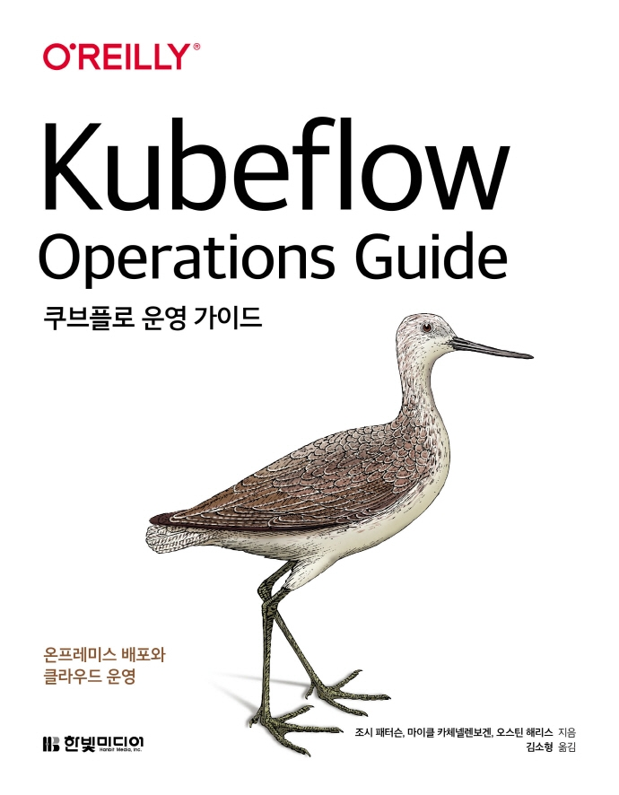

:::info
한빛미디어 \<나는 리뷰어다\> 활동을 위해서 책을 제공받아 작성된 서평입니다.
:::

## Book Info

:::tip
책 이미지를 클릭하면 교보문고 사이트로 이동합니다!
:::

- 제목: 쿠브플로 운영 가이드
- 저자: Josh Patterson, Michael Katzenellenbogen, Austin Harris
- 역자: 김소형
- 출판사: 한빛미디어
- 출간: 2022-01-31

{/* truncate */}

## Book Review

### Introduction

최근 몇 년 동안 MLOps가 뜨기 시작하면서 쿠버네티스(Kubernetes)는 가장 인기있는 기술이 되었습니다.  Kubeflow는 그런 쿠버네티스에 ML workflow를 배포하는 것을 단순하고 확장 가능하도록 하는 데 목표를 둔 기술입니다. 최근 Airflow를 사용해보고 공부하면서 Kubeflow에 대해서도 관심이 생겼는데 마침 이런 좋은 책을 읽을 기회가 생겼습니다. 

### 간단한 구성 소개

처음 3개의 Chapter는 Kubeflow에 대한 개념적인 부분에 대해 설명합니다. Kubeflow가 왜 등장하게 됐고, Kubeflow 아키텍처, 어떤 환경에서 사용해야 하는지 등에 대해 알려줍니다. 개인적으로 이 부분과 KFServing을 사용하는 Chapter 8, 부록이 읽기 가장 어려웠습니다.  

Chapter 4부터 Chapter 7까지는 본격적으로 Kubeflow 환경을 구축합니다. 온프레미스와 3가지의 클라우드 환경에서 구축하는 방법을 설명합니다. 

Chapter 8은 Kubeflow의 핵심 모델 관리 구성 요소인 KFServing에 대해 소개합니다. KFServing에 대한 개념, 사용 시 이점, KFServing에 모델 배포 방법 등을 설명합니다. 

### 클라우드에서 Kubeflow 환경 구축

GCP, AWS, Azure의 각 서비스에 대해 간단하게 설명하고 Kubeflow 환경을 구축하는 방법을 설명합니다. 구축하는 데 어려움을 갖고 있으신 분들께는 도움이 되는 내용이지만, 너무 다양한 환경에 구축하는 것에 초점이 맞춰져 있어서 그런지 실제 사용 예제가 없다는 건 매우 아쉬웠습니다. 클라우드에서 Kubeflow 환경을 구축 후 직접적으로 사용해보고 싶으시다면 Kubeflow Documentation에서 제공하는 [MNIST image classification](https://www.kubeflow.org/docs/started/kubeflow-examples/)을 따라 해보시는 걸 추천해 드립니다. 물론 이 예시도 AWS SDK인 boto3, GCP SDK인 Cloud SDK에 대한 사전 지식이 필요하기에 전반적인 클라우드 공부가 필요합니다.

### 추가적인 정보

이 책에 담긴 내용들 이외에도 Kubeflow와 관련된 수많은 정보들이 많습니다. 책 한 권에서 모두 자세하게 설명하지 못하기에 그런 정보들은 각주를 사용하여 소개합니다. 다음 공부를 위해 가이드를 알려주는 느낌이라 개인적으로 도움이 됐던 부분입니다. 

## 대상 독자

개인적으로 이 책은 저에게 꽤 어려운 책이었습니다. 왜 기업에서 MLOps 인턴, 신입 포지션이 흔하지 않은지 알려주는 책이었습니다. 더 열심히 공부해야겠다는 걸 오늘도 느끼네요.

이 책은 MLOps에 관심 있으며 쿠버네티스, ML에 대해 이해도가 있는 엔지니어가 읽으시는 걸 추천해 드립니다. 특히 DevOps 엔지니어, ML 엔지니어, 데이터 엔지니어 등의 포지션에 있으신 분들이 읽으시면 도움이 될 것이라 생각합니다.
