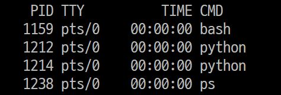

## 🤔실수 때문에 생긴 에러

django를 시작하고 종료할 때 `Ctrl-C`를 사용해서 꺼야 했는데 `Ctrl-Z`를 사용했다.
종료가 제대로 된 줄 알았지만, 프로세스가 중단된 것이었다.

  

결국 위의 `Error: That port is already in use.`라는 에러가 발생했다.

<!--truncate-->

## 🚩해결

  

대충 프로세스를 종료하면 되지 않을까 생각했고, `ps` 명령어를 사용해봤으나 역시 어떤 PID가 장고 프로세스인지 알아볼 수 없었다.

결국 스택오버플로우에 냅다 검색해버렸다.(Reference 참고)  
역시 StackOverFlow는 정답을 알려줬다.(스택오버플로우는 신이야!)

```bash
sudo lsof -t -i tcp:8000 | xargs kill -9
```

위의 명령어를 사용하면 해결이 된다.

간단하게 정리하자면 `lsof`는 시스템에 열려있는 파일에 대한 정보를 출력하는 명령어다.
여기서 사용한 `-i` 옵션은 열려있는 네트워크 포트 정보를 확인하는 것이고, `-t` 옵션은 그 중 PID만 출력한다는 것이다.

`xargs`는 파이프 이전의 명령을 인자로 받아 다음 명령을 실행할 때 주로 사용한다.  

`kill -9`는 유명해서 다들 아시겠지만 SIGNAL 리스트 중 `SIGKILL`의 번호를 옵션으로 사용한 것이다.

명령어는 우분투 환경에서 사용했지만, 맥에서도 돌아간다고 한다.

## 🌐References

>- [jango Server Error: port is already in use - stackoverflow](https://stackoverflow.com/questions/20239232/django-server-error-port-is-already-in-use) 
>- [Ubuntu 프로세스 강제 종료시키기](https://ghostweb.tistory.com/828)
>- [lsof 명령어 사용법](https://dev.plusblog.co.kr/44)
>- [xargs 명령 & 파이프 와 차이점 완벽 정리 (표준입력 / 인자 차이)](https://inpa.tistory.com/entry/LINUX-%F0%9F%93%9A-xargs-%EB%AA%85%EB%A0%B9-%ED%8C%8C%EC%9D%B4%ED%94%84-%EC%99%80-%EC%B0%A8%EC%9D%B4%EC%A0%90-%EC%99%84%EB%B2%BD-%EC%A0%95%EB%A6%AC-%ED%91%9C%EC%A4%80%EC%9E%85%EB%A0%A5-%EC%9D%B8%EC%9E%90-%EC%B0%A8%EC%9D%B4#top)