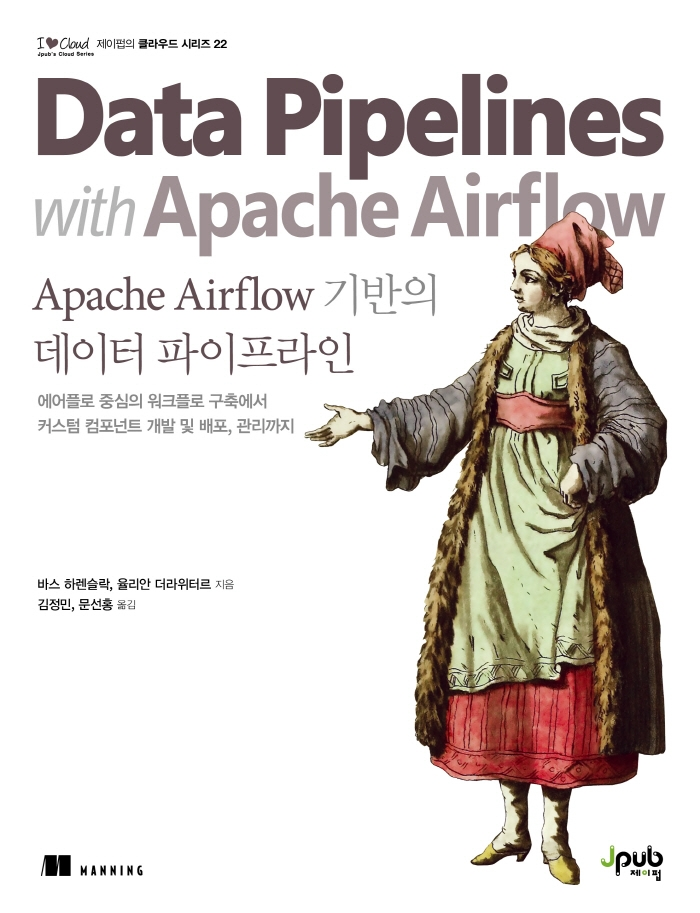

:::info
제이펍 \<믿고 보는 IT 전문서 리뷰어\> 활동을 위해서 책을 제공받아 작성된 서평입니다.
:::

## Book Info

:::tip
책 이미지를 클릭하면 교보문고 사이트로 이동합니다!
:::

- 제목: Apache Airflow 기반의 데이터 파이프라인
- 저자: Bas P. Harenslak, Julian Rutger de Ruiter
- 역자: 김정민, 문선홍
- 출판사: 제이펍
- 출간: 2022-03-16

{/* truncate */}

## Book Review

### 구성

이 책은 4개의 큰 파트로 이루어지며, *기본*, *중급*, *실습*, *클라우드에서 airflow 사용*으로 구성되어 있습니다.  
*기본*에서는 말 그대로 데이터 파이프라인 개념, Airflow DAG(Directed Acyclic Graph)의 정의, 스케줄링, 의존성 정의 등을 설명합니다. 이 부분에서 airflow 2.x 버전에 도입된 Taskflow API를 사용해봅니다.  
*중급*에서는 외부 시스템에서 task를 실행할 수 있는 방법, 테스트, 컨테이너를 이용한 파이프라인 등을 배울 수 있습니다. 예시를 활용하여 설명하는 점이 인상 깊었습니다.  
*실습*에서는 본격적으로 효율적이고 유지보수 가능한 파이프라인 구축, Airflow를 실제 서비스에 도입할 때 고려해야 할 것 등을 설명합니다. 너무 개념만 설명하는 것이 아니고, 자세하게 설명이 되어 있어서 필요할 때 다시 보면 좋은 내용들이었습니다.  
*클라우드에서 airflow 사용*은 말 그대로 AWS, Azure, GCP 환경에서 Airflow 배포에 대한 아키텍처를 설계해봅니다. 이 부분도 단순히 하는 방법만 설명하는 것이 아니라 예제가 있어서 너무 좋았습니다.

### 도커 환경

주어진 코드들의 각 장에는 거의 모두 *docker-compose.yml* 파일이 있습니다. 즉, 코드를 쉽게 실행할 수 있도록 도커를 환경이 주어진다는 것이죠. 이 부분이 이 책의 가장 큰 장점이라고 생각합니다. 전 그래도 환경 구성을 직접 해봐야 겠다 싶어서 로컬로 돌려보기도 했고 간단하게 도커로 돌려보기도 했습니다. 확실히 도커가 편합니다. 이 책을 읽으신다면 이 부분 꼭 활용하시길 바라겠습니다.

### 부록

이 책의 부록에서도 도움이 되는 내용이 많았습니다. 예를 들어  *Appendix A 실행 코드 예제*에서는 코드가 어떻게 구성되어 있는지 간단하게 설명하고, 도커 환경을 사용하여 예제를 실행시키는 명령어 몇가지를 알려줍니다. 도커를 한 번도 사용해보지 못해보셨더라도 이 부록 하나만 있으면 쉽게 환경을 구성할 수 있을 것입니다.  또한, *Appendix B Airflow 2 패키지 구성*에서는 Airflow 1과 2의 패키지 차이에 대해 간단하게 설명합니다. 어떤 차이가 있었는지 설명해주는 이런 세심한 부록이 좋았습니다.

## 대상독자

이 책은 소개에도 적혀 있듯이 중급 이상의 파이썬 스킬을 보유한 DevOps 엔지니어, 데이터 엔지니어, 머신러닝 엔지니어 등을 위한 책이라고 생각합니다. 이제 막 데이터 엔지니어링에 입문하거나 기초 CS 지식이 없다면 읽기 어려울 수도 있을 것 같습니다. 그러나 국내 IT 도서 중 Airflow를 주요 주제로 지정하여 쓰여진 책은 아직 이 책 밖에 없는 점에서 파이프라인, Airflow에 관심이 있다면 충분히 읽어볼만한 좋은 책입니다. 조금은 어렵지만 상황별 예제가 많아 Airflow를 사용할 예정이라면 꼭 읽어보길 추천합니다.