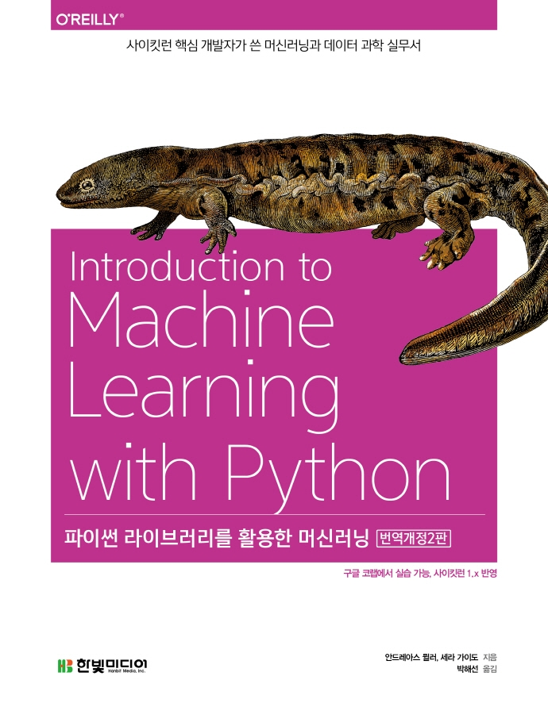

**
한빛미디어 <나는 리뷰어다> 활동을 위해서 책을 제공받아 작성된 서평입니다.
**

## Book Info

**
`책 이미지를 클릭하면 교보문고 사이트로 이동합니다!`
**

- 제목: 파이썬 라이브러리를 활용한 머신러닝
- 저자: Andreas C. Müller, Sarah Guido
- 역자: 박해선
- 출판사: 한빛미디어
- 출간: 2022-02-25

## Intro

개정되기 전부터 이 책은 머신러닝을 공부하기에 상당히 유명한 책 중 하나였습니다. 언젠가 한 번쯤 꼭 읽어보고 싶다는 생각을 했는데 이번 기회에 읽게 됐습니다!

## Book Review

### 간단한 소개

쉽게 설명하면 머신러닝에 관한 입문서라고 할 수 있습니다. 그러나 바닥부터 완전히 구현하는 것이 아닌 `사이킷런`이라는 라이브러리를 이용해서 이미 구현되어져 있는 것을 배우는 책입니다. TensorFlow, PyTorch을 사용하여 딥러닝을 하는 책이 아니라, sklearn 기반의 머신러닝 기초 지식을 배우는 걸 목표로 하고 있습니다. 또한, 딱히 코드를 실행하기 위한 환경 설정이 필요없으며 이 책의 모든 코드는 구글 코랩(Colab)에서 실습할 수 있습니다.

### 주석

이번 책의 역자님은 `박해선`님입니다. 역시나 다를까 역자님께서 번역하신 다른 책처럼 이번 책도 번역이 깔끔하고, 역주를 너무 자세하게 잘 활용해주셔서 읽기 편했습니다. 일반적인 책들의 주석이라면 출처 또는 참고할만한 것들만 간단하게 정리하지만, 박해선님이 번역하신 책에는 독자가 이해하기 쉽도록 부가적인 내용들까지 적혀 있습니다. 그렇기에 주석도 꼼꼼하게 읽어보시는 것을 추천합니다.

### 마무리

마무리 chapter 8에서는 앞으로 어떤 걸 더 공부할지 가이드를 해줍니다. 이 책을 벗어나 더 깊게 머신러닝을 공부해보고 싶은 사람들에게 추천하는 전문적인 자료들입니다. 저는 이 책처럼 키워드를 던져주는 책을 정말 선호하는 편입니다. 친절하다고 느껴지며 독자에게 매우 도움되는 내용이라고 생각합니다.

### 한국어판 부록

한국어판 부록으로 [KoNLPy](https://konlpy.org/ko/latest/)를 사용하여 한국어 자연어처리를 해봅니다. 이밖에도 역자님께서 더 넣고 싶은 부분들은 부록으로 추가해서 넣은 모습을 확인할 수 있습니다. 또한, 재밌었던 점은 이 책의 저자가 한국 독자를 위해 인터뷰를 했었다는 것입니다. 사이킷런의 변화와 관련된 내용이 있으니 사이킷런에 관심있으신 분들은 이 부분도 충분히 읽을 가치가 있어 보입니다.

## 대상독자

머신러닝에 관심이 생겨 입문하시는 학부생들께 추천드리며, 사이킷런이 업데이트 됨에 따라 뭐가 바뀌었는지 궁금하신 분이 읽으셔도 좋을 것 같습니다. 