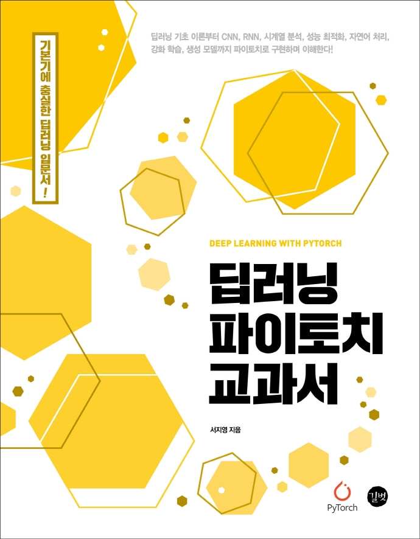

## Book Info

**
길벗 ‘17차 개발자 리뷰어’ 활동을 위해서 책을 제공받아 작성된 서평입니다.
**

**
`책 이미지를 클릭하면 교보문고 사이트로 이동합니다!`
**

- 제목: 딥러닝 파이토치 교과서
- 저자: 서지영
- 출판사: 길벗
- 출간: 2022-03-04

## Intro

최근 파이토치를 사용한 책들을 읽으며 간단한 개념들은 [파이토치 튜토리얼](https://tutorials.pytorch.kr/)이나7 [PyTorch로 시작하는 딥러닝 입문](https://wikidocs.net/book/2788)을 참고하면서 공부했었습니다. 필요할 때마다 찾아보는 형식으로 공부했었죠. 그러나 앞으로 파이토치를 사용할 일이 많아질 것 같아 기본 개념들을 깔끔하게 정리해보면서 손에 익숙해지고 싶었습니다. 물론 저 문서들도 문서화가 잘 되어 있는 자료들이지만, 기본 개념들을 깔끔하게 정리 해보기는 어렵다고 생각하여 이 책을 읽게 됐습니다.

## Book Review

### 교과서

정말 교과서라는 이름에 어울리는 책입니다. 제 기억에서 교과서는 언제나 모든 걸 알려주는 책인 적은 없었습니다. 기본, 기초적인 것들만 알려주고 더 심화된 내용에 대해서는 직접 생각하게 해주는 그런 책이었습니다. 덤으로 다음에 공부해보면 도움이 되는 키워드를 알려주는 책이었죠. 전 그런 책들이 언제나 다음 공부를 위한 호기심을 자극했었습니다. 이 책 또한 그런 느낌에 가깝습니다. 

### 다양한 주제

750페이지의 엄청난 두께로 `파이토치를 사용한 딥러닝 기본` 그 자체를 담고 있는 책이라고 해도 부족함이 크게 없는 책입니다. CNN, 시계열 분석, 자연어 처리 등 딥러닝에서 해볼만한 주제는 거의 다 담고 있을 뿐만 아니라, 딥러닝을 시작하기 전 머신러닝에 대한 기초 지식도 알려줍니다. 다양한 주제들이 모두 파이토치로 구현되어 있는 것은 아니지만 전체적으로 봤을 때 `이런 기술들도 있다.`라는 것을 보여주기 때문에 기술 파악에 도움이 됐습니다.

전 이 책에서 특히 인상 깊었던 점은 CNN 파트를 2개로 나누어 자세하게 설명하는 부분이었습니다. 저자께서 이 부분을 세부적으로 설명해주고 싶다는 것이 돋보였습니다.  그러나 이 부분이 너무 자세하게 설명되어 있어 RNN, 임베딩, 생성 모델 등의 부분이 구현하는 데 있어 설명이 조금 아쉽다고 생각할 수도 있을 것 같습니다.  

### 그림

이 책의 가장 큰 장점 중 하나는 그림이라고 생각합니다. 독자가 이해하기 힘든 부분들도 모두 그림을 통해 자세하게 설명합니다. 또한, 그림이 컬러인 것도 꽤 인상 깊었습니다. 그림을 통해 깔끔하게 시각화 되어 있어 이해하기 쉬웠습니다.

## 대상 독자

딥러닝 입문자 보다는 그래도 몇 번 경험해본 초급자에게 적절한 책이라고 생각합니다. 밑바닥부터 어느정도 구현해보고 이 책을 읽으시면 파이토치라는 프레임워크를 입문하는 데 매우 좋다고 생각합니다.

또한, 딥러닝 공부를 이론적으로만 하셔서 실제 구현에 자신이 없으신 분들께도 추천합니다. 이 책은 구현에 큰 중점을 둔 책이라 상당히 도움이 많이 될 것입니다.