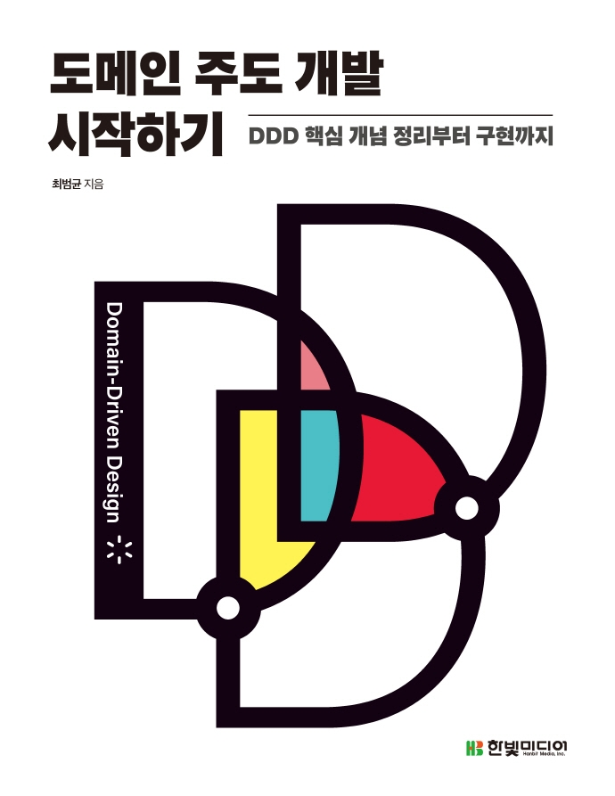

**
한빛미디어 <나는 리뷰어다> 활동을 위해서 책을 제공받아 작성된 서평입니다.
**

## Book Info

**
`책 이미지를 클릭하면 교보문고 사이트로 이동합니다!`
**

- 제목: 도메인 주도 개발 시작하기
- 저자: 최범균
- 출판사: 한빛미디어
- 출간: 2022-03-21

## Intro

학교 선배가 백엔드 공부를 할 거라면 `최범균`님의 `DDD Start!`라는 책을 DDD 입문서로 추천한다고 말했던 기억이 있습니다. 근데 아쉽게도 지금은 절판됐고 지금은 막 리셀가로 팔리기 때문에 도서관이라도 가서 꼭 읽어보라고 말하더라고요. 백엔드 공부하다 보면 언젠가 읽어보겠지 싶었는데 이번에 한빛미디어에서 새롭게 나오게 되어 읽어보게 됐습니다.

## Book Review

### 기본 지식

이 책의 예제 코드는 자바로 쓰여져 있으며 스프링 MVC와 JPA를 기반으로 구현되어 있습니다. 초반에는 개념에 대한 내용이 많아서 코드에 대해 정확히 모르시는 분이 읽어도 괜찮지만, 후반으로 갈수록 코드로 구현하면서 설명하는 부분이 많고 불필요한 설명은 생략되어 있으니 Spring과 JPA에 대한 경험이 어느정도 있으신 분께 추천드리는 책입니다.

### 신입 개발자

이 책은 DDD 고수가 되는 법을 알려주는 책이 아니며 DDD를 처음 접하는 입문자를 대상으로 하는 책이라고 합니다. DDD 입문자가 읽기에는 좋은 책이지만 백엔드 개발자를 목표로 하는 대학생 입장에서는 신입 개발자가 읽기에는 좀 어려운 책이라고 느꼈습니다. 후반으로 가면 갈수록 제가 JPA에 대한 이해가 낮아서 그런지 점점 읽기 힘들었습니다. 또한, DDD에 대한 개념적인 내용은 대략적으로 이해가 됐으나 이걸 어떻게 구현해야 할 지는 아직도 `막막하다`라고 느꼈습니다. 그러나 저자의 깔끔하고 자세한 설명 덕분에 충분히 공부해서 읽어볼 만한 책이라 생각합니다.

## 대상독자

대상독자는 아무래도 이 책의 저자께서 설명하신 것처럼 대략 3~4년의 개발 경험이 있다면 내용을 이해하는 데 어려움은 없을 것 같습니다. 또한, Spring에 관심 있고 자바 백엔드 개발자가 되고 싶은 대학생이라면 한 번쯤 읽어볼 만한 책이라 생각합니다. 