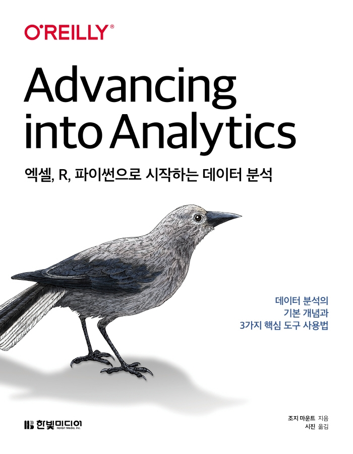

:::info
한빛미디어 \<나는 리뷰어다\> 활동을 위해서 책을 제공받아 작성된 서평입니다.
:::

## Book Info

:::tip
책 이미지를 클릭하면 교보문고 사이트로 이동합니다!
:::

- 제목: 엑셀, R, 파이썬으로 시작하는 데이터 분석
- 저자: George Mount
- 역자: 시진
- 출판사: 한빛미디어
- 출간: 2022-04-29

{/* truncate */}

## Intro

처음에 이 책의 표지와 목차를 읽었을 때 상당히 흥미로운 주제라고 생각했습니다. 전 데이터 분석이 처음은 아니지만, 매번 파이썬으로만 했었지, 엑셀로는 경험해보지 못했거든요. 엑셀로도 물론 하면 할 수는 있겠지만, 매번 프로그래밍 언어만 사용하던 사람으로서 그럴 생각을 해보지는 못했어요. 그리고 제가 예전에 공부하다 포기한 R을 배워볼 수 있다는 것만으로도 재밌겠다고 생각했습니다.

## Book Review

### 데이터 분석 입문자를 위한 책

제가 생각하기에 이 책은 데이터 분석 입문자에게 유용할 것 같습니다. 특히 엑셀을 자주 사용했던 사람들에게는 더더욱이요. 자연스럽게 파이썬과 R과 같은 프로그래밍 언어를 공부할 수 있는 기회가 될 것입니다. 이 책은 R 또는 파이썬을 전혀 모르는 독자를 대상으로 작성되었기 때문에 모르더라도 쉽게 공부해볼 수 있을 것입니다. 또한, 데이터 분석 공부를 어디서부터 시작하면 좋을지 고민하던 개발자에게도 유용할 것 같습니다. 데이터 분석의 개념부터 간단한 프로그래밍 실습까지 다루고 있기 때문이죠. 여기서 데이터 분석의 개념이란 통계적인 개념을 의미합니다. 예시를 들어 설명하여 통계 용어가 나와도 크게 어렵지 않았습니다.

### 독자를 신경 쓴 책

어떤 분야나 기술에 관심 있으면 책을 참고해보라고 책 제목을 적어뒀습니다. 이 책에 모든 지식을 적어둘 수 없으니 reference라도 제공하는 거죠. 물론 번역되지 않은 책들도 많지만 추천해주는 부분이 인상적이었습니다. 저자가 얼마나 독자를 신경 쓴 책인지 알 수 있는 부분입니다.

또한, 연습문제를 제공합니다. 연습 문제 해답도 [GitHub 저장소](https://github.com/stringfestdata/advancing-into-analytics-book)에 제공하므로 풀어보시고 답과 해답을 비교하시면 될 것 같습니다.

## 대상독자

데이터 분석에 입문하는 사람에게 추천합니다. 개발을 지금까지 한 번도 경험해보지 못한 분들이어도 괜찮습니다. 다만 확률과 통계를 한 번도 공부해보신 적이 없으시다면 이 책이 재미없을 수도 있습니다. 그만큼 통계적인 개념들이 나오니 이 부분만 감당하고 읽으실 수만 있다면 도전해보세요!