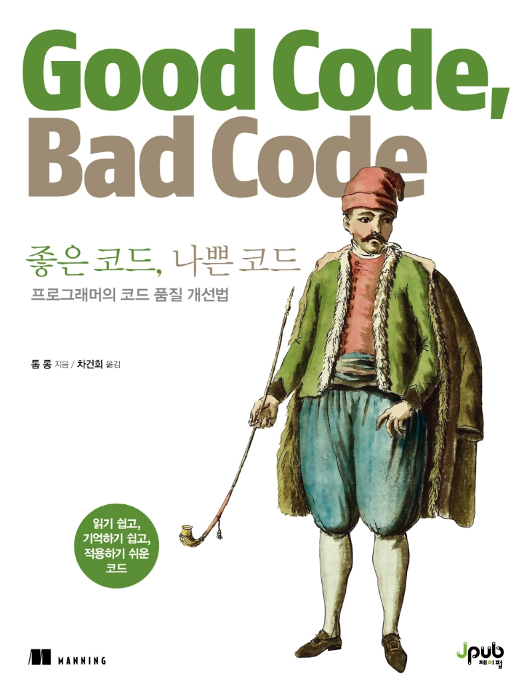

## Book Info

**
제이펍 <믿고 보는 IT 전문서 리뷰어> 활동을 위해서 책을 제공받아 작성된 서평입니다.
**

**
`책 이미지를 클릭하면 교보문고 사이트로 이동합니다!`
**

- 제목: 좋은 코드, 나쁜 코드
- 저자: Tom Long
- 역자: 차건희
- 출판사: 제이펍
- 출간: 2022-05-26

## Intro

이 책의 제목을 처음 접했을 때 `난 좋은 코드를 쓰고 있는가?`에 대해 고민하며 반성하는 시간을 갖게 됐습니다. 매번 팀 단위로 코드를 작성해야 했을 때는 그저 프로젝트를 빨리 끝내고 싶다는 생각 밖에 하지 않았거든요. 그 코드들은 적어도 다시 볼 코드는 아니라고 생각했기 때문이죠. 그러다 제가 쓴 코드를 다시 참고할 일이 있어 읽어보는데 주석도 대충 적혀 있고 읽기 힘들어 처음부터 다시 코드를 짰던 경험이 있습니다. 이런 상황이 다시 오지 않게 하기 위해 이 책을 읽어보게 됐습니다.  

## Book Review

### 사람들과 스터디 해보고 싶은 책

이 책이 재밌는 점은 거의 대부분의 장을 시작할 때 문제가 될 수 있는 사례 또는 코드를 먼저 설명하고 이를 해결하기 위한 코드를 보여주는 방식입니다. 그러니 좋은 사례와 나쁜 사례를 알려주는 책인 것이죠. 물론 이 부분은 주관적인 것이며 저자분께서도 상황에 따라 다를 수 있다는 점을 주의하라고 합니다. 동료들과 책에 나오는 사례 외에도 더 생각해보는 스터디를 진행해보는 것도 재밌을 것이라 생각합니다. 

### 저자와 역자 모두 노력한 책

책을 읽으며 저자분께서 알려주고 싶으신 내용들이 엄청 많았다는 느낌을 받았습니다. 이 책은 좋은 코드를 작성하기 위해 유닛 테스트까지 다루며 TDD 등의 테스트 철학까지 조금이나마 다뤄봅니다. 솔직히 유닛 테스트 내용까지 없어도 좋은 코드에 대해 충분히 생각해보고 내용에 대해 만족할만한 책입니다.

또한, `프로그래머의 뇌`라는 책에서도 느꼈지만 역자분께서 남기신 주석들, 그리고 매끄럽게 읽히는 점에서 번역하시는 데 독자가 어떻게 더 잘 이해할 수 있을까 고민하신 점들이 보였습니다. 개인적으로 전공 서적에도 이런 역자분들이 많이 생기셨으면 좋겠다는 소망이 있습니다.

## 대상독자

이제 막 한 언어의 문법서를 뗀 분들께는 그닥 추천하지 않습니다. 의사코드로 기술되어 있으나 자바 or C#과 닮은 코드를 사용하기에 자바 등의 객체 지향 프로그래밍 언어로 코드를 많이 작성해본 분들께 추천합니다. 특히, 취업을 위해 공부하시는 분들보다는 현업에서 엔지니어로 일한 경험이 있으신 분들께 더 추천하고 싶습니다. 앞으로 개발하면서 도움이 되는 좋은 팁들이 매우 많지만, 취업을 위해 공부하시는 분들은 소화하기 어려울 수 있겠다는 생각이 들었습니다. 팀원들과 협업하는 상황일 때 더욱 도움이 될 책인 것 같습니다. 