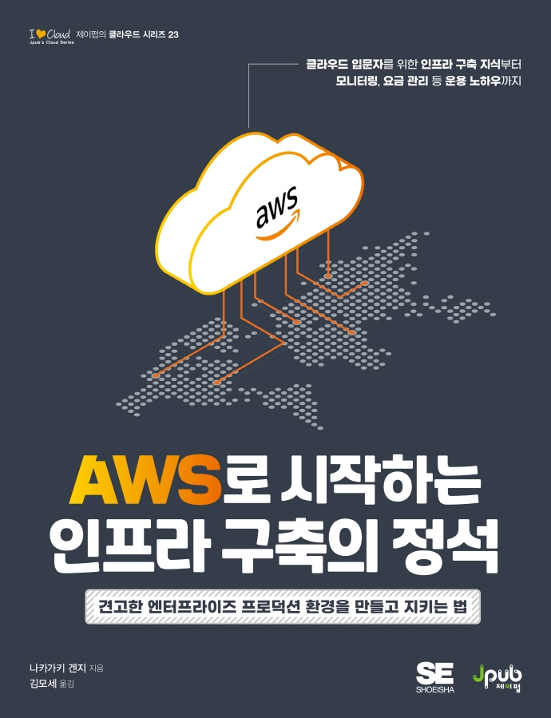

## Book Info

**
제이펍 <믿고 보는 IT 전문서 리뷰어> 활동을 위해서 책을 제공받아 작성된 서평입니다.
**

**
`책 이미지를 클릭하면 교보문고 사이트로 이동합니다!`
**

- 제목: AWS로 시작하는 인프라 구축의 정석
- 저자: Kenji Nakagaki(나카가키 겐지)
- 역자: 김모세
- 출판사: 제이펍
- 출간: 2022-06-09

## Intro

요즘은 어쩌다 아마존 웹 서비스에서 메일을 받고 있어 다양한 교육들을 들어보라고 홍보 메일들이 저에게 옵니다. 전 이런 메일을 통해 aws에서 클라우드 기초 교육을 진행한다는 것을 알게 됐습니다. 아마 이런 교육들이 있었다는 사실을 알고 있었더라면, 굳이 책을 읽지 않았을지도 모르겠습니다. 

전 저런 교육들이 아마존 웹 서비스에 관심이 있지 않다면 접하기 힘들다고 생각합니다. 저는 aws를 생활코딩에서 처음 공부하게 됐고, 다른 책들을 통해 웹 서비스 배포를 공부하며 조금씩 접했었습니다. 물론 생활코딩에서도 잘 알려주지만, 더 자세히 공부하기 위해서 책을 읽어보게 됐습니다.

## Book Review

### 단순히 aws 서비스를 공부하는 것이 아닌

단순히 aws 서비스에 관련된 내용이 아니라 좀 더 CS 지식 관점으로 쓰여져 있어 CS 지식이 꽤 부족한 사람도 편하게 읽을 수 있습니다. 제가 그랬습니다. 전 전공자로서 네트워크 수업을 들었지만, 이 책을 읽으며 제가 네트워크 지식이 엄청 부족했다는 사실을 깨닫게 됐습니다. 컴퓨터 전공자라면 큰 어려움 없이 이 책을 읽으실 수 있을 것 같습니다.

또한, 책 제목과 알맞게 단순히 aws 서비스를 하나하나 배우는 것이 아닌, 점프 서버, 캐시 서버 등을 배우며 말 그대로 인프라 구축에 관점을 둔 책입니다. aws 서비스를 점차적으로 추가해보면서 공부해보고 싶은 분들께 도움이 많이 될 것이라 생각합니다.

### 리소스 이미지

제가 이 책을 읽으면서 가장 좋게 본 부분입니다. 한 chapter마다 읽을 때마다 리소스가 추가 되는데 시각적으로 무엇이 달라졌는지 알  수 있어서 책을 읽는데 도움이 됐습니다. 이 밖에도 그림을 통해 어려운 내용을 쉽게 시각적으로 보여줬다는 점에서 너무 읽기 편했습니다.

### 부록

부록에서는 이 책에서 쓴 리소스 정보들과 리소스 삭제 방법 등을 소개합니다. 이 부분도 마음에 들었던 게 리소스 삭제 방법을 몰라서 삭제를 못하시는 분들도 많은데 이렇게 따로 삭제 방법을 간단하게나마 알려준다는 것이 큰 도움이 될 것 같았습니다. 

## 대상독자

인프라 구축에 관심이 많으며 네트워크를 한 번쯤 공부해보신 분들이 읽으시는 걸 추천합니다. 또한, 리눅스 명령어 사용 경험이 있어야 합니다. 책에서 간단하게 설명은 해주지만, 그래도 어느정도 사용할 수 있어야 책 읽는데 불편함이 없을 것 같습니다. 이 책의 기준 환경은 Windows10이지만 다른 OS에 익숙하신 분들이 읽어보셔도 큰 어려움은 없을 것 같습니다.