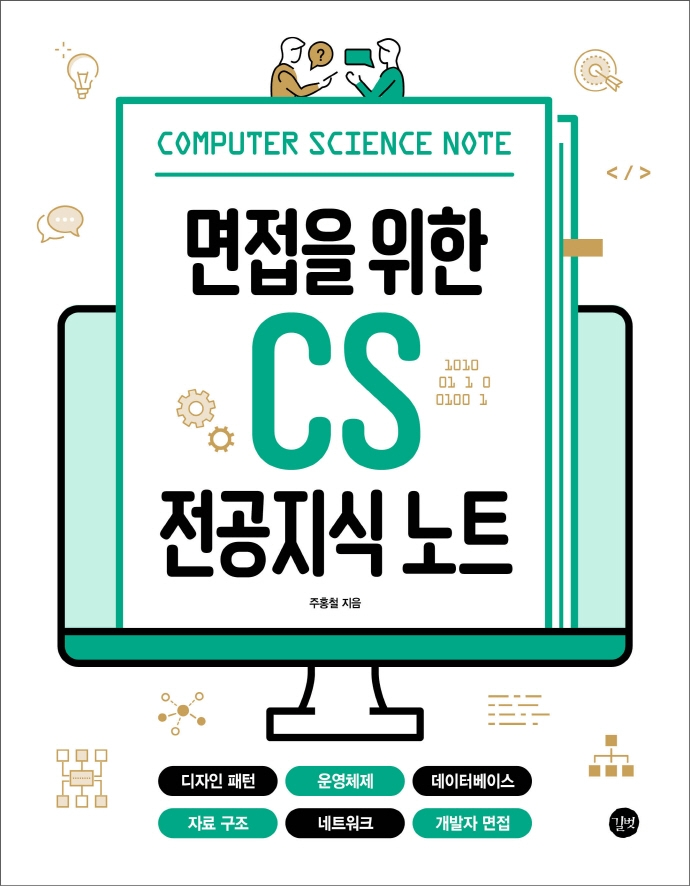

## Book Info

**
길벗 ‘18차 개발자 리뷰어’ 활동을 위해서 책을 제공받아 작성된 서평입니다.
**

**
`책 이미지를 클릭하면 교보문고 사이트로 이동합니다!`
**

- 제목: 면접을 위한 CS 전공지식 노트
- 저자: 주홍철
- 출판사: 길벗
- 출간: 2022-04-28

## Intro

신입으로 취업을 준비하는 학생에게 가장 중요한 건 코딩 테스트와 면접 준비라고 생각합니다. 전 취준생으로서 코딩 테스트는 지금도 열심히 공부하고 있지만, 문제는 면접 준비였습니다. 어느정도 대답은 할 수 있겠지만, 아직 부족하다고 생각했습니다.

보통 면접에서는 프로젝트 관련해서도 지원자에게 묻지만 Computer Science 전공 지식을 묻는 경우도 있습니다. 그렇기에 CS 전공을 다시 복습할 필요가 있었고, 전 "어떻게 CS 전공을 다시 복습하지?"라는 고민을 하게 됐습니다. 운영체제, 네트워크, 자료구조, 데이터베이스, 컴퓨터 구조 등의 전공은 모두 책 하나하나가 엄청 두껍기에 다시 볼 생각에 막막했습니다. 이런 고민을 하고 있을 때 이 책을 만나게 됐고, 이번 개발자 리뷰어에 신청을 하여 읽어볼 수 있게 됐습니다.

### 디자인 패턴

저는 이 부분이 가장 어려우면서 가장 유용했던 부분이었습니다. 솔직히 전 백엔드를 엄청 깊게 공부한 것이 아니라 디자인 패턴에 대해 간략하게는 알고 있었으나, 예를 들어 "싱글톤 패턴"에 대해 자세히 설명해보라고 하면 못할 수준이었습니다. 이 책을 읽으면서 다양한 디자인 패턴을 공부해볼 수 있어 도움이 됐습니다.

### 정말 필수적인 지식

정말 각 전공 과목에서 필수적인 지식만 간단하게 엄청 잘 요약되어 있습니다. 중간중간 이미지 삽화로 설명하는 부분도 좋았고, 진짜 복습용으로 공부하기 좋은 책이라고 생각합니다.

이 책을 보면서 각종 문서들을 참고하면서 공부했지만, 이 책에서 설명하는 것이 가장 깔끔했습니다. 또한, 책에 기술되어 있는 것들만 내가 제대로 알고, 설명할 수 있으면 적어도 면접에서 마이너스는 되지 않겠다고 생각했기에 이 책을 믿고 공부했습니다. 딥하게는 아니지만 간단하게라도 이 책을 통해서 전반적인 디자인 패턴을 공부할 수 있게 되어 너무 유익했습니다.

### 마지막 면접 팁

저자의 개인적인 포트폴리오 작성 방법, 면접 노하우 등을 설명합니다. 또한, 면접에서 나올 수 있는 예상 질문에 대해 설명합니다. 저자께서 직접 경험하시고 대답하신 내용들이 담겨져 있어 면접에서 어떻게 대답을 해야 할지 참고할 수 있었습니다.

## 대상 독자

면접 전에 급하게 공부해야 할 때 보기 좋을 것 같습니다. 그러나 꼬리 물기 질문을 어디까지 할지 저희는 예측할 수 없으니 책에 적힌 내용으로도 부족할 수 있습니다. 부제에 기술되어 있는 전공 과목에 대해 공부해보시지 않으셨다면 상당히 어려울 수 있습니다. 그럴 때는 다른 문서들과 함께 읽으시면서 공부하시는 걸 추천합니다. 
