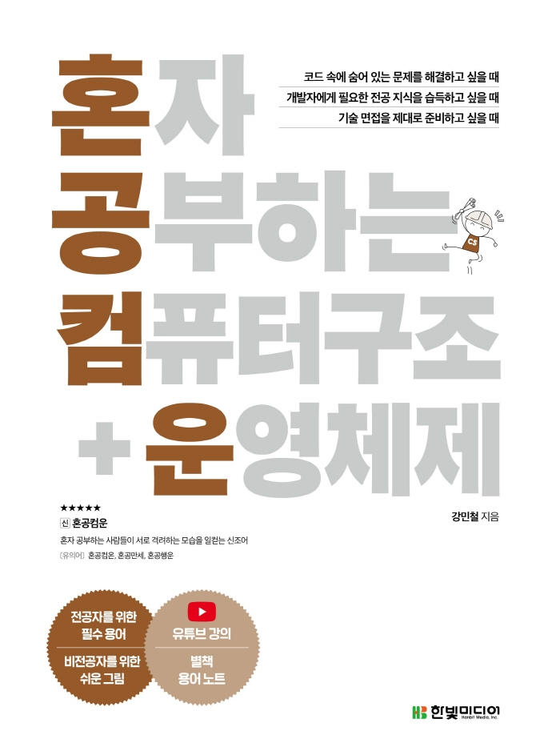

:::info
한빛미디어 <나는 리뷰어다> 활동을 위해서 책을 제공받아 작성된 서평입니다.
:::

## Book Info

:::tip
책 이미지를 클릭하면 교보문고 사이트로 이동합니다!
:::

- 제목: 혼자 공부하는 컴퓨터 구조+운영체제
- 저자: 강민철
- 출판사: 한빛미디어
- 출간: 2022-08-16

<!--truncate-->

## 🎬Intro

C언어, 파이썬, 자바를 거쳐 벌써 네 번째로 읽어보는 혼공 시리즈이다. 전공생으로서 컴퓨터 구조, 운영체제 수업을 들었음에도 부족함을 느껴 이 책을 읽게 됐다. 이번에는 리뷰어에 지원하여 읽게 됐지만, 리뷰어가 되지 않았더라도 구매해서 읽어볼 예정이었던 책이었다.

사실 나는 혼공 시리즈가 너무 쉽고 간단하다는 이유로 별로 좋아하지 않았었다. 그러나 몇몇 책들을 읽어보니 결국 혼공 시리즈만큼 입문하기 편한 책이 없었다. 가끔 비전공자 친구들이 코딩을 이제 막 시작해본다고 나에게 추천을 해달라고 하는데 그럴 때마다 나는 혼공 시리즈를 추천한다. 

## Book Review

### 읽기 쉬운 책

컴퓨터 구조를 처음 공부하게 되면 architecture를 ARM 또는 RISC-V로 배우게 되는데 이 책은 입문자를 대상으로 하니 그런 어려운 지식은 거의 배제되어 있습니다. 너무 디테일하게 CS 지식을 알려주는 책은 아니라는 겁니다. 만약 이 책이 디테일하고 쉽게 설명되었더라면 책 두께가 어마어마했을 것입니다.

정말 꼭 필요한 필수 요소 즉, 핵심만 들어가 있으며 공부하면서 쓸데없는 고민을 하지 않게 해줍니다. 그런 점에서 저는 이 책이 매우 읽기 쉬웠다고 생각합니다.

### 이해하기 쉬운 그림

초보자가 이해하기 쉽도록 그림으로 매우 설명이 잘 되어 있습니다. 컴퓨터 구조 같은 경우에는 처음 공부하게 되면 어떤 구조로 돌아가는지 순서가 어려울 수 있으나 이 책은 첫 장부터 삽화로 잘 표현이 되어 있기에 어렵지 않았습니다.

### 혼자 공부하는 사람을 위한 책

혼자 공부하게 되면 자신이 공부한 지식이 제대로 머리에 남았는지 알기 쉽지 않습니다. 그렇기에 공부한 후에 지식을 점검하는 것은 꼭 필수라 생각합니다. 이 책은 각 장의 마지막에 마무리로 정리를 다시 해주고, 확인 문제를 통해 제대로 공부했는지 점검할 수 있게 해줍니다. 이게 혼공 시리즈의 장점이라 생각합니다.

책의 맨 끝에 부록으로 혼자 공부하는 사람을 위한 혼공 용어 노트가 있습니다. 정말 별거 아니지만, 정말 출판사가 혼자 공부하는 사람을 위해 노력하고 있다는 모습이 보여서 재밌기도 하고, 이 책을 읽는 사람에게는 도움이 많이 되겠다고 생각했습니다.

## 대상 독자

컴퓨터 구조와 운영체제 수업을 선행 학습해보고 싶은 2학년 전공생에게 추천합니다. 제가 컴퓨터구조, 운영체제 수업을 들을 때 이 책이 왜 없었는지 아쉽기만 합니다. 그때로 돌아간다면 수업보다 이 책으로 먼저 공부를 시작했을 것입니다.

또한, 요즘 많은 비전공자들이 국비 학원 또는 다양한 교육 프로그램을 통해 개발을 공부하고 있는 걸로 알고 있습니다. 그러나 그런 프로그램에서는 CS 공부를 정말 간단하게 하는 경우가 많은 것 같습니다. 솔직히 저는 그 정도의 공부로는 부족하다고 생각하는 사람으로서 프로그램의 수업을 듣되, 꼭 책도 읽어보라고 권합니다. 나중에 다시 책 추천할 일이 있더라면 이 책으로 컴퓨터구조와 운영체제를 공부해보라고 할 것 같습니다.