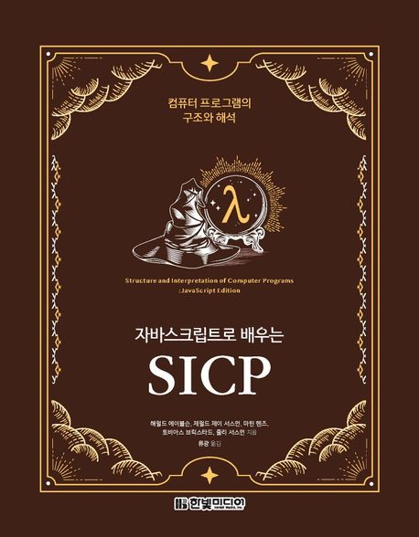

:::info
한빛미디어 <나는 리뷰어다> 활동을 위해서 책을 제공받아 작성된 서평입니다.
:::

## Book Info

:::tip
책 이미지를 클릭하면 교보문고 사이트로 이동합니다!
:::

- 제목: 자바스크립트로 배우는 SICP
- 저자: 해럴드 에이블슨, 제럴드 제이 서스먼, 마틴 헨즈, 토비아스 브릭스타드, 줄리 서스먼 저자
- 출판사: 한빛미디어
- 출간: 2022-12-30

<!--truncate-->

## Intro

SICP(Structure & Interpretation of Computer Programs)는 컴퓨터 과학 분야에서는 빠질 수 없는 유명한 명서이다. 그러나 최근에는 모르는 사람이 더 많을 것이다. 나 또한 이 책을 처음 알게 됐을 때가 2020년도였다. 알더라도 이 책에 도전하는 사람은 몇 없었다. 그 이유는 Scheme이라는 생소한 언어를 사용하기 때문이다. MIT에서도 수업 교재로 쓰였던 책이었고, 이 분야에서는 꽤 유명한 책이라 읽어보고 싶었지만 인공지능에 빠져 선형대수학을 공부하고 있을 때라 아쉽게도 읽을 시간이 없었다.

이번 나는 리뷰어다 2023에 참여하게 되어 JavaScript로 각색된 이 책을 읽을 수 있게 됐다. 엄청난 행운이라 여긴다. 이 책이 두꺼워 완독까지 얼마나 걸릴지는 모르겠지만, 계속 꾸준히 읽어볼 예정이다. 

## Book Review

### JavaScript

이 책은 원래 Scheme이라는 언어로 쓰였던 책이다. [Scheme](https://ko.wikipedia.org/wiki/%EC%8A%A4%ED%82%B4_(%ED%94%84%EB%A1%9C%EA%B7%B8%EB%9E%98%EB%B0%8D_%EC%96%B8%EC%96%B4))은 [LISP](https://ko.wikipedia.org/wiki/%EB%A6%AC%EC%8A%A4%ED%94%84)라는 언어의 한 방언이다. 둘 다 함수형 프로그래밍에 관심이 있다면 들어볼 만한 언어이지만 꽤 생소한 언어이다.

이 책을 리뷰할 때 당연히 처음부터 하고 싶은 말은 이 책이 JavaScript로 쓰였다는 점이다. 접근성을 매우 높였다고 말할 수 있다. 이제 나를 포함하여 이 책에 관심 있던 사람들이 읽을 수 있게 됐다. 이게 다 자바스크립트, 파이썬 등 자주 쓰이는 언어에도 함수형 프로그래밍이 추가되어 이 책을 읽을 수 있게 됐다. 굳이 LISP과 Scheme을 몰라도 함수형 프로그래밍을 배워볼 수 있는 기회가 생긴 것이다. 

### 엄청난 두께

두께에 압도당하는 책이다. 전공책이 생각나며 이 책을 받았을 때 '언제 다 읽지?'라는 생각이 들었을 정도이다. 참고문헌(Bibliography), 찾아보기(Index)를 제외해도 824쪽이나 된다. 그러나 이렇게 두꺼운 데는 다 이유가 있다.

첫 번째 이유로 연습문제가 꽤 많다. 어느 정도 앞부분을 읽었을 때는 '재밌는 문제가 많네.' 정도였는데 뒤로 갈수록 점점 더 어려운 문제들이 많이 나온다. 특히 sin 함수를 계산해보기도 하고, 적분을 하는 등의 수학과 관련된 내용이 많다. 또한, 알고리즘 문제에 자주 사용되는 개념들도 많기에 사전에 알고리즘 수업을 들어봤거나 공부해 본 사람이라면 읽는 데 유리할 것이다.

두 번째 이유로 컴퓨터 과학과 관련된 다양한 주제를 다루면서 설명도 꽤 자세하다. 프로그래밍 언어뿐만이 아니라 자료구조, 컴파일러, 동시성, 논리 회로 등이 책에서 나온다. 그렇기에 전반적인 CS 지식이 있다면 읽기 더욱 쉬울 것이라 생각한다. 

## 대상 독자

함수형 프로그래밍과 전반적인 CS 지식을 공부하고 싶은 사람에게 이 책을 추천하고 싶다. 또한, 꾸준히 공부 습관을 길러보고 싶은 분들께도 추천한다. 이 책은 무려 약 800쪽의 두꺼운 책이다. 그렇기에 실제로 이 책을 읽다가 포기하신 분들도 많다고 알고 있다. 완독을 목표로 한다면 다른 선수 지식은 다 필요 없고 인내심을 갖고 천천히 읽는 것을 추천한다.