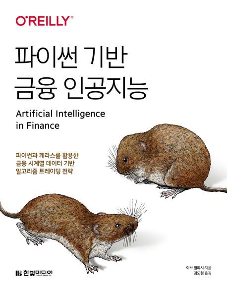

:::info
한빛미디어 <나는 리뷰어다> 활동을 위해서 책을 제공받아 작성된 서평입니다.
:::

## Book Info

:::tip
책 이미지를 클릭하면 교보문고 사이트로 이동합니다!
:::

- 제목: 파이썬 기반 금융 인공지능
- 저자: 이브 힐피시
- 역자: 김도형
- 출판사: 한빛미디어
- 출간: 2022-09-30

<!--truncate-->

## Intro

최근 금융 도메인에 관심이 생겨 어떻게 공부할 방법이 없나 찾아보다가 이 책을 읽게 됐다. 사실 금융 쪽을 공부하기 위해서 이런 책보다는 전문 지식과 관련된 책을 읽는 것이 더 나을 수도 있다. 그러나 이 책을 선택하게 된 건 **어떻게 인공지능에 금융 지식을 접목할 수 있을까?**라는 이유 때문이다. 내가 만든 인공지능이 투자까지 해서 돈을 벌어다 줄 수만 있다면 얼마나 좋을까. '이제 몇 년만 좀 더 지나면 가능하지 않을까?'라는 희망을 갖고 이 책을 통해 금융 기초 지식을 공부하고 싶어 선택했다. 

## Book Review

### 상당히 어려운 난이도

초반에는 인공지능과 초지능에 대해 설명하며 Chapter 3부터 본격적으로 금융 관련 지식이 나오기 시작한다. 확률 및 통계, 금융, 경제 등의 지식이 나오니 사전 지식이 있으면 더욱 이 책을 읽기에 수월할 것이다.

나는 금융 지식이 부족하여 이 책을 읽는데 어려움이 있었다. 그러나 각 chapter마다 참고 문헌이 있어 특정 부분을 더 공부하고 싶으면 참고 문헌을 읽어봄으로서 더 공부할 수 있었다.

이 책을 읽기 전 이 책의 저자가 쓴 [파이썬을 활용한 금융 분석](https://product.kyobobook.co.kr/detail/S000001810474)을 읽어보면 이 책을 더 편하게 읽을 수 있지 않을까 예상해본다. 

### 코드 제공의 불편함

일반적인 책들은 소스코드를 GitHub에 올려놓기 마련이다. 그러나 이 책은 자신의 사이트에 소스코드를 공개해뒀다. 사이트에서 주피터 랩으로 연결되어 코드를 바로 실행시키는 것은 장점이나 일부 코드가 잘 안 돌아가는 경우도 있었다. 코드를 다운 받아 colab 또는 자신의 로컬 환경에서 실행시키는 것을 추천한다.

## 대상 독자

금융 또는 경제에 관심이 많으며, Keras를 한번쯤 사용해본 프로그래머에게 추천한다. 이 책은 절대 입문서가 아니다. 쉬운듯이 설명되어 있지만, 사실 하나하나 어려운 내용이니 사전 지식을 공부 후에 이 책을 읽기를 바란다.