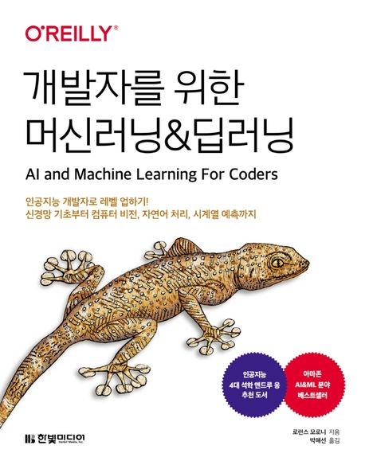

:::info
한빛미디어 \<나는 리뷰어다\> 활동을 위해서 책을 제공받아 작성된 서평입니다.
:::

## Book Info

:::tip
책 이미지를 클릭하면 교보문고 사이트로 이동합니다!
:::

- 제목: 개발자를 위한 머신러닝&딥러닝
- 저자: 로런스 모로니
- 역자: 박해선
- 출판사: 한빛미디어
- 출간: 2022-08-24

{/* truncate */}

## Intro

다시 머신러닝 책 리뷰를 쓰게 됐다. AI가 인기가 많은 만큼 머신러닝 책도 많이 나오고 있다. 실무에서 자주 쓰이는 백엔드, 프론트엔드 기술과 관련해서도 책이 많이 나왔으면 좋겠는데 요즘 트렌드가 이러하니 어쩔 수 없는 것 같다. 

어쨌든 이런 책들이 많이 나오니 머신러닝은 더 이상 전공자만 배울 수 있는 기술이 아니게 되고 있다. 누구나 배우고 싶으면 배울 수 있다. 그러니 머신러닝 또는 딥러닝을 공부해 보고 싶다면 사람들이 쓴 리뷰를 잘 판별해서 책을 골라보자. 

## Book Review

### 개발자에게 추천하고 싶은 책

개인적으로 나는 밑바닥부터 공부해서 올라오는 Bottom-Up 방식을 좋아한다. 그래서 내 첫 딥러닝 책은 [밑바닥부터 시작하는 딥러닝](https://teddygood.github.io/blog/deep-learning-from-scratch)이었다. 그러나 지인들에게 책을 추천할 때 **Bottom-Up 방식의 공부를 좋아하지 않으면 과연 어떤 책을 추천할 수 있을까?** 라는 생각이 들었다. 

누군가는 개념들을 간단하게 공부한 후, 빠르게 적용하고 싶을 수도 있지 않은가. 이 책은 그런 경우에 적절하게 사용할 수 있는 책이라 생각한다. 모르는 개념들과 용어는 개인적으로 구글링을 통해 찾아보면 된다. 또한, 저자뿐만 아니라 역자분께서 역주를 사용하여 부족한 개념들을 보충해 주셨기에 읽기 쉬울 것이다. 이번에 이 책을 읽으면서 다음부터 개발자들에게 머신러닝, 딥러닝 책을 추천할 일이 있다면 이 책을 추천할 예정이다. 

### 간단한 순서

이 책은 PART 1과 PART 2로 나누어진다. 처음에 PART 1에서는 전반적으로 모델들에 대해 설명한다. 텐서플로부터 간단하게 소개하고 바로 컴퓨터 비전과 CNN으로 넘어간다. 그리고 텐서플로 데이터셋을 사용하는 방법을 알려주는데 여기서 **4.6 텐서플로에서 데이터 관리를 위한 ETL 프로세스**가 인상적이었다. 간단하게 설명하지만 이 부분이 실제로 중요한 부분이라 생각된다. 이후 자연어처리, RNN 그리고 시계열 데이터까지 다룬다. 누군가에게는 이 책이 불친절하다고 생각할 수 있다. 하지만 책을 읽는 대상 자체가 개발자로 지정했기에 불친절하더라도 모르는 부분은 검색하면서 읽어야 하지 않을까 생각이 된다. 검색하면서 모르는 개념들을 공부해 볼 수 있는 것이고 시간이 조금 걸리겠지만 그래도 머신러닝을 빠르게 활용할 수 있게 도와준다는 점에서 나는 이 책을 추천하고 싶다.

PART 2에서는 모델을 어떻게 사용할 수 있는지에 대해 설명한다. 
 텐서플로 라이트를 활용하여 안드로이드, iOS에서 사용할 수 있도록 알려주고, TensorFlow.js를 사용하여 웹에서 사용할 수 있도록 알려준다. TensorFlow.js 기술에 대해서는 예전에 들어본 적이 있었지만, 웹에서 CNN까지 사용해 볼 수 있다는 점은 이 책을 읽으며 처음 알게 됐다. 기술의 발전이 정말 빠르다는 것을 느꼈다.

또한, TFX를 간단하게 소개하고 TensorFlow Serving(TFS)에 대해서 알려준다. TFS 이외의 TFX는 [살아 움직이는 머신러닝 파이프라인 설계](https://teddygood.github.io/blog/building-machine-learning-pipelines)를 참고하는 것을 추천한다. 개인적으로 TFX를 더 다뤄줬으면 좋겠다고 생각하나 그랬다면 책이 엄청나게 굵어졌을 것이라 예상한다. 마지막으로 인공지능 윤리, 개인 정보 보호 등에 대해 간단하게 설명하고 마무리된다. 이런 부분에서 많은 개발자들이 지식이 부족했을 텐데 끝으로 상기시켜 주면서 다뤄주는 것이 좋았다.

## 대상 독자

이 책은 개발자를 대상으로 쓰였다. 그래서 머신러닝, 딥러닝에 대한 기본적인 지식이 없다면 이 책을 읽는 것이 조금 힘들 수도 있다. 하지만 개발자라면 누구나 읽을 수 있게 최대한 간단하고 쉽게 설명하고 있으니 머신러닝, 딥러닝에 관심이 있다면 도전해보길 바란다. 수식이나 어려운 ML 개념은 대부분 제외하고 코드와 결과 위주로 쓰여졌기 때문에 데이터 과학자가 아닌 개발자에게 더욱 특화된 책이라 생각한다. 물론 머신러닝에 대해 사전 지식이 있으면 이 책을 읽기에는 더욱 쉬울 것이다.