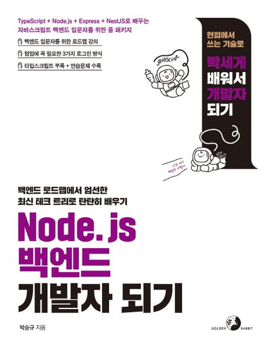

:::info
골든래빗 출판사로부터 책을 제공받아 작성했습니다.
:::

## Book Info

:::tip
책 이미지를 클릭하면 교보문고 사이트로 이동합니다!
:::

- 제목: Node.js 백엔드 개발자 되기
- 저자: 박승규
- 출판사: 골든래빗
- 출간: 2023-04-15

<!--truncate-->

## Intro

최근 Django, FastAPI로 무언가 만들어 보려고 노력 중이었는데 수많은 채용 공고들을 읽어보니 파이썬 백엔드 개발로는 취업에 한계가 있을 거라 생각하게 됐다. 굳이 한 기술만 팔 필요도 없고 다른 기술들도 공부해 보고 싶다고 생각하여 예전에 경험해봤던 Node.js를 선택하게 됐다. "Node.js 개발자가 되기 위해서는 어떤 것들을 공부해야 할까?" 라는 생각에 채용 공고들을 읽어봤는데 가끔 NestJS가 적혀있는 걸 볼 수 있었다. NestJS는 스프링과 비슷한 느낌의 프레임워크라고 많이 말하던데 궁금해서 이 기술도 공부해 보고 싶었다. 그러던 중 최근 핫한 IT 출판사인 골든래빗에서 이 책을 출간하게 되어 북스포일러를 모집하고 있었다. Node.js 백엔드 개발자가 되기 위해 필요한 기술들을 한 권에 담고 있다고 해서 지원했고 당첨되어 책을 받게 되었다. 

## Book Review

### 올인원 책

이 책은 Node.js 개발자가 되기 위한 기술들을 공부할 수 있는 올인원 책이다. 지금까지 나도 한 번에 많은 기술들을 공부하고 체험해 볼 수 있는 올인원 책들을 읽어왔지만 단연코 이 책이 지금까지 최고라고 말해주고 싶다.

DB, 네트워크, Node.js, Express, JavaScript, TypeScript, NestJS 등 공부해야 할 것들이 어마무시하게 많은데 이 책은 이 모든 것들을 한 권에 담으려고 노력했다. 세부적인 설명이 많았다. 다시 봐도 "이걸 어떻게 다 담았지?"라는 생각이 들 정도이다. 

DB, 네트워크 그리고 언어적인 부분까지도 꽤 자세하게 설명해 준다. 솔직히 지금까지 봐왔던 올인원 책들은 대충 설명하여 구글링을 하면서 읽어야 하는 책들도 꽤 있었는데 이 책은 달랐다. 설명이 너무 잘 되어 있어서 놀라울 정도였다. 

프레임워크에만 집중하다 보면 언어적인 부분은 설명이 없기 마련인데 이 책은 타입스크립트는 부록으로 따로 제공하기도 하고 자바스크립트도 필수적으로 알아야하는 부분은 설명해 준다. 타입스크립트에 익숙하지 않은 나도 이 책을 편하게 읽을 수 있었다.

또한, 리눅스 명령어에 익숙하지 않은 독자를 위해서 부록으로 명령어도 기술되어 있다. 정말 올인원 책 중 이렇게 자세하게 설명해 주는 책은 처음이었다.

### 키워드 제시

이 책 또한 후에 어떤 것을 더 공부하면 좋을지 키워드를 제시해 준다. 저자분께서 올리신 [강의](https://www.inflearn.com/course/%EC%B4%88%EB%B3%B4-%EB%B0%B1%EC%97%94%EB%93%9C-%EA%B0%9C%EB%B0%9C%EC%9E%90-%EB%A1%9C%EB%93%9C%EB%A7%B5)도 참고하는 것을 추천한다. 이 책을 읽으면서 더 공부해야 할 것들을 더 명확하게 알 수 있어서 좋았다.

### 트렌디한 책

이 책은 최근 핫한 기술인 NestJS를 사용한다는 점 때문에 트렌디한 책이다. 현재 한국어로 출간된 NestJS 책은 이 책이 아마 두 번째일 것이다. 공식 문서를 읽는 것보다 책으로 공부하는 것이 더 익숙한 독자에게는 정말 도움이 많이 되는 책이라 생각한다. 

## 대상 독자

이 책은 Node.js 백엔드 개발자가 되기 위한 기술들을 공부하고 싶은 사람들을 위한 책이다. 사전 지식으로 자바스크립트를 알고 있으면 이 책을 읽는 데 도움이 많이 될 것이다. 