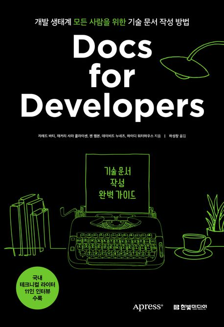

:::info
한빛미디어 \<나는 리뷰어다\> 활동을 위해서 책을 제공받아 작성된 서평입니다.
:::

## Book Info

:::tip
책 이미지를 클릭하면 교보문고 사이트로 이동합니다!
:::

- 제목: Docs for Developers 기술 문서 작성 완벽 가이드
- 저자: 자레드 바티, 재커리 사라 콜라이센, 젠 램본, 데이비드 누네즈, 하이드 워터하우스
- 역자: 하성창
- 출판사: 한빛미디어
- 출간: 2023-04-10

{/* truncate */}

## Intro

나는 예전에 개발자라면 그저 개발만 잘하면 되는 건 줄 알았다. 그러나 실상은 그렇지 않았다. 선배 개발자분들이 쓰신 책들을 통해 협업이라는 것을 해야 된다는 것을 알게 됐고, 또한 서로 의 소통을 해야 한다는 것을 알게 됐다. 이 소통이 그저 말로 하는 커뮤니케이션이라고 생각할 수도 있겠지만, 문서를 통해 소통하는 경우도 많다고 한다. 그렇기에 나는 문서를 잘 쓰는 것 또한 개발자에게 개발하는 것만큼 중요한 능력이라 생각했고 이 책을 선택하게 되었다.

## Book Review

### 누구를 위한 문서인가

이 책은 **'우리가 작성하고 있는 문서를 읽는 사람은 누구인가?'**를 계속 상기시켜 주는 책이다. 이 책은 지식의 저주를 강조한다. 마블의 영화를 봤다면 알 것이다. 간단하게 설명하면 내가 아는 것을 상대방도 알 것이라고 생각하는 것이다. 문서를 읽는 사람이 내가 작성한 코드와 설명에 대해 이해하고 있을 거라고 생각하지 말고, 독자의 눈높이에 맞게 기술 수준을 풀어서 설명하라고 말한다. 결국 독자가 알고 싶어 하는 것을 명확하고 간결하게 전달하는 것이 중요하다는 것이다.

### 간단한 구성과 반성

이 책은 'Corg.ly'라는 가상의 프로젝트를 설정하고 출시 전부터 출시 후까지의 내용을 다룬다. 그 과정에서 어떻게 개발 문서를 작성하고 개선하는지 알려준다.

이 책을 읽으면서 지금까지 내가 썼던 문서들에 대해서 반성을 하게 됐다. 대개 '내가 쓴 문서들은 그래도 개발자가 읽을 테니까 대충이라도 이 기술에 들어봤고 관심이 있을 것이다.'라고 생각하고 쓴 글들이 많다. 책 리뷰도 마찬가지라는 것을 알게 됐고, 앞으로 글을 어떻게 작성해야 할지 고민하게 됐다. 

### 부록

부록은 국내 테크니컬 라이팅에 관한 내용, 전문가를 고용해야 하는 경우, 참고 자료. 즉, 총 3가지가 제공된다. 나는 특히 국내 테크니컬 라이팅에 관한 내용이 마음에 들었다. 난 테크니컬 라이터라는 직업에 대해서 단편적으로 알고 있었으며, 정확히 어떤 일을 담당하고 있는지 몰랐다. 그러나 부록인 국내의 테크니컬 라이터 11분의 인터뷰를 통해 이 직업에 대해 더욱 자세하게 알게 됐고, 이 직업에 대해 흥미도 생기게 됐다. 솔직히 테크니컬 라이터가 되기 위한 분들은 부록만 해도 이 책의 가치는 충분하다고 생각한다.

## 대상 독자

자신이 개발한 것들을 자주 문서화해야 하는 사람들에게 추천한다. 그 이외에도 테크니컬 라이터가 되고 싶어하는 분들께도 이 책을 추천한다. 위에서도 언급했듯이 부록에 현업에서 일하시고 있으신 국내 테크니컬 라이터 11분의 인터뷰가 담겨 있기에 테크니컬 라이터가 되고 싶어 하는 분들께도 이 책을 추천하고 싶다.