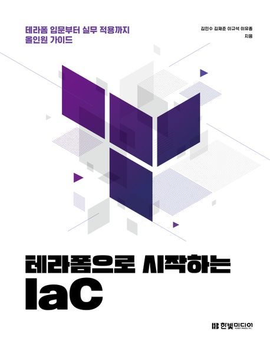

:::info
한빛미디어 <나는 리뷰어다> 활동을 위해서 책을 제공받아 작성된 서평입니다.
:::

## Book Info

:::tip
책 이미지를 클릭하면 교보문고 사이트로 이동합니다!
:::

- 제목: 테라폼으로 시작하는 IaC
- 저자: 김민수, 김재준, 이규석, 이유종
- 출판사: 한빛미디어
- 출간: 2023-05-24

<!--truncate-->

## Intro

사실 난 DevOps는 아는 것이 별로 없는 학생이다. 쿠버네티스와 도커를 잠깐 공부해보긴 했지만 깊게 공부하지는 않았다. 그렇기에 이 책을 선택했을 때 두려움도 있었으나, 언젠가는 DevOps 쪽도 공부해보고 싶었기에 이 책을 선택했다. 테라폼이라는 용어도 가끔 기업들의 CI/CD 파이프라인 이미지에서만 보거나, 얼핏 들어보기만 했지 정확히 무엇인지는 몰랐다. 그래서 이 책을 읽으면서 테라폼이 무엇인지, 어떻게 사용하는지 알고 싶었다.

## Book Review

### 초심자도 읽을만한 책 

위에서도 언급했듯이 이 책을 읽기 전 두려움이 많았었다. 예전에 쿠버네티스, 도커를 공부해볼 때 '그냥 하면 되겠지'라는 심정으로 공부를 했는데 생각보다 어려웠어서 테라폼도 어렵지 않을까 생각했었다. 게다가 DevOps 초심자라 공부하면서 모르는 용어도 분명히 많을 거라 생각해서 책을 읽기도 전에 겁을 먹었었다. 그러나 두려움은 책을 읽으며 점차 사라졌고, 이 책은 초심자도 읽으려고 노력만 한다면 읽을만한 책이라는 것을 느꼈다.

테라폼의 기본 사용법부터, 동작 방식, 어떻게 적용하고 사용하는지 등 테라폼을 어떻게 활용할 수 있는지 설명한다. 크게 1부와 2부로 나뉘어지는데 1부에서는 기본적으로 테라폼을 어떻게 사용하는지 그리고 프로바이더, 동작 방식 등을 설명한다. 2부에서는 테라폼으로 프로비저닝을 하면서 사용 규모가 확장되는 모범 사례를 알려준다. 이 부분이 나는 장점이라 생각했다. 다른 팀 또는 조직과 협업하는 방법을 알려주기 때문이다. 나중에 테라폼을 도입할 일이 생긴다면 이 책을 다시 볼 예정이다.

## 대상 독자

대상 독자는 DevOps에 관심이 있기 보다는 테라폼이라는 기술에 대해 먼저 알고 공부하고 싶은 사람들에게 추천한다. 특히 인프라 엔지니어, 데브옵스 엔지니어 등 서비스를 설계하고 관리하는 직군에게 어울리는 책이 아닌가 싶다. 