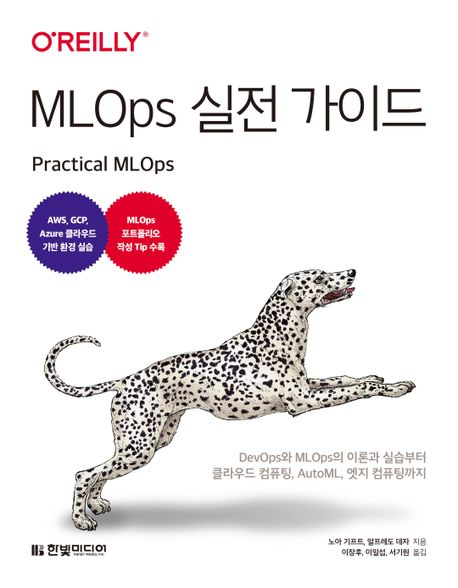

:::info
한빛미디어 <나는 리뷰어다> 활동을 위해서 책을 제공받아 작성된 서평입니다.
:::

## Book Info

:::tip
책 이미지를 클릭하면 교보문고 사이트로 이동합니다!
:::

- 제목: MLOps 실전 가이드
- 저자: 노아 기프트, 알프레도 데자
- 역자: 이장후, 이일섭, 서기원
- 출판사: 한빛미디어
- 출간: 2023-05-24

<!--truncate-->

## Intro

MLOps는 머신러닝이 뜨기 시작하기부터 엄청 뜨고 있는 분야이다. 요즘은 머신러닝 모델만 잘 만들어야 되는 것이 아닌 파이프라인까지 잘 만들어야 한다. MLOps는 머신러닝(ML)과 DevOps의 합성어로 쉽게 설명하면 머신러닝 모델을 개발하고 배포하는 과정을 자동화하는 것이다. 이게 어떻게 가능한가 궁금한 사람들이 많을 것이다. 나 또한 그렇게 공부를 시작했으며, 현재는 머신러닝을 공부하고 더 나은 파이프라인을 만들기 위해 MLOps, 백엔드 부분을 더 공부해보고 있다. 이 책 또한 나에게 도움이 될 것 같아 읽게 됐다.

## Book Review

### 초심자도 읽을만한가

엄청 쉽다고는 말하지 못 할 것 같다. 그러나 MLOps에 대해 관심이 있고 한 번이라도 공부해본 분들께는 이 책을 추천할 것 같다. 제목 그대로 실전 가이드이기에 이론적인 부분보다는 실습 위주로 설명이 되어있다. 그러나 이론적인 부분도 충분히 설명이 되어있기 때문에 커맨드라인 환경, 파이썬, 컨테이너 등 기본 개념만 있다면 이 책을 읽기에 더욱 수월할 것이다. MLOps에 관심이 있다면 한 번쯤 읽어봐야 할 책이라고 생각한다.

### 실습 가이드

이 책은 위에서도 언급 했듯이 실습 가이드 그 자체라고 말할 수 있다. MLOps를 공부하고 싶다면 이런 것들은 알아야 한다고 간접적으로 알려주는듯이 말한다. MLOps라는 분야 자체가 엄청 많은 것들을 알아야 할 수 있는 분야이기에 이렇게 설명했다고 생각한다. 깊이보다는 다양한 것들을 알려주기 위한 책이라 말할 수 있다. 그래서 이 책을 읽고 나면 MLOps에 대해 어떤 것들을 공부해야 하는지 알 수 있을 것이다. 재밌었던 점은 각 챕터의 마지막에 '연습해보기'와 '생각해보기'가 있는데 문제를 해결해야 한다는 것이 재밌었다. 연습해보기는 실습 위주로 문제를 풀어야 하고 생각해보기는 이론적인 부분을 생각해서 풀어봐야 한다. 이런 부분까지 다 해결해보면 MLOps에 대해 더 잘 이해할 수 있지 않을까. 개인적으로 설명도 꽤 잘 되어 있고, 번역도 잘 되어 있다고 느꼈다. 또한, 지금 하고 있는 공부에 여유가 생긴다면 MLOps에 대해 더 깊게 공부해보고 싶다는 생각이 들었다.

### 21년도에 번역되었다면

조금 아쉬웠던 점은 이 책이 flask를 사용한다는 점. 요즘도 물론 flask를 많이 사용하고 있겠지만, fastapi를 사용하는 추세이지 않나 싶다. 기회가 된다면 이 책의 flask 코드를 fastapi로 바꿔보는 것도 재밌는 경험이 될 것 같다.

이쪽 기술은 항상 변화가 빠르기에 이런 부분에서는 아쉬움이 남는다. 아무래도 이 책의 원서가 2021년도에 출간된 것이라 그런 것 같다. 2021년도에 이 책이 번역되어 나왔다면 엄청 인기가 있었지 않았을까.

21년도에는 코드가 돌아갔지만, 현재 23년도에는 안 돌아가는 코드들도 있을 수 있을 수 있으니까 역자분들께서 그런 부분을 찾아내고 수정 및 보완하는 과정에서 엄청 힘드셨지 않으셨을까 싶다. 

## 대상 독자

MLOps 쪽으로 업무를 해야 하는 사람에게 추천한다. 관심이 있거나 이쪽을 경험해보고 싶은 분들께도 추천할 수 있을 것 같다. 사전에 컨테이너, 커맨드라인, 백엔드, 클라우드 등을 알고 있으면 이 책을 읽기 더욱 쉬울 것이다.