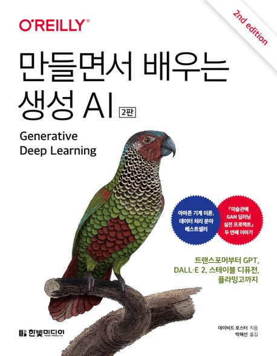

:::info
한빛미디어 \<나는 리뷰어다\> 활동을 위해서 책을 제공받아 작성된 서평입니다.
:::

## Book Info

:::tip
책 이미지를 클릭하면 교보문고 사이트로 이동합니다!
:::

- 제목: 만들면서 배우는 생성 AI
- 저자: 데이비드 포스터
- 역자: 박해선
- 출판사: 한빛미디어
- 출간: 2023-09-15

{/* truncate */}

## Intro

최근 생성 AI는 AI 분야에서 가장 뜨고 있는 분야라고 생각한다. OpenAI의 GPT4부터 최근에는 DALL·E 3까지 많은 발전을 이루고 있는 분야이다. OpenAI뿐만 아니라 다른 기업들에서도 엄청난 제품들을 만들어내고 있다. AI가 점점 더 우리의 생활을 편하게 해주며 좀 더 가까워지고 있는 모습이다. 이런 세상 속에서 생성 AI에 대해 더 궁금해졌고, 이 책을 읽게 됐다. 정말 GAN을 공부했을 때가 엊그제 같은데, 진짜 빠르게 발전했다. 앞으로 AI가 얼마나 더 발전할지 한편으로는 무섭기도 하지만 인공지능을 공부하겠다고 마음 먹은 이상 포기하지 않고 계속 되는 데까지는 공부해보려고 한다.

## Book Review

### 만들면서 배우는

정말 제목을 잘 지었다고 생각한다. 직접 케라스로 모델을 만들어 보면서 하나하나 공부하는 구조이다. 이런 책이 정말 좋다. 이론적인 부분만 공부하다가는 이해가 잘되지 않는 경향이 있다. 그래서 이론적인 부분을 공부하면서 실습도 병행하는 것이 정말 좋다. 이 책도 그런 책이다. 

### 되도록 쉬운 설명

저자가 많은 신경을 쓴 책이라 생각한다. AI 분야 중에서도 생성 AI는 정말 어려운 분야라고 느낀다. 그래서 이 책을 읽기 전에는 뭐랄까 예전에 GAN을 공부했던 기억이 떠오르면서 엄청 어려울 것 같았다. 그러나 저자가 충분히 이해할 수 있도록 예시를 들기도 하고 그림 삽화가 매우 적절하게 있어 책을 편하게 읽을 수 있었다. 그림들도 거의 직접 논문에서 발췌한 것이었다. 수많은 논문들을 읽는 대신 이 책을 편하게 읽을 수 있었다. 영어가 어렵고, 논문을 읽기 힘드신 분들께는 도움이 되지 않을까 싶다. 또한, 믿을 수 있는 역자님께서 번역하셨기에 번역에 큰 의심은 하지 않고 읽어도 됐다. 

### 특히 좋았던 부분

아무래도 가장 좋았던 부분은 이 책의 마지막 부분이었다. 꽤 최신 기술인 DALL·E 2와 스테이블 디퓨전 구조를 조금이나마 공부해 볼 수 있다는 것 또한 이 책의 장점이라 생각한다. 또 좋았던 부분은 마지막에 생성 AI의 타임라인이 나오는데 지금까지 어떤 모델들이 있었고 어떻게 발전하고 있는지 알아볼 수 있어서 좋았다. 

## 대상 독자

생성 AI를 전혀 몰라도 읽을 수 있는 책이지만 그래도 기본적인 딥러닝 개념을 알고 최신 딥러닝 기술들에 대해서도 관심 있고 공부하신 분이 읽으면 도움이 될 것이라 생각한다. 또한, 생성 AI에 대해 더 깊게 공부하고 싶은 분들께도 추천한다.