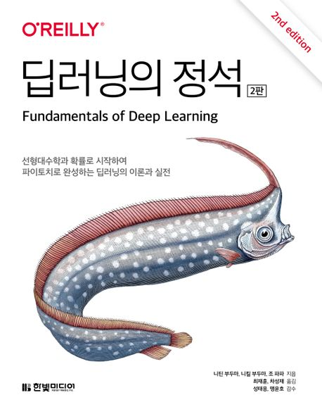

:::info
한빛미디어 \<나는 리뷰어다\> 활동을 위해서 책을 제공받아 작성된 서평입니다.
:::

## Book Info

:::tip
책 이미지를 클릭하면 교보문고 사이트로 이동합니다!
:::

- 제목: 딥러닝의 정석
- 저자: 니틴 부두마, 니킬 부두마, 조 파파
- 역자: 최재훈, 차성재 
- 감수자: 성태응, 맹윤호
- 출판사: 한빛미디어
- 출간: 2024-02-02

{/* truncate */}

## Intro

벌써 2024년이다. 지금까지 딥러닝을 공부하면서 어려움이 많았다. 물론 아직도 어렵다. 이번 년도에도 난 열심히 머신러닝을 공부하겠지. 읽고 싶은 책은 매우 많지만 이번 2024년에도 한빛미디어의 나는 리뷰어다에 참여하게 되어 2024년 첫 IT 책은 딥러닝의 정석이 되었다. 

## Book Review

### 초심자보다는 초중급자를 위한

초심자보다는 초중급자를 위한 책이라 느껴진다. 내 개인적인 의견이다. 거의 중급자 정도 되면 이제 코드를 보면 대충 어떤 느낌인지 감이 올 것이다. 그 상태에서 이 책의 설명을 읽으면 더 재밌게 읽을 수 있다. 오랜만에 글을 쓰는 거라 설명을 정말 못 하는데, 하고 싶은 말은 파이토치의 문법 하나하나를 다 자세하게 설명하지는 않는다는 것이다. 이 책은 코드 전체의 흐름을 진행하며 설명하는 그런 느낌의 책이다. 그렇기에 초심자가 읽기에는 조금 어렵다고 생각했다. 근데 의외로 난 재밌게 읽었다. 복습하는 느낌도 들었고, 도움이 많이 됐다고 생각한다. 특히 4장까지는 선형대수학, 확률, 신경망, 순방향 신경망에 대해 설명하는데 코드는 하나도 나오지 않는다. 다 수학과 개념이 나오는데 비록 기초적인 내용이지만 내가 알고 있는 지식을 다시 점검하면서 복습할 수 있기에 좋았다. 그리고 이 책에는 수식이 꽤 많이 나오는데 저자가 수학적인 내용도 설명하고 싶었다는 걸 보여주는 모습이다. 이런 부분은 중급자 입장에서는 더 도움이 되지 않나 생각이 든다.

근데 내가 벌써 중급자라고 생각이 드는 건 자만이지 않을까. 그냥 딥러닝을 좀 공부해본 사람이지. 중급자는 과분한 표현인 것 같다. 근데 리뷰를 보는 사람 입장에서는 저 표현이 더 적절한 표현이 아닐까.

### 이것저것

CNN, RNN, 강화학습, 생성 모델, XAI 그리고 NTM이라고 불리는 Neural Turing Machines까지 다 언급하고 간단하게라도 다뤄본다. XAI, NTM 부분은 개인적으로 너무 어려웠던 부분이다. CNN, RNN, 강화학습에 비하면 조금 지엽적이기에 이해하기 어려웠지 않았나 싶다. 공부 열심히 하신 분들은 이 부분도 이해 하지 않을까. 어쨌든 한 번이나마 이런 분야가 있다는 걸 알게 되어서 흥미로웠던 부분이다.

## 대상 독자

초심자에게는 불친절한 책이 맞다고 생각이 든다. 그러나 어느정도 딥러닝의 흐름을 알고 있다면 이 책을 재밌게 읽을 수 있을 것이다. 딥러닝의 다양한 분야를 찍먹 해보고 싶은 분들께도 추천하고 싶다. 딥러닝을 공부하고 싶은데 내가 어떤 분야를 해보고 싶을지 모를 때 참고하면 도움이 될 것이다. 또, 읽고 싶은 부분을 복습하고 싶은 분들도 한 번 읽어보는 걸 추천한다. 개념 설명은 누구나 다르게 할 수도 있으니 말이다. 복습은 언제나 좋은 것이라 생각한다. 난 요즘 생성 모델을 열심히 공부하고 싶어 GAN 부분을 특히 더 자세히 읽었다. 