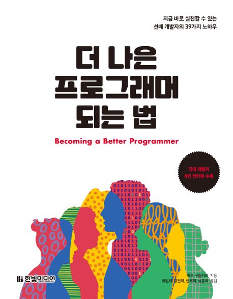

:::info
한빛미디어 \<나는 리뷰어다\> 활동을 위해서 책을 제공받아 작성된 서평입니다.
:::

## Book Info

:::tip
책 이미지를 클릭하면 교보문고 사이트로 이동합니다!
:::

- 제목: 더 나은 프로그래머 되는 법
- 저자: 피트 구들리프
- 역자: 최원재, 강전희, 안재덕, 남윤화 
- 출판사: 한빛미디어
- 출간: 2024-04-30

{/* truncate */}

## Intro

2024년 두 번째 기술책이다. 최근 다양한 책들을 접하고 프로젝트도 하고 있기에 시간이 부족하여 완독이 어려워지고 있다. 그럼에도 불구하고 이 책은 읽기 쉬울 것 같기도 하고 '더 나은 프로그래머가 되기 위해서는 어떤 걸 더 해야 할까?'라는 궁금증이 생겨 읽게 됐다.

## Book Review

### 반성하게 되는 책

이 책은 프로그래머로서 어떻게 성장해야 하는지에 대해 다루고 있다. 책을 읽으면서 나는 이런 부분을 놓쳤구나, 이런 부분을 더 신경 써야겠다는 생각이 들었다. 책을 읽으면서 반성하게 되는 부분이 많았다. '나는 코드에 신경을 쓰고 있는가?', '내가 쓴 코드를 다시 보는가?', '테스트 코드를 작성하는 것이 중요한가?' 등. 이런 부분들을 다시 한 번 생각해보게 되었다.

### 선배가 알려주는 책

책을 읽으면서 선배 프로그래머가 하나하나 알려주는 느낌이 들었다. 프로그래머로서 어떻게 생각하고 행동해야 하는지 등의 노하우. 그런 노하우를 배운 느낌이 들었다. 나는 분명히 지금 회사에 다니고 있지도 않고 선배도 없는데 선배가 생긴 듯한 느낌. 책에서도 '마치며' 부분에 '생각해보기'가 있는데 거기에 적힌 질문 외에도 생각해볼 만한 것들이 많았다. 나중에 기회가 된다면 다른 사람들과 이 책으로 간단하게 스터디를 해보고 싶을 정도이다.

## 대상 독자

프로그래머로서 성장하고 싶은 사람이라면 읽어보면 좋을 것 같다. 특히 신입, 주니어가 읽으면 좋은 책이지 않을까 싶다. 학생도 좋다. 나도 학생이니까. 이 책을 읽으면서 반성하고 더 나은 프로그래머로 성장하고 싶은 사람이라면 추천한다. 
