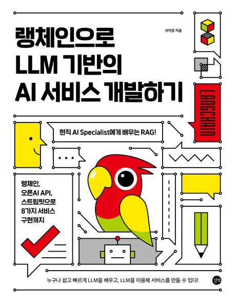

## Book Info

:::tip
책 이미지를 클릭하면 교보문고 사이트로 이동합니다!
:::

- 제목: 랭체인으로 LLM 기반의 AI 서비스 개발하기
- 저자: 서지영
- 출판사: 길벗
- 출간: 2024-02-27

{/* truncate */}

## Intro

요즘 LLM(Large Language Model)이 너무 인기가 많아 나도 시험기간이지만 잠깐 시간을 내어서 공부해 봤다. 사실 인공지능을 공부하는 사람이니 LLM이 무엇인지도 알고, 어떻게 사용할지도 대충은 알고 있다. 그러나 책을 읽는 이유는 다시 한번 더 복습을 위해서이기도 하고, 무엇보다도 이 책이 엄청 얇았기 때문이다. 거기다 마이크로소프트 직원이 쓰셨으니 무언가 더 특별한 팁이 없지 않을까 생각한 점도 있었다.

## Book Review

### 머신러닝 직군이 아닌 개발자에게 좋은 책

머신러닝을 공부하지 않은 개발자에게 도움이 되는 책이라 생각한다. 전반적인 인공지능 개념이 담겨 있으며, 코드가 그렇게 많지 않은 편이다. 즉, 가볍게 읽기 좋았던 책이다. 콘다 설치부터 OpenAI API key를 받는 것, 그리고 허깅페이스 토큰까지 얻는 과정이 상세히 나와 있으니 기초 개념서로 충분히 좋은 책이라 생각한다.

나는 RAG에 대한 부분을 복습할 수 있어서 도움이 됐고, 랭체인도 처음 써봤는데 은근 나쁘지 않았다. 끝부분에는 랭체인으로 할 수 있는 프로젝트들이 소개되어 있으니 참고하면 좋을 것 같다. 나도 내 프로젝트에 랭체인과 LLM을 어떻게 써볼지 고민했던 좋은 계기가 된 책이다. 곧 랭체인으로 프로젝트를 하나 해봐야겠다.

## 대상 독자

LLM이 인기가 많아 한 번쯤 공부해 보고 싶은 분들께 이 책을 추천한다.