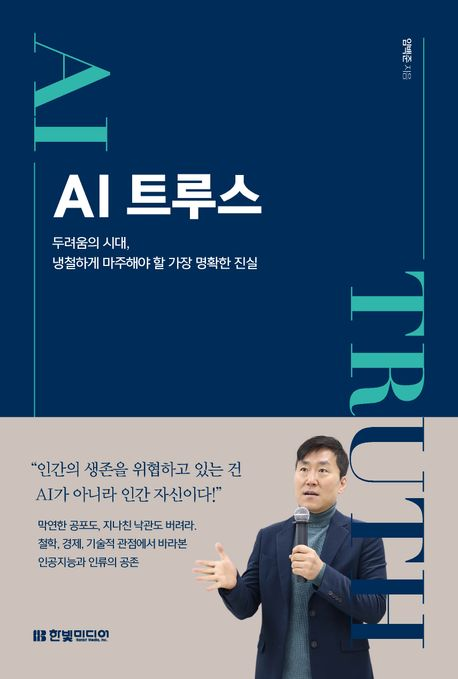

:::info
한빛미디어 \<나는 리뷰어다\> 활동을 위해서 책을 제공받아 작성된 서평입니다.
:::

## Book Info

:::tip
책 이미지를 클릭하면 교보문고 사이트로 이동합니다!
:::

- 제목: AI 트루스
- 저자: 임백준
- 출판사: 한빛미디어
- 출간: 2024-08-20

{/* truncate */}

## Intro

2024년 네 번째 기술책이다. 최근 취업 준비도 하고, 인강도 듣고, 각종 프로젝트도 하고 있기에 시간이 부족하여 읽던 개발 서적의 완독이 어려워지고 있다. 그럼에도 불구하고 이번에 읽어 보고 싶은 책이 생겨 나는 리뷰어에 지원해서 읽게 됐다. 내가 저자의 팬이기도 하고, 인공지능에 대한 관심이 많아서 선택했다.

## Book Review

### 전반적인 책 리뷰

처음에는 저자가 10년 후 인공지능과 함께 일하는 모습을 상상한 소설로 시작한다. 재미가 없을 수도 있는 주제인데 소설로 시작하니 에피타이저를 먹으며 입맛을 돋구는 느낌이었다. 그리고 실제로 그렇게 될 가능성도 충분히 있다고 생각해서 재밌게 읽은 부분이다. 2장에서는 인공지능의 역사를 다루는데, 너무 깊지도 얕지도 않게 적절한 수준으로 잘 다뤄주기에 이해하기 편했다. 인공지능이 어떻게 발전해 왔는지 확인할 수 있는 부분이었다.

3장에서는 인공지능이 사람을 놀라게 했던 사례들이 나온다. 최근 문제로 떠오르고 있는 딥페이크부터 시작해, 예전에 뉴스에도 많이 나왔던 딥마인드 팀의 알파고, 단백질 구조를 예측하는 알파폴드까지 다양한 사례를 알려준다. 4장은 이 책의 핵심이라고 말할 수 있는데, 특히 개발자가 인사이트를 얻을 수 있는 내용이 많이 담겨 있다고 생각한다. 여기까지 읽다 보면 이 책이 정말 최근 이슈까지 잘 반영되어 있는 책이라는 사실을 알 수 있을 것이다.

5장에서는 인공지능이 실제로 어디에, 그리고 어떻게 쓰이고 있는지 설명해준다. 마지막 6장은 저자의 상상과 함께 우리가 두려워해야 하는 것에 대해 다룬다. 6장은 생각하면 할수록 무섭고 두렵다. 물론 해결책도 다루지만, 여기에 적어두지는 않겠다. 만약 궁금하다면 직접 책을 읽어보길 바란다.

### 개발자는 대체되는가

현재 개발자로 일을 하고 있거나, 개발자를 꿈꾸는 학생이라면, AI의 빠른 발전으로 인해 개발자라는 직군이 AI로 대체되지 않을까라는 생각을 한 번쯤은 해보지 않았을까 생각해본다. 나는 솔직히 말하면 두려움을 느꼈었다. 최근 Anthropic 사의 Claude 기능 중 Artifacts 라는 기능이 Feature Preview로 선공개 된 적이 있었다. 난 트위터에서 알게 되어 그 기능을 바로 써봤었는데 정말 놀라웠다. 원하는 UI가 있으면 캡처를 한 후, input으로 넣고 '이 UI처럼 만들어줘'라는 한 문장만 입력하면 완벽하지는 않지만 비슷한 UI를 만들어준다. 프레임워크도 React로 만들어달라고 하면 만들어 주고, 언어도 TypeScript로 만들어 달라고 요청만 하면 만들어준다. 처음에는 내가 프론트엔드를 주로 하지 않으니 '와, 프론트엔드 개발자들 조금만 더 있으면 대체 되는 거 아냐?'라는 바보 같은 생각을 조금 했었다. 거기다 플러스로 프론트엔드도 이 정도인데 다른 분야도 이 정도면 곧 대체가 되지 않을까 하는 생각도 들었다.

근데 이 책을 읽으면서 그런 생각은 사라지게 됐다. 당연한 얘기지만 인공지능은 아직 완벽하지 않다. 무언가 만들어 달라고 하는 input을 넣으면 완벽하게 output이 나오지 않는다. 가끔 환각(hallucination)이 있을 수도 있고, 아직은 인간이 원하는대로 완벽하게 나오지는 않는다. 물론 코드의 품질 자체는 이미 사람이 작성한 코드보다 더 정확하고 깔끔한 코드를 잘 만들어 내고 있다고 느낀다. 그러나 코드의 범위가 넓어지고, 추상 수준이 올라가면 아직은 사람의 실력에 미치지 못한다.  

그리고 앞으로 개발자가 필요가 없어진다는 건 애초에 말이 안 되는 얘기다. 어떤 한 사람이 인공지능이 작성한 코드를 활용하여 도박, 사이버 범죄 등 비윤리적인 소프트웨어를 만들면 누가 막을 것인지 생각을 해봐야 한다. 지금은 현업에 계시는 분들이 있지만, 앞으로 신입 개발자를 뽑지 않는다면 막을 방법이 없다. 그것도 '인공지능이 알아서 해줄 거야'라고 생각하면서 미래를 대비하지 않는 것은 위험한 생각이다.

결국 신입 개발자는 적은 수가 됐든 많은 수가 됐든 지속적으로 뽑아야 하는 것이 맞다. 그러니 현재 시점에서 개발자가 대체되는 것은 아니다. 이 이유가 아니더라도 대체 되지 않는 이유에 대해서는 책에서 더 설명하니 책을 읽어보길 바란다.

### 두려움

그래도 어느정도의 두려움은 가질 필요가 있다. 기술의 발전은 점점 더 빨라지고 있기 때문이다. 이번년도 초에는 GPT-3.5 Turbo를 쓰고 있었는데 어느새 ChatGPT 서비스에서 GPT-3.5 Turbo는 없어졌다. 그리고 이제는 GPT-4를 넘어서서 GPT-4o, 지금은 o1-preview와 o1-mini까지 나온 상태이다. 정말 기술의 발전이 빠르다는 것을 느낀다. 또 언제 다른 모델이 갑자기 나올지도 모른다. 이게 지금 우리가 바라봐야 하는 현실이다. 우리는 두려움을 가지면서도 이 시대를 대비해야 한다.

이 책을 마지막으로 쓴 시점이 언제인지는 잘 모르겠으나 정말 놀랐던 부분이 있었다. 현재의 인공지능 모델은 대부분 확률과 통계를 기반으로 하는 모델이다. 그런데 이 책에서는 단순히 확률과 통계 기반으로 '말하기'를 넘어 그 다음 단계인 '생각하기'로 나아갈 수 있다고 말한다. 지금 OpenAI의 o1 모델이 그 단계이다. 요즘 취업 준비 때문에 인공지능 공부를 잠시 놓고 있었는데, 이 책을 읽으면서 최근 이슈들을 많이 놓치고 있다는 걸 깨닫고 반성하게 됐다. 

### 그럼 무엇을 준비해야 하는가

인공지능은 계속 발전할 거고 우리는 이 시점에서 무엇을 할 수 있을까? 그리고 무엇을 해야 할까? 먼저 프로그램 전부를 코딩하는 사람이 될 필요는 없어 보인다. 반복적인 일은 빠르게 인공지능에게 맡기고, 조금 어려운 업무나 인간이 할 수 있는 다른 직군과의 커뮤니케이션을 하거나, AI가 작성한 코드를 확인하고 테스트하는 등의 일을 더 해야 한다고 생각한다. 즉, 인공지능을 도구처럼 사용하면서 풀어야 하는 문제를 해결하는 것에 더 집중해야 한다고 느낀다.

그런 사람은 어떻게 될 수 있을까? 과거의 수준 높은 개발자와 크게 다른 것은 없어 보인다. 많은 기술을 알아야 하고, 문제를 해결하는 수학적인 재능, 코드를 읽고 이해하는 능력, 몰입할 수 있는 집중력 등이 필요할 것이다. 결국 인공지능을 더 빠르게 이용할 수 있어야 한다는 것을 제외하면 크게 달라진 것은 없다.

### 진짜 가치

책에서 게임 개발자로 유명한 존 카맥이 한 말이 인용되어 있다. 이 부분은 너무 인상 깊어 가져왔다.

> 가치의 원천이 '코딩'인 적은 한 번도 없었다. 그러니 사람들을 코딩에 너무 집착하지 말아야 한다. 문제를 해결하는 것이야말로 핵심 기술이다. 전통적인 프로그래밍이 요구하는 규율과 정확성은 계속 소중한 가치로 남아 있겠지만, 그런 것들은 더 이상 진입장벽 역할을 하진 않을 것이다. 나는 인공지능이 나보다 더 뛰어난 프로그래머라면 인공지능을 관리하는 일을 즐겁게 할 수 있을 것 같다.

개발자는 결국 문제를 해결하는 직군이다. 국요즘 각 기업의 JD(Job Description)을 읽으면서 나도 체감하고 있다. 기업들도 결국 문제를 잘 해결할 줄 알고 그런 경험을 해본 사람을 원한다.

어쨌든 이제 코딩은 아무나 할 수 있는 시대가 됐다. 인터넷에는 좋은 문서, 강의 등이 정말 많고, 그만큼 코딩을 할 수 있는 사람도 많아지고 있다. 예전에는 코딩이라는 것을 아무나 할 수 있는 게 아니었겠지만 현재는 누구나 공부만 하면 할 수 있는 시대가 됐다. 원래 책 리뷰를 적으면서 책 내용을 인용하지는 않지만 진짜 마지막으로 책의 문장을 또 인용해보겠다. 정말 인상 깊었던 문장이다.

> 코딩에 집착하지 말라. 자기가 사용하는 기술에 매달리지 말라. 인공지능의 도움을 받는 것을 즐겁게 생각해야 한다. 인공지능의 도움을 받아 문제를 해결하는 것이야말로 진정한 가치에 해당하기 때문이다. **진짜 가치는 문제를 해결하는 것이다.** 코딩이 아니다.

## 대상 독자

이 책은 개발자에게 추천하는 책이다. 특히 인공지능 직군에 있지 않은 개발자에게 더 추천하는 책이다. 이 책을 읽으면서 인공지능이 어떻게 발전해왔는지, 어떻게 사용되고, 어떻게 사용해야 하는지에 대해 알 수 있을 것이다. 그리고 이 책을 읽으면서 인공지능이 발전하는 시대 속에서 개발자로서의 가치를 높이는 방법에 대해 생각해볼 수 있을 것이다. 