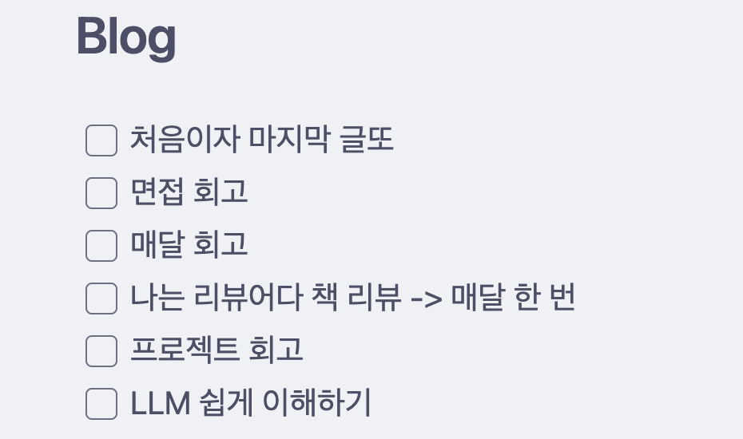
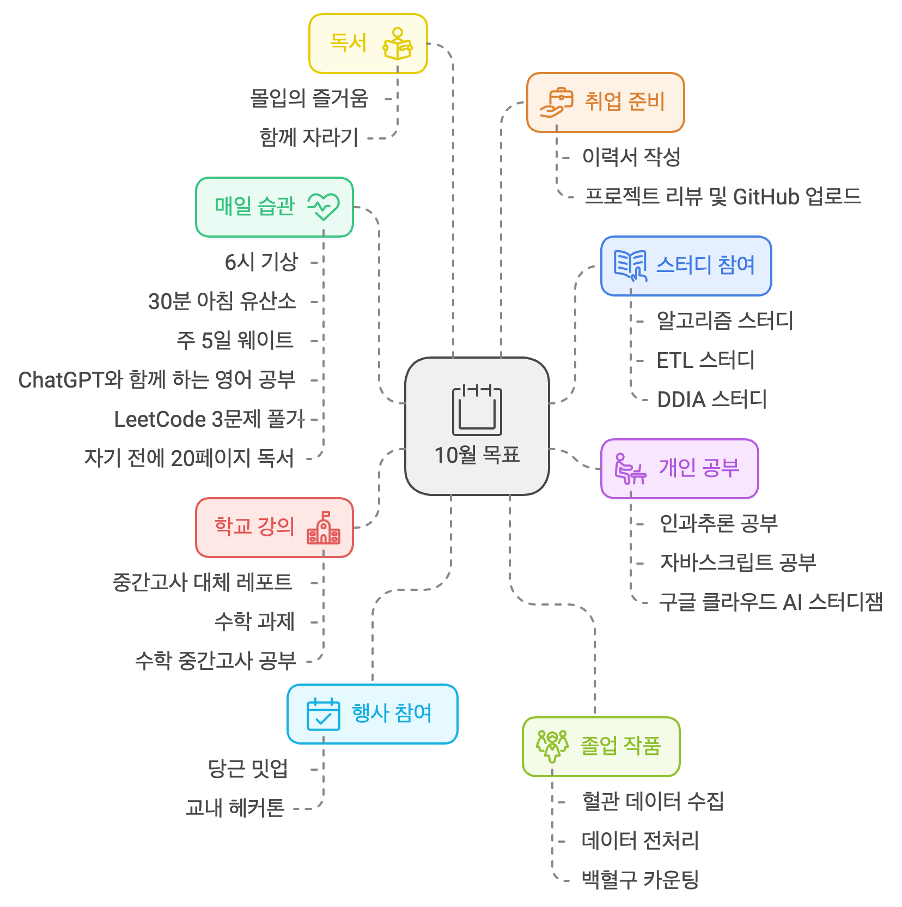

## 글또 10기

### 지원

이번에 글또 커뮤니티에 들어갈 수 있는 기회가 생겼다. 매 기수마다 참여하고 싶은 마음이 있었지만, 바쁘거나 체크를 안 해둬서 놓치는 경우도 있었고, 지원서를 작성하면서 '나' 자신을 되돌아 보는 것이 부담스러웠을 때도 있었다. 사실 이번에도 지원서를 작성하는 게 쉽지 않았지만, 이렇게라도 지금까지의 내가 뭘 했고, 어떻게 살았는지 다시 한 번 알아볼 수 있어서 정말 좋은 경험이었다. 그리고 무엇보다 이번이 글또의 마지막이기에 꼭 활동해보고 싶었다.

### 글또에서 이루고 싶은 목표

취업 준비 중이라 바쁘지만, 처음이자 마지막 글또 활동이기에 최대한 많은 활동을 해보려고 한다.

- 다양한 소모임 채널에 참여
- 다양한 분들과 커피챗 또는 모각코, 모각글
- 건강한 삶을 위한 습관 형성

9월은 정말 힘든 달이었다. 취업 준비로 인한 온갖 스트레스에 시달리며, 평소 지키던 루틴은 무너져 버렸다. 일주일에 세 번씩 배달 음식을 시켜 먹었고, 혼자 술을 마시는 날도 잦았다. 우연히 글또에 들어올 수 있게 됐고, 이대로는 안 되겠다는 생각에 10월에는 글또의 다양한 소모임 채널에 참여하여 다시 건강한 습관을 만들기로 다짐했다.

그 중 하나로 예전의 뿌듯함과 성취감을 되찾고자 다시 6시 기상에 도전하고 있는데, 예전에는 그렇게 쉬웠던 일이 요즘에는 왜 그렇게 어려운지 모르겠다. 예상 외로 이번주에 가장 순조롭게 잘 해낼 수 있을 것 같았떤 기상 습관이 벌써 실패했. 그렇지만 포기하지 않고, 계속 도전할 예정이다. 비록 갑자기 너무 많은 것을 하려 해서 스트레스를 받고 있지만, 하루하루가 행복하고 감사하다.

스스로 아직 전문성이 부족하다고 생각하여 커피챗은 아직 조금 두렵기도 하다. 과연 내가 1:1로 대화를 하거나 여러 사람을 만났을 때, 과연 어떤 이야기를 나눌 수 있을지 고민이 된다. 다른 분들은 대부분 직장인이시기 때문에 나의 지식이나 경험이 부족하여 대화가 원활하게 안 이뤄질 수도 있지 않을까 걱정도 된다.

하지만 이런 고민은 항상 새로운 사람들을 만날 때마다 반복된다고 느낀다. 그렇기에 이번 글또를 잘 활용하여 이를 극복하고, 조금 더 적극적으로 소통해보려고 한다. 전문성에 대한 부담 내려놓고, 완벽하지 않아도 괜찮다는 마음으로 활동해보려고 한다. 어차피 난 아직 대학생이고, 직장인도 아니기에 나에게 큰 기대가 없을 것이다. 그러니 너무 걱정하지 말고, 이 시간을 충분히 즐기자.

그리고 어쩌면 내가 가진 작은 지식이나 경험도 누군가에게 큰 도움이 될 수도 있지 않을까? 나도 상대방의 이야기를 듣고 배우고, 나 또한 내 이야기도 해보면서 서로가 더 성장할 수 있는 그런 인연을 만들어 보고 싶다.

### 어떤 글을 쓸 것인가

난 블로그와 위키를 따로 운영하고 있다. 예전부터 위키에는 CS 지식이나 간단한 인사이트를 담고 싶었고, 블로그에는 단순히 지식을 전달하는 글이 아니라 나의 생각과 경험이 담긴 글을 적어보고 싶었다. 그리고 읽기 쉬우면서도 짧은 글이 아닌 조금 긴 글을 쓰고 싶었다.

지금까지 생각한 주제는 위와 같다. 대략적으로 이런 내용들의 글을 쓰지 않을까 싶다. ML과 관련된 멋진 글을 써보고 싶기도 한데 아직까지는 어떤 주제로 글을 쓰게 될지 모르겠다. 활동하다 보면 좋은 글이 떠오르지 않을까 싶다. 

## 10월 목표

마지막으로 10월 목표를 간단히 공유해보려고 한다! 항상 계획하고 목표를 설정하고 행동하려 하지만, 내 생각과 현실은 항상 다른 것 같다. 그래서 계획을 설정하는 것이 어렵지만 재밌기도 하다.

- 매일 할 수 있는 습관 만들기
  - 6시 기상
  - 새벽 30분 공복 유산소(걷기, 뛰기)
  - 주 5일 웨이트(가슴, 등, 어깨, 하체, 팔)
  - ChatGPT와 함께 하는 영어 공부
  - 리트코드 최소 3문제 풀기
  - 자기 1시간 전에 최소 20p 독서
- 스터디 참여
  - 알고리즘 스터디([Coursera Stanford Algorithms](https://www.coursera.org/specializations/algorithms))
  - ETL 스터디([러닝 스파크](https://product.kyobobook.co.kr/detail/S000061353994))
  - DDIA 스터디([데이터 중심 애플리케이션 설계](https://product.kyobobook.co.kr/detail/S000001766328))
- 개인 공부
  - 인과추론
    - [실무로 통하는 인과추론 with 파이썬](https://product.kyobobook.co.kr/detail/S000212577153)
    - [인과관계 추론과 발견 with Python](https://product.kyobobook.co.kr/detail/S000213021532)
  - 자바스크립트
    - [코어 자바스크립트](https://product.kyobobook.co.kr/detail/S000001766397)
  - [구글 클라우드 AI 스터디잼](https://sites.google.com/view/2024-study-jams/ai?fbclid=IwY2xjawFGYPlleHRuA2FlbQIxMAABHfcnts6c4jK3Hu0Z54OCOf1N3TLFGWM7Kcs5r43nvVpXteynWljH_6o4oA_aem_wSwPx49oIGWNDlWfJcizow)
- 학교 강의
  - 교양 중간고사 대체 레포트 작성
  - 수학 과목 과제
  - 수학 과목 중간고사 공부(마지막 학기인데도 수학 과목을 듣는 미쳐버린 나)
- 졸업 작품
  - 혈관 데이터 수집
  - 데이터 전처리(CLAHE, LDC(Lightweight Dense CNN for Edge Detection))
  - DVS(Dynamic Vision Sensor) 카메라로 촬영
  - YOLOv8을 활용하여 백혈구 카운팅
  - 계속 실험
- 독서
  - 몰입의 즐거움(벌써 3번째 읽는 책)
  - 함께 자라기(다음 읽을 책)
- 취업 준비
  - 이력서 작성
  - 지금까지 했던 학교 프로젝트 복습 후 GitHub에 깔끔하게 올리기
- 행사 참여
  - 당근 밋업
  - 해커톤(학교 내부에서 곧 진행 예정)

이렇게 적어보니 정말 많은 것 같다. 일단 지금 하고 있는 것들과 예정되어 있는 걸 적어봤는데 변수가 더 있을 수도 있다. 어떻게 될지는 아무도 모른다. 개인적으로는 책을 더 읽고 싶은데 그럴 수 없는 게 안타깝다.

근데 나도 이걸 다 어떻게 하고 있는지 잘 모르겠다. 그냥 열심히 살려고 노력하다 보니 이렇게 된 것 같다. 스터디 중에서 러닝 스파크랑 데이터 중심 애플리케이션 설계는 읽어도 읽어도 정말 어렵다는 느낌을 받고 있다. 나중에 또 읽어 봐야 할 거 같은 느낌. 인과추론은 얼마나 더 어려울까 기대 반, 걱정 반이다.

성윤님께서 알려주신 [napkin.ai](https://www.napkin.ai/)를 활용해서 시각화 해봤다. 예쁜 UI를 만들어 준다는 점에서 앞으로 자주 쓸 것 같다. 좋은 툴 알려주셔서 감사합니다! 

## 진짜 마무리

이렇게 긴 글을 쓰는 건 역시 어렵다고 느낀다. 그렇지만 계속 쓰다보면 실력도 늘지 않을까? 6개월 후의 나는 어떤 변화를 겪었을까. 글또를 통해 변화될 내가 기대된다. 그때는 얼마나 많은 인연을 만들었을까? 어떤 글을 쓰고 있을까? 어떻게 살고 있을까? 그때를 기다리면서 더 열심히 살고 노력해보자. 충분히 할 수 있다.

마지막으로 글또야 잘 부탁해!
