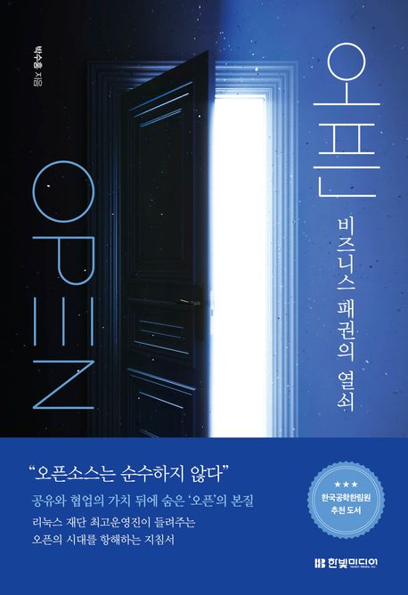

:::info
한빛미디어 \<나는 리뷰어다\> 활동을 위해서 책을 제공받아 작성된 서평입니다.
:::

## Book Info

:::tip
책 이미지를 클릭하면 교보문고 사이트로 이동합니다!
:::

- 제목: 오픈
- 저자: 박수홍
- 출판사: 한빛미디어
- 출간: 2024-09-30

{/* truncate */}

## Intro

오픈 소스를 처음 알게 된 날이 언제였을까 생각을 해보면 그때였다. 중학생 때 단순히 프로그래머가 되겠다는 마음을 먹고 한빛미디어에서 출간한 **[프로그래머로 사는 법](https://product.kyobobook.co.kr/detail/S000001223874)**을 읽었을 때. 그 책에는 리누스 토르발스, 리차드 스톨만 등 정말 대단하신 선배 프로그래머 분들의 얘기가 나오는데 그때 **오픈 소스**라는 용어를 처음 알게 됐던 것 같다. 별도의 얘기지만 기회가 된다면 읽어보는 걸 추천한다. 자바, C++을 만든 사람부터 이메일 만든 사람, 애플 컴퓨터 만든 사람 등 이 업계에 몸 담고 있으면 알 수 있는 전설들의 인터뷰가 담겨 있다. 책 읽을 당시에는 아무것도 모르는 학생이었기에 별 관심 없었지만, 컴퓨터공학과를 진학하면서 모를 수가 없는 단어가 됐다. 오픈 소스에 기여를 해보는 것을 목표로 하는 전공 과목도 들은 적도 있었다. 그리고 지금도 여전히 다양한 커뮤니티, 소셜 미디어를 통해 오픈 소스의 좋고 안 좋은 소식들을 듣기도 한다. 그래서 그런지 이 책에서 과연 어떤 내용을 다루는지 궁금했고, 리뷰어로 신청하게 됐다.

## Book Review

### 프롤로그

이 책은 전반부터 재밌게 프롤로그로 시작된다. 

> 오픈은 속셈이 있다.

정말 생각이 많이 들게 하는 문장이다. 최근 몇 년 동안 IT 트렌드를 알기 위해 각종 소셜 미디어와 커뮤니티를 보면서 다양한 내용들을 접했다. 그중에는 당연히 오픈 소스와 관련된 내용도 많았다. 내가 처음 오픈 소스에 대해 알게 될 때는 자신의 재능과 지식을 공유하고, 누구나 접근 가능하며, 투명하다는 장점만 알고 있었다. 그러나 오픈 소스에 대해 공부할수록 이면이 존재한다는 걸 깨달았다. 이 책을 읽으면서 그런 내용들을 다시 한 번 상기시킬 수 있었다. 

### 전반적인 책 리뷰

이 책은 총 5장으로 이루어져 있으며 짧은 에세이가 여러 개 모여있는 형태로 구성되어 있다. 큰 주제는 있으나 연속적으로 이어진 이야기가 아니라서 매일마다 몇 장의 에세이를 조금씩 읽으면서 즐길 수 있는 책이다. 기술적으로 깊이 있는 설명보다는, 오픈 소스에 대한 이해를 높이기에 좋은 책이라고 생각한다. 

1장에서는 '오픈'이라는 개념의 모습들을 다양하게 설명한다. 오픈은 평등하지만 공평하지 않다는 것을 상기시키고 책을 시작하는 느낌이었다. 1장에서는 오픈의 모습에 대해 이야기를 한다면, 2장에서는 오픈의 케이스들을 설명하면서 오픈의 이유에 대해 알려준다.

3장에서는 오픈이 왜 강한가에 대해 얘기를 하며, 4장에서는 오픈 소스가 단순히 순수하지 않다는 것을 말한다. 개인적으로 4장이 가장 인상 깊었다. 마이크로소프트와 리눅스, 삼성과 인텔의 IoT 오픈 소스, 내가 지원해보고 싶었던 GSoC(Google Summer of Code) 등 다양한 사례들이 나와서 재미있게 읽었다. 테크 직군에 있으신 분들이라면 정말 재밌게 읽을 수 있는 파트라고 생각한다.

마지막 5장에서는 오픈 소스의 시대에서 어떻게 대처해야 할지 생각하게 만든다. 특히 오픈 소스 개발자 채용에 대한 내용이 인상 깊었다. 정말 오픈 소스에 열정적이고 재능이 있다면 몇 번의 메시지만으로 채용이 될 수도 있다는 내용이 정말 신기했다. 또한, 내부 채용 프로세스는 기업마다 다양하겠지만, 행사가 끝난 후 채용 게시판에 JD가 적혀 있는 것이 아닌 '오픈 소스 개발자를 채용합니다' 문구 하나만 적힌 포스트잇으로 채용 프로세스를 시작한다는 점도 재밌었다. 

### 오픈 소스의 이면에 대한 통찰

이 책은 오픈 소스의 긍정적인 면뿐 아니라 그 이면 또한 다루며, 대기업이 오픈 소스를 어떻게 이용하고 있는지 전략적 관점에서도 보여준다. 이는 오픈 소스를 단순한 코드 공유와 접근성으로만 이해했던 사람들이 ‘공유’와 ‘자유’와 같은 낭만적인 개념을 넘어, 오픈 소스가 실제 비즈니스 전략으로 어떻게 활용하고 있는지에 대한 인사이트를 제공한다. 특히 오픈 소스 생태계가 단순히 기술적인 실험장이 아닌, 글로벌 기업들이 기술적 우위를 점하기 위한 전략적 도구로 변하고 있음을 보여주는 부분은 이 책의 큰 장점이라고 생각한다.

### 삼성전자

나는 솔직히 이 책을 읽으면서 정말 놀라웠던 것은 오픈 소스의 이면보다는 삼성전자었다. 위에서도 언급했듯이 오픈 소스의 이면에 대해서는 소셜 미디어, 커뮤니티를 통해 이미 알고 있었다. 나는 취업 준비생의 입장에서 삼성전자는 엄청난 기업이라고 생각하지만 다른 테크 기업에 비해서는 아직 보수적인 기업이라고 생각했다. 그런데 이 책을 읽으면서 삼성전자라는 기업이 오픈 소스에 대해 어떻게 생각하고 있는지 알 수 있었고, 조금이나마 보수적이라는 생각을 벗을 수 있었다.

삼성이 IoT에서 오픈 소스를 어떻게 활용하고 있는지, 그리고 어떤 프로젝트를 진행하고 있는지 대략적으로 알 수 있었으며, 저자와 같은 대단한 사람이 삼성에 있다는 것만으로도 그 그룹에 정말 들어가서 함께 일을 경험해보고 싶은 기업이라는 생각이 들 정도였다.

## 대상 독자

단순히 오픈 소스에 관심이 있는 사람뿐만 아니라 그 생태계를 이해해보고 싶은 사람에게 추천하는 책이다. 위에서도 설명했듯이 저자의 경험을 풀어 설명하는 부분은 정말 재밌었고 인상적이었다. 오픈 소스에 대한 사전 지식이 있으면 읽는데 더욱 편하겠지만, 큰 부담 없이 접근할 수 있으며, 오픈 소스가 단순히 기술적인 도구가 아니라 강력한 전략이라는 것을 깨달을 수 있을 것이다.