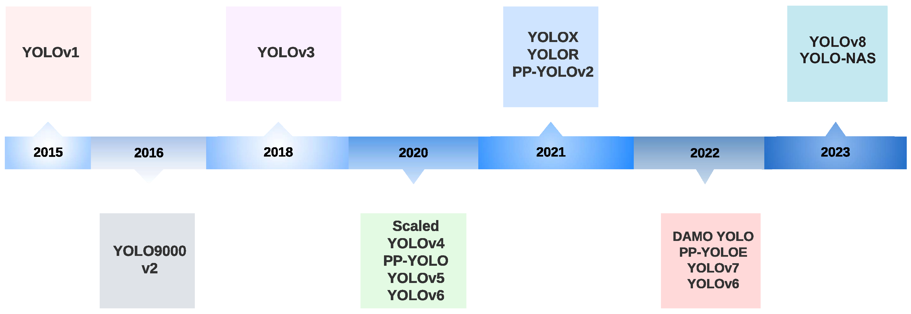
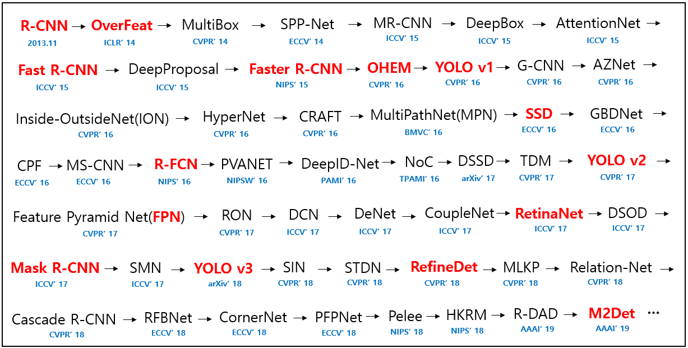
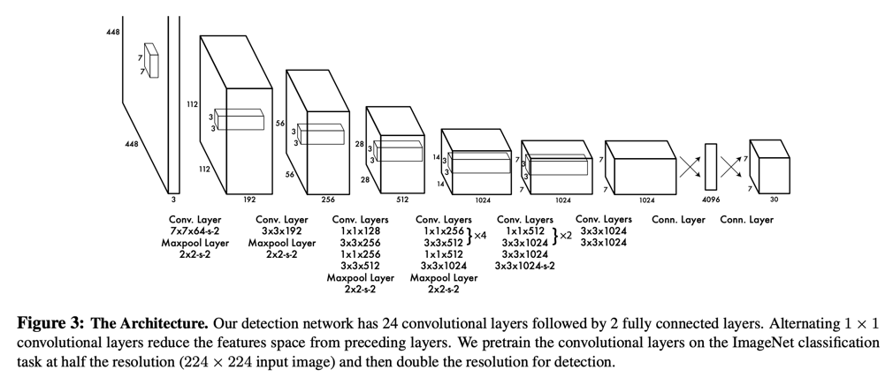

<!-- truncate -->

## You Only Look Once

흔히 YOLO는 사람들에게 You Only Live Once라고 많이 알려져 있다. 하지만 Computer Vision에서는 **You Only Look Once**라고 불린다. YOLO는 Object Detection 분야에서 빠르고 뛰어난 성능을 갖고 있는 모델이며, 실시간 객체 탐지 기능도 지원한다. 현재 YOLO 모델은 11 버전까지 나온 상태이며, 이번 글에서는 YOLOv1부터 지금까지의 YOLO 모델들을 다뤄보고자 한다. 

YOLO의 전체적인 timeline은 위와 같다. 위의 이미지에서는 v8까지 보여지고 있지만, 2024년 2월에는 YOLOv9가 공개됐고, 그 해 5월에는 YOLOv10, 그리고 가장 최근 버전인 YOLOv11은 10월 30일에 공개됐다. 

YOLO의 개발자인 Joseph Redmon은 YOLOv3까지 개발 후 윤리적 이유로 YOLO 연구를 중단했다. 그 후 YOLOv4은 다른 저자들이 개발했고, YOLOv5는 Ultralytics에서 개발됐다. 이후 v6는 meituan에서, v7은 v4의 일부 저자들이 개발했고, v8부터는 쭉 Ultralytics에서 공개했다.

## Object Detection

Object Detection은 이미지나 비디오에서 특정 객체의 존재 여부를 확인하고, 그 위치와 종류를 식별하는 컴퓨터 비전의 한 분야라고 할 수 있다. 조금 더 자세히 설명하면 다양한 크기와 위치에 있는 여러 개의 객체를 인식하고, 바운딩 박스로 표시하여 객체의 위치와 어떤 종류의 객체인지 알려주는 기술이다.

이 글에서 Object Detection 자체를 자세히 다루지는 않기에 궁금하다면 아래의 논문들을 참고해보길 바란다.

위의 이미지는 [deep_learning_object_detection](https://github.com/hoya012/deep_learning_object_detection)에서 가져왔다. 몇 년 전 한창 비전 분야가 활발했을 때 [텐서플로우코리아(현 AGI-KR)](https://www.facebook.com/groups/agikr/)에 돌아다녔던 기억이 난다. 오래된 정보라 출처를 못 찾을 줄 알았는데 다행히 찾을 수 있었다. 빨간색은 당시 이 레포를 만든 분이 필수로 읽어야 한다고 생각하는 논문이고, 다른 논문들도 중요하지만 시간이 된다면 읽어보는 걸 추천하셨다. 참고로 큰 글씨가 논문 또는 모델 이름이고, 작은 글씨는 학회와 논문이 출간된 연도이다.

## YOLOv1

### Architecture

YOLOv1은 24개의 convolutional layer와 2개의 fully connected layer로 구성되며, 마지막 레이어를 제외한 모든 레이어는 leaky ReLU 활성화 함수를 사용하며, 마지막 레이어는 linear 활성화 함수를 사용한다. GoogLeNet 및 Network in Network(NIN) 구조에서 영감을 받아 1×1 convolution을 활용해 feature map 수를 줄이고 파라미터 수를 최적화했다. 별도로 Fast YOLO라고 불리는 경량 모델은 9개의 convolutional layer로 구성된다.

### 작동 원리

YOLOv1 작동 원리

YOLOv1은 객체 탐지 과정을 통합하여 모든 bounding box를 동시에 탐지한다. 이를 위해 입력 이미지를  $S \times S$  그리드로 나누고, 각 그리드 요소에서 $B$개의 bounding box와 해당 클래스 $C$에 대한 confidence를 예측한다. 각 bounding box 예측은 5개의 값 $P_c, b_x, b_y, b_h, b_w$로 구성된다.

- $P_c$ : 해당 bounding box에 객체가 포함될 가능성을 나타내는 confidence score
- $b_x, b_y$ : 그리드 셀 기준 bounding box의 중심 좌표
- $b_h, b_w$ : 전체 이미지에 대한 bounding box의 높이와 너비

YOLO의 출력은  $S \times S \times (B \times 5 + C)$ 크기의 텐서로 제공되며, Non-Maximum Suppression(NMS)을 통해 중복 탐지를 제거한다.

### 학습 방식

YOLOv1은 ImageNet 데이터셋에서 224×224 해상도로 초기 20개 레이어를 사전 학습한 후, PASCAL VOC 2007 및 VOC 2012 데이터셋으로 448×448 해상도로 미세 조정했다. 데이터 증강은 입력 이미지 크기의 20% 범위에서 무작위 스케일링과 이동, HSV 색 공간에서 노출 및 채도 변화를 적용했다. 

## Reference

- [A Comprehensive Review of YOLO Architectures in Computer Vision: From YOLOv1 to YOLOv8 and YOLO-NAS](https://www.mdpi.com/2504-4990/5/4/83)
- [YOLOv1: You Only Look Once: Unified, Real-Time Object Detection](https://arxiv.org/abs/1506.02640)