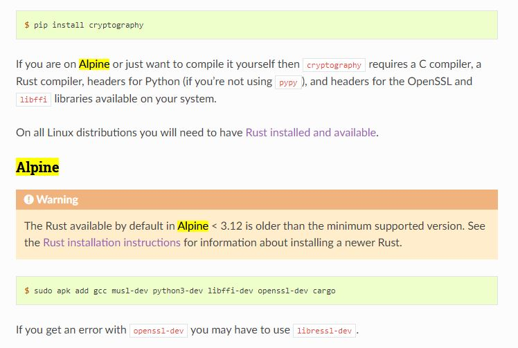
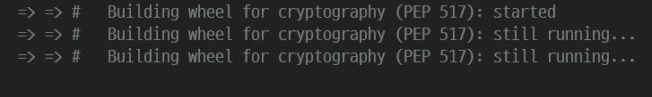

<!-- truncate -->


## Introduction

Django를 활용하여 블로그를 만들어보는 프로젝트를 진행하다가 docker로 환경을 옮기는 도중 여러 에러들을 만났다. 이 글은 문제를 해결하면서 얻은 지식을 공유하고자 작성한 글이다.

## 첫 번째 문제

### Alpine Linux와 cryptography의 호환성 문제

`Dockerfile`, `docker-compose.yml` 파일을 작성 후 마지막으로 빌드를 하던 중 아래의 에러를 만났다.

```
ERROR: No matching distribution found for cryptography==3.4.7
```

현재 Dockerfile에서 사용하는 image 버전과 requirements.txt에 적힌 cryptography 버전은 아래와 같다. 이렇게 설정해두고 `docker-compose`로 빌드를 하려고 했는데 에러가 발생한 것이다.

```Dockerfile
FROM python:3.8-alpine
```

```bash
cryptography==3.4.7
```

### 해결

alpine linux와 python에서 암호화 알고리즘이 구현된 패키지인 cryptography의 호환성 문제라고 생각했고, cryptography의 공식 문서를 참고하여 해결책을 찾아보았다.



대략 요약하면 cryptography 패키지는 Rust를 빌드할 때 사용한다. 즉, Rust의 패키지 관리자이자 빌드 도구인 **cargo**를 같이 설치해야지 돌아간다는 것이다. 

```shell
$ sudo apk add gcc musl-dev python3-dev libffi-dev openssl-dev cargo
```

위의 코드를 Dockerfile에 추가하면서 첫 번째 문제는 잘 해결할 수 있었다.

## 두 번째 문제

### 빌드가 오래 걸리다가 안 되는 문제

위의 명령어를 Dockerfile에 추가하고 다시 build 하면 당연히 잘 작동될 거라 생각했으나 아래와 같이 다시 한 번 에러가 발생했다. 이미지를 보면 알 수 있듯이 still running이 지속되는 상황이다. 대략 10분 정도 그대로 놔뒀는데도 빌드가 안 되고 계속 진행하다가 종료가 된다.



### 해결

계속 구글링을 하면서 이 문제를 해결하려 했으며, cryptography 라이브러리와의 문제일 수도 있다고 생각하여 공식 문서도 다시 다 읽어보고, 라이브러리의 GitHub 이슈도 찾아보았다.


대략적으로 비슷한 이슈를 찾을 수 있었다. 위의 이미지는 cryptography GitHub 저장소에서 가져온 한 이슈 이미지다. 현재의 상황과 비슷하여 답변을 참고할 수 있었다.

대략 요약하자면 아래와 같다.

1. Alpine Linux에서 Python 패키지를 빌드하는 작업이 느리며, 특히 CI/CD 환경에서 매번 빌드해야 하는 경우 비효율적이다.
2. Python의 pip 및 휠 패키징과 관련하여 Alpine과 호환 가능한 휠을 업로드하는 작업이 필요하지만, 이는 pip/wheel/packaging 및 관련 PEP 논의가 필요하다.
3. 최신 Alpine 환경에서 Python 패키지를 제대로 설치하려면 최신 Rust 컴파일러가 필요하다.
4. Alpine에서 발생하는 이와 같은 문제는 문서화되어 있고, 현재로서는 개선 사항이 없으므로 추가적인 문제가 있다면 새로운 이슈를 열거나 PR(Pull Request)을 제출해야 한다.

이 답변에서의 핵심은 결국 1번과 2번이었다. 즉, Alpine 리눅스가 문제였고, 아래와 같이 이미지만 바꿈으로서 문제를 해결할 수 있었다.

```Dockerfile
FROM python:3.8-slim-buster
```

근데 문제만 해결하면 끝일까? 그건 아니다. 이유를 알아보자.

## Alpine Linux가 파이썬 환경에서 적절하지 않은 이유

내가 alpine linux를 사용한 이유는 Ubuntu linux와 비교했을 때 용량도 작고 빌드할 때 더 빠르기 때문이다. 즉, 경량화가 잘 되어 있기 때문이다. 그러나 이 이미지는 python 환경에서는 적절하지 않다.

그 이유는 사용하는 라이브러리의 차이에서 시작된다. 대부분의 리눅스 배포판은 파이썬을 포함한 모든 C언어 프로그램에 필요한 C언어 표준 라이브러리인 GNU 라이브러리(glibc)를 사용한다. 그러나 Alpine Linux는 좀 더 경량화하기 위하여 GNU 라이브러리를 사용하는 것이 아니라 musl 라이브러리를 사용한다. 이 musl 라이브러리는 GNU 라이브러리로 컴파일 된 `Wheel 바이너리`를 지원하지 않는다. 그렇기 때문에 `.whl` 확장자를 갖는 패키지를 다운 받는 것이 아니라 `.tar.gz` 확장자 파일을 다운 받게 된다. 즉, alpine linux를 사용하는 경우 사용하는 모든 파이썬 패키지의 C 코드를 컴파일 해야 하므로 빌드 시간도 오래 걸리며 용량도 커진다는 것이다.

최근 대부분의 파이썬 패키지에는 PyPI의 Wheel 바이너리가 포함되어 있어 설치 시간이 빠르다. Wheel은 사실 .whl 확장자와 특별한 형식의 파일 이름으로 이루어진 ZIP 형식을 아카이브한 것이다. 쉽게 말하면 확장자만 바꾼 것이다.

1. 빌드가 느리다.
2. 이미지 용량이 커진다.
3. 시간이 많이 낭비된다.(빌드하는 과정)
4. 런타임 버그들을 만날 수 있다.

위의 이유들로 인해, Python 환경에서는 Alpine Linux보다는 Debian 기반의 slim 이미지나 Ubuntu 기반 이미지를 사용하는 것이 더 적합하다.

## 🌐References

- [Cryptography installation](https://cryptography.io/en/latest/installation/)
- [Dependencies to build on Alpine Linux?](https://github.com/pyca/cryptography/issues/5776)
- [도커 이미지 잘 만드는 방법](https://jonnung.dev/docker/2020/04/08/optimizing-docker-images/)
- [Using Alpine can make Python Docker builds 50x slower](https://pythonspeed.com/articles/alpine-docker-python/)
- [The best Dockeer base image for Python application](https://pythonspeed.com/articles/base-image-python-docker-images/)
