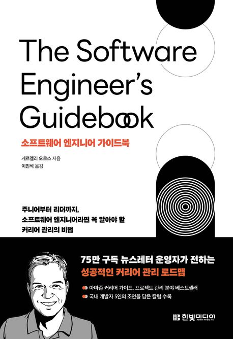

:::info
한빛미디어 \<나는 리뷰어다\> 활동을 위해서 책을 제공받아 작성된 서평입니다.
:::

## Book Info

:::tip
책 이미지를 클릭하면 교보문고 사이트로 이동합니다!
:::

- 제목: 소프트웨어 엔지니어 가이드북
- 저자: 게르겔리 오로스
- 역자: 이민석
- 출판사: 한빛미디어
- 출간: 2024-10-30

{/* truncate */}

## Intro

최근 취업 준비를 하느라 정신 없는 날들을 보냈다. 그래도 어떻게든 자투리 시간을 만들어서 조금씩 읽은 나에게 칭찬해주고 싶다. 나에게 필요한 부분들을 다 못 읽을 뻔 했지만 이번에 인턴 취업이 되면서 시간이 생기게 됐고, 본가에 들고 가서 읽었다. "주니어부터 리더까지"라는 말이 '아직 취업도 못한 내가 읽어도 괜찮은 책인가?'라는 생각을 하게 만들었지만, 그래도 궁금하여 읽어보게 됐다.

## Book Review

### 전반적인 책 리뷰

1부에서는 전반적으로 어떻게 커리어를 설계하고 관리해 나갈지에 대한 내용이 적혀 있다. 성과 평가, 승진, 이직 등의 내용이 담겨 있으며, 이런 부분들을 어떻게 준비해야 하는지에 대한 내용이 담겨 있다. 내가 실제로 주니어 개발자로 일을 했으면 고민할 부분들이 많이 담겨 있다. 특히 일을 한 내용이 담긴 작업 일지를 작성하는 게 인상 깊었다.

2부에서는 개발자로서 일을 어떻게 하는 게 좋은지에 대한 내용이 나온다. 어떻게 보면 소프트웨어 엔지니어로서 당연한 얘기들이 담겨 있다고 생각할 수 있으나, 자세히 읽어보면 자잘한 팁들이 나오니 이런 내용을 처음 접하는 사람들에게는 재밌을 수 있을 것 같다. 3부에서는 시니어 엔지니어에 대한 내용이 나온다고 목차에 적혀 있지만 시니어 엔지니어에게만 해당이 되는 내용은 아니었다. 실제 업무 시간을 확보하는 방법, 팀 단위 협업, 테스트, 아키텍처 등 결국은 주니어 엔지니어도 미리 알면 좋은 내용이라고 생각한다. 어차피 주니어는 시니어가 되어야 하고 결국 이 내용들을 알아야 한다. 미리 시니어 엔지니어를 이 책으로 체험하는 게 도움이 될 것이다.

4부에서는 리드에 관한 내용이었다. 프로젝트 관리부터 의사결정, 프로덕션 출시, 이해관계자 등을 설명하는데 개인적으로는 이해관계자 부분이 재밌었다. 이 부분은 테크 리드에게만 해당되는 내용은 아니었다. 고객, 프로젝트에 참여하는 비개발자 등 소프트 스킬에 대한 내용이 담겨 있다. 5부에서는 스태프 및 수석 엔지니어와 관련한 것들을 설명하는데 비즈니스의 이해, 고객의 입장에서 생각하기 등의 내용은 주니어 엔지니어도 그런 부분을 고려해야 한다고 생각한다.

마지막으로 6부에서는 이 책의 결론인 '배움을 멈추지 말자'와 부록이 있다. 결국은 계속 엔지니어로서 배움을 추구해야 한다는 점을 다시 한 번 느꼈다. 부록에서는 우리 나라의 시니어 엔지니어 직급 이상의 분들이 좋은 개발자, 성장, AI 시대의 개발자 역할 등 다양하고 재밌는 주제들이 담겨 있다. 사실 이렇게 경험이 담긴 부분은 매번 얘기하지만 실제로 일을 하는 것도 아니고 어디 가서 이렇게 높은 직급의 분들을 만날 수 있는 것도 아니기에 정말 재밌게 읽은 부분이었다.

## 대상 독자

주니어, 시니어 등 직급을 따지지 않고 엔지니어로 일을 하고 있으시다면 모두에게 추천을 하는 책이다. 특히 나는 실제로 일을 하기 전인 사람에게 이 책을 추천하고 싶다. 대부분은 내부 프로세스를 따라가면서 일을 배우겠지만, 처음부터 어떻게 일을 잘 할 수 있을지 고민하고 실제로 업무를 맞이하면 좋지 않을까? 또 이런 책 한 권 갖고 있으면 미래에 또 다시 읽어보면 생각 못 했던 부분들도 있지 않을까? 그런 생각도 들었다. 정말 일을 하기 전에 이런 책을 만날 수 있었다는 것에 너무 감사하다.