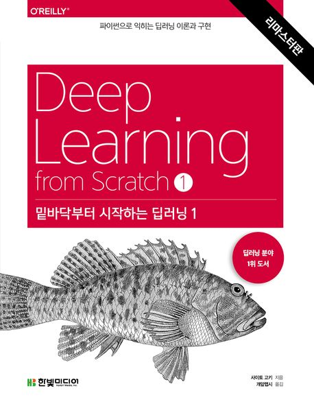
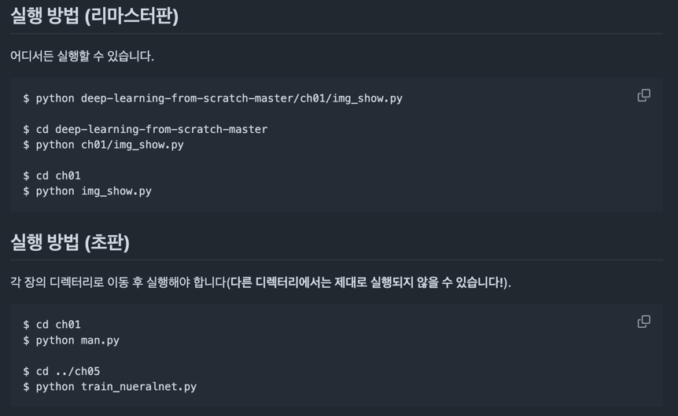

:::info
한빛미디어 \<나는 리뷰어다\> 활동을 위해서 책을 제공받아 작성된 서평입니다.
:::

## Book Info

:::tip
책 이미지를 클릭하면 교보문고 사이트로 이동합니다!
:::

- 제목: 밑바닥부터 시작하는 딥러닝 1(리마스터판)
- 저자: 사이토 고키
- 역자: 개앞맵시(이복연)
- 출판사: 한빛미디어
- 출간: 2025-01-24

{/* truncate */}

## Intro

먼저 이번 2025년에도 감사하게 한빛미디어 '나는 리뷰어다'에 참여할 수 있게 됐다. 언제나 책을 읽으면서 리뷰를 작성하고, 한빛미디어의 책을 다른 사람보다 쉽게 접근하여 볼 수 있는 건 정말 행운이라고 생각한다. 이번에는 밑바닥부터 시작하는 딥러닝 1(리마스터판)을 읽게 됐다. 이 책은 2017년 1월에 출간된 책으로 한국 딥러닝의 교육에 이바지했다고 말해도 무방한 책이라고 생각한다. 정말 그만큼 사람들이 딥러닝에 입문하는데 도움이 된 책이다. 이번에 리마스터 되면서 좀 더 읽기 편해졌다.

## Book Review

먼저 리마스터 되기 전의 리뷰는 [여기](http://localhost:3000/blog/deep-learning-from-scratch)에서 확인할 수 있다. 이번 리뷰에서는 이 책에 어떤 내용이 담겼는지에 대해 소개하기 보다는 직접 책을 읽어본 사람으로서
어떤 달라진 점이 있는지, 어떤 부분이 더 좋아졌는지에 대해 소개하려고 한다. 내가 소개한 부분 외에 어떤 점이 더 달라졌는지 알고 싶다면 [[환생 비화] 밑바닥부터 시작하는 딥러닝 1 (리마스터판)](https://www.hanbit.co.kr/channel/category/category_view.html?cms_code=CMS2416204088&cate_cd=)를 읽어보는 것도 재밌을 것이다.

### 풀컬러

가장 크게 달라진 점이라 하면 흑백에서 컬러로 바뀐 점이라 생각한다. 예전 흑백도 옛날 논문을 읽는 느낌이라 매력적이었지만, 이번에 컬러로 바뀌면서 더 눈에 띄고 좋았다. 최근 IT 책들이 제작 비용은 높아지지만, 독자를 위해서 퀄리티를 높이는 모습을 보이고 있어서 좋다고 느꼈다.

### 코드

초판에서는 작업 디렉터리가 정말 중요했는데 이제는 편하게 코드를 사용할 수 있게 됐다.

또한, 예전에는 파이썬 파일로만 코드를 제공했다면, 현잰는 Colab 환경에서 코드를 사용할 수 있도록 주피터 파일 또한 공유하고 있다. 이 부분은 정말 좋은 변화라고 생각한다. 프로그래밍 환경을 굳이 구축하지 않아도 웹에서 모든 것을 실행할 수 있게 됐다.

추가적으로 당연히 예전 책을 기준으로 코드가 쓰여져 있기 때문에 matplotlib, numpy도 경고가 뜨는 부분이 있었다. 그 부분도 최신 환경에 맞춰 수정을 한 것으로 보인다.

### 다른 시리즈

다른 시리즈에 대한 소개도 처음에 나온다. 이 책을 읽고 딥러닝에 더 관심이 생긴다면 다른 시리즈도 읽어보는 것이 좋다. 앞으로 출간 예정인 LLM을 주제로 하는 밑시딥 6권도 기대가 되는 부분이다. 

이 책의 마지막 장인 8장을 보면 심화적인 내용이 많이 나오는데 'NOTE' 라고 표기되어 있는 부분에도 내용이 좀 더 추가된 것으로 보였다. 다른 시리즈에 더 자세한 내용이 담겨 있으니 그 책을 읽어보라는 부분이었는데, 난 이 부분도 매력적으로 느꼈다. Next Step을 제공하는 것이 좋은 책의 특징이라고 생각한다. 

## 대상 독자

이 책은 딥러닝에 입문하고 싶은 사람들에게 추천한다. 이 책을 읽고 나면 딥러닝에 대한 기본적인 지식을 얻을 수 있을 것이다. 또한, 이 책을 읽고 나서 다른 시리즈도 읽어보는 걸 추천한다. 난 매번 내 친구, 동료, 선배, 후배 등 딥러닝을 공부하고 싶은 사람이 있다면 무조건 처음부터 이 책을 읽으라고 추천한다. 그만큼 정말 좋은 책이고 첫 시작을 쉽게 시작할 수 있는 책이라 생각한다. 이 책은 정말 가치가 있는 책이라고 생각한다.